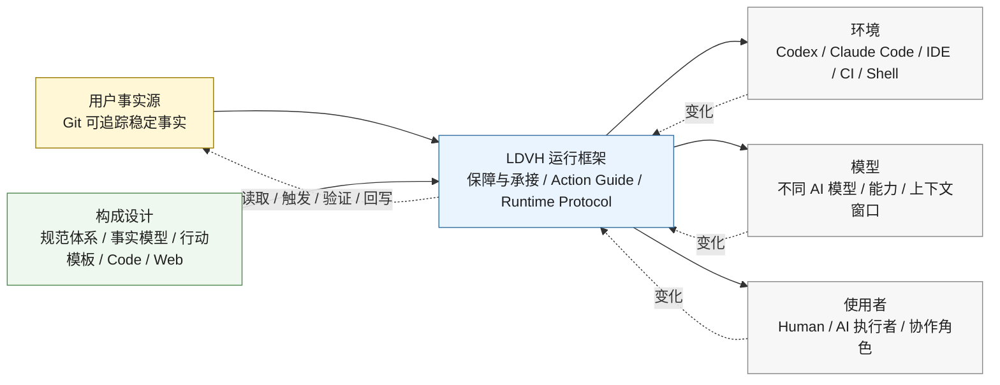

# 00 事实源解耦与运行框架比较草稿

```yaml
draft:
  status: discussion_draft
  canonical_path: "00-事实源解耦与运行框架比较草稿.md"
  target_spec: "specs/00-理念与构成.md"
  purpose: "记录并比较 00 中构成设计、事实源和 LDVH 运行框架的顶层关系"
  fact_sources:
    - "specs/00-理念与构成.md"
    - "specs/01-保障与承接.md"
    - "01-保障与承接-讨论草稿.md"
```

> 文件状态：讨论草稿。本文不是正式规范，不替代 `specs/00-理念与构成.md`。本文用于记录新的顶层判断：LDVH 希望通过事实源把环境、模型和使用者拆分开，使三者可以在事实源稳定的前提下重新组合。

## 1. 新增判断

当前讨论形成一个更上位的判断：

LDVH 不只是为了让 AI 有规则可读，也不只是为了把规范、事实模型、行动模板、Code 和 Web 组织起来。LDVH 更深一层的目标，是通过稳定事实源，把项目推进从特定环境、特定模型和特定使用者中解耦出来。

环境、模型和使用者都可能变化：

1. 环境可能从 Codex 变成 Claude Code、IDE、Shell、CI 或其它 AI 协作入口；
2. 模型可能从一个 AI 模型换成另一个 AI 模型，能力、上下文窗口、工具调用方式和行为偏好都会不同；
3. 使用者可能从一个 Human、一个 AI 执行者或一个协作角色切换到另一个。

LDVH 希望这些变化不会让项目失去方向、状态、依据和闭环。原因是项目的稳定事实、判断依据、状态、证据和回写位置应落在 Git 可追踪事实源中，而不是落在聊天上下文、某个环境缓存、某个模型记忆或某个使用者的临时理解里。

因此，环境、模型和使用者发生变化时，变化的主要应是读取、触发、执行、展示、验证和适配方式，而不是项目的权威事实基础。

## 2. 与当前 00 表达的差异

| 比较项 | 当前 00 倾向 | 新判断 | 影响 |
|---|---|---|---|
| 顶层结构 | 六类构成要素 + 事实源原则 + 保障与承接链路 | 五类构成设计 + 用户事实源 + LDVH 运行框架 | 避免把运行框架压成“运行时扩展”这一类构成要素 |
| 事实源定位 | 事实源不是第七类构成要素，而是底层权威原则 | 事实源还是用户资产与权威依据，同时承担环境、模型、使用者解耦的稳定锚点 | 事实源不只是防漂移，还负责跨环境、跨模型、跨使用者保持项目连续性 |
| 运行时扩展 | 被列为第六类构成要素 | 不宜作为构成要素；应转为 LDVH 运行框架的一部分 | Hook、插件、环境薄引用、历史 Rules / Skill 能力等不再被误判为同级构成 |
| 保障与承接 | 是规则进入技术环节的共同链路 | 是 LDVH 运行框架的核心内容 | 01 不只是补充技术细节，而是展开 00 的运行框架 |
| 环境关系 | 开发环境是运行时扩展的接入与适配对象 | 环境是可替换外部变量，由运行框架适配 | 支持插件时走插件 / Hook；不支持时走入口薄引用 |
| 模型关系 | 主要通过 AI 第一原则体现 | 模型是可替换外部变量，由事实源、Action Guide 和验证机制降低差异影响 | 不把项目连续性绑定在某个模型的记忆或行为偏好上 |
| 使用者关系 | 主要通过 Human Gate 和 AI 执行者体现 | 使用者是可切换参与方，事实源保证新参与方可以重新获得项目依据 | 减少换人、换 AI、换入口后的上下文重建成本 |

## 3. 推荐顶层结构

可以把 00 的顶层结构整理为三类基础面向：

```text
LDVH
  -> 构成设计
       -> 规范体系
       -> 事实模型
       -> 行动模板
       -> Code
       -> Web
  -> 用户事实源
       -> 稳定事实
       -> 判断依据
       -> 状态
       -> 证据
       -> 回写与 Git 追溯
  -> LDVH 运行框架
       -> 内部保障
       -> 外部衔接
       -> Action Guide
       -> Runtime Protocol / canonical event
       -> Hook registry / dispatcher
       -> 环境薄引用路径
       -> receipt / evidence / diagnostic
       -> 缺口分流与 Human Gate
```

其中：

1. 构成设计回答：LDVH 用哪些内部能力组织规则、事实、行动模板、代码和 Human-facing 交互；
2. 用户事实源回答：项目稳定事实、判断依据、证据和追溯权威在哪里；
3. LDVH 运行框架回答：构成设计和用户事实源如何进入具体环境、模型和使用者的协作场景，并被读取、触发、执行、验证和回写。

五类构成设计的候选口径：

| 构成设计 | 回答的问题 | 边界 |
|---|---|---|
| 规范体系 | 规则、价值、边界和保障需求如何被表达 | 不承载运行触发和执行步骤副本 |
| 事实模型 | 工作对象、状态、证据和稳定事实如何被对象化 | 不定义行动路径或环境入口 |
| 行动模板 | 可复用行动结构、步骤顺序、Gate 和交还方式如何组织 | 不重复规则本体，不替代 Action Guide 当前行动组织 |
| Code | 确定性解析、校验、诊断、索引和受控写入如何提供反馈 | 不替代 AI 判断、Human Gate 或事实源 |
| Web | Human-facing 状态、风险、证据、确认和受控交互如何呈现 | 不维护最终事实源，不替代行动判断 |

## 4. 环境、模型、使用者的解耦关系



这张图表达的是：环境、模型和使用者都不是最终权威。它们可以变化，但必须通过 LDVH 运行框架回到同一个事实源和同一套构成设计。

## 5. 对 00 的候选措辞：更大的愿景

建议位置：放在 00 的 `## 7. 构成要素实践准入判断` 之后，作为一个新的上位愿景段落。这样安排的好处是：前文先说明 LDVH 为什么存在、由哪些构成设计支撑、事实源为什么是权威原则、构成要素实践如何准入；随后再说明 LDVH 更大的愿景，是通过事实源稳定项目连续性，让环境、模型和使用者可以被拆分、替换和重新组合。

可以考虑在 00 中加入如下上位表达：

```md
LDVH 不把项目推进绑定在特定 AI 协作环境、特定模型或单一使用者身上。环境、模型和使用者都可能变化；LDVH 通过 Git 可追踪事实源承载稳定事实、判断依据、状态、证据和回写位置，使这些变化主要影响读取、触发、执行、展示、验证和适配方式，而不改写项目的权威事实基础。

因此，事实源不仅用于避免事实漂移，也用于把环境、模型和使用者从项目连续性中解耦出来。只要稳定事实、规则依据、行动状态和验证证据能够回到权威事实源，项目就可以在不同环境、不同模型和不同使用者之间继续推进。

为了让这种解耦真实发生，LDVH 还需要运行框架，也就是保障与承接机制。运行框架负责把构成设计和用户事实源接入具体 AI 协作环境，使其能够被读取、触发、消费、验证、留证、回写和 Human Gate 承接。00 只定义运行框架的上位必要性；其内部保障、外部衔接、Action Guide、Runtime Protocol、Hook / 插件路径、环境薄引用路径和生效边界由 01《保障与承接》展开。
```

## 6. 工作编排边界风险

在“五类构成设计 + 用户事实源 + LDVH 运行框架”的结构下，原行动编排 / 工作编排的边界确实会变得更敏感。当前更稳的处理，是把它重命名并收窄为“行动模板”。

模糊点在于：运行框架会定义 Action Guide、Runtime Protocol、Hook、环境薄引用、receipt、diagnostic、阻断和分流；这些内容都会影响 AI 怎么行动。若不划清边界，工作编排容易被运行框架吞并，或者反过来把环境入口、规则触发、receipt 和 diagnostic 都塞进工作编排。

更核心的矛盾是：工作编排很容易重复 specs 正文已经定义的规则、步骤、验证、Human Gate 和 Stop Conditions。一旦工作编排重新描述这些内容，它就不再只是流程素材，而会变成第二规则源。AI 随后需要判断“以 spec 为准，还是以工作编排为准”，反而增加读取、比较和冲突处理负担。

建议先用下面的边界判断：

| 对象 | 回答的问题 | 不应承担 |
|---|---|---|
| LDVH 运行框架 / 保障与承接 | 构成设计和事实源如何被环境读取、触发、消费、验证、留证、回写和分流 | 不定义具体工作类型的完整流程，不替代工作状态模型 |
| 行动模板 | 某类行动如何从目标进入上下文、步骤、Gate、执行、验证、关闭和分流 | 不定义跨环境入口、Hook 适配、Runtime Protocol、receipt 基础语义或规则本体 |
| Action Guide | AI 当前行动拿到的承接包：读什么、先做什么、何时停、如何验证、如何分流 | 不成为独立工作编排体系，也不替代行动模板中的场景流程 |
| 事实模型 | 工作对象、状态、证据和稳定事实如何被对象化承载 | 不定义行动路径，也不替代运行触发 |

可以压缩成一句话：

```text
运行框架负责让规则和事实进入行动现场；行动模板负责定义某类行动在行动现场如何推进。
```

因此，Action Guide 应属于运行框架的 AI 消费形态，但它可以读取和组合行动模板提供的 Scenario、Gate、执行路径、验证要求和分流规则。行动模板不是运行入口，也不是事实源；它是可被运行框架消费的可复用行动结构。

判断某项内容归口时，可以使用四个问题：

1. 它是否定义跨所有工作通用的入口、触发、消费、receipt、diagnostic 或生效边界？如果是，归运行框架 / 01。
2. 它是否定义某类行动从开始到关闭的场景、阶段、Gate、执行路径、验证和分流？如果是，归行动模板。
3. 它是否只是 AI 当前行动要读什么、先做什么、何时停下的临时承接包？如果是，归 Action Guide，不升级为工作编排。
4. 它是否保存工作状态、证据、决策或稳定事实？如果是，归事实模型或事实源边界。

进一步的取舍方向可以是：不再保留“工作编排”这个厚重概念，而是保留“行动模板”作为五类构成设计之一。行动模板不得重复 spec 正文规则，只能引用规则、声明顺序、组合场景和消费条件；一旦需要定义规则本体、验证要求、Human Gate 或 Stop Conditions，应回到对应 spec 正文和 01 的保障链路。

候选边界可以写成：

```text
specs 定义规则本体；
01 定义规则如何被保障与承接；
Action Guide 组织当前行动；
行动模板只表达可复用的行动顺序和场景组合，不重新定义规则。
```

## 7. 需要继续讨论的问题

1. 00 是否应正式从“六类构成要素”改为“五类构成设计 + 用户事实源 + LDVH 运行框架”；
2. “事实源原则”是否要升级为“用户事实源”这一基础面向，但仍声明它不是构成要素；
3. “保障与承接”是否在 00 中统一命名为“LDVH 运行框架”，而在 01 中继续作为规范标题；
4. 环境、模型、使用者三者是否需要在 00 中单独成节，还是并入事实源底层原则；
5. 00 是否需要明确：环境、模型、使用者变化不会保证没有成本，但不应导致权威事实基础和项目推进闭环失效。
6. 行动编排 / 工作编排是否正式改名为“行动模板”，并明确其只承载可复用行动结构，不重复 specs 规则。

## 8. V2 Skill 能力补充

V2 中 Skill 不是泛泛的“技巧”或普通工具，而是运行时扩展承载物之一。V2 `06-运行时扩展规范.md` 把 Rules、Skills、Agents、Hooks 作为典型运行时扩展承载物；其中 Skill 的定位是“按需加载的可复用流程能力包”，用于承载可复用执行步骤、输入输出、失败处理、验证和主控交还。

V1 `04.02-LDVH能力资产与保障机制规范.md` 对 Skill 的边界更清楚：Skill 可以把稳定规范要求转换为 AI 可复用的执行步骤、预检顺序、失败处理和交还方式；但不得新增规范规则、替代 Code 校验、替代 Hook registry、替代 Human Gate，或声明环境已经安装。当前 V2 active 固定 Skill 是 `skills/ldvh-git-commit/SKILL.md`，它把 Git 提交规范和提交行动编排转换为提交准备、拆分判断、消息编写、预检和交还流程，但 commit message 本体规则仍以 specs 和 Code validator 为准。

V2 后续 spark 还补出一个重要判断：Skill 是“事件驱动的可复用工作流”。它至少包含：

1. 触发时机，例如 pre-tool-use 阶段发现 AI 准备 git commit；
2. 执行步骤，例如读取相关规范、检查 git status、拆分提交、验证 commit message；
3. 完成交还，例如提交后回报 hash、剩余状态和执行模式。

V2 的实现方向也已经出现：Code 扫描 `skills/*/SKILL.md` 中的 `ldvh_asset` 自描述，读取 `trigger_conditions`，由 dispatcher 在 `pre-tool-use`、`acknowledge-read-plan` 等事件中输出 `skill_plan`，提示 AI 读取对应 Skill 并按 Workflow 执行。也就是说，Skill 不是独立事实源，而是运行框架可以推荐或触发的流程执行包。

转换到 V3 后，可以改写为：

```text
specs 定义规则本体；
01 / 运行框架定义触发、承接和模板建议；
Action Guide 组织当前行动，并在需要时引用行动模板；
行动模板吸收 V2 Skill 的可复用执行流程；
Code / Hook / Rules 负责发现触发时机和输出建议；
Human Gate、事实源和验证规则仍回到对应规范。
```

如果工作编排重命名并收窄为行动模板，V2 Skill 的价值可以被吸收进来：那些“重复出现、步骤稳定、适合按需加载”的流程，可以成为行动模板的一种表达，而不必保留独立 Skill 体系。但这些流程必须保持薄边界，只能引用规则、执行步骤、输入输出、验证入口和交还方式，不能重新定义 specs 已经定义的规则、状态、Human Gate 或 Stop Conditions。

候选判断：

```text
工作编排可以重命名并收窄为行动模板；
V2 Skill 能力可以并入行动模板 + Action Guide + 01 运行框架；
V3 不必保留 Skill 作为独立机制或环境执行对象。
```

## 9. 不保留 Skill 后的责任归口

如果 V3 不打算把 LDVH 流程注册进外部环境的 Skill 系统执行，则可以不保留 Skill 作为独立机制。V2 Skill 的价值可以并入“行动模板”：触发时机由 01 / 运行框架与 Code / Hook / Rules 识别，当前行动由 Action Guide 组织，复用步骤由行动模板承载。

责任可以重新分层为：

| 责任层 | 负责内容 | 不负责内容 |
|---|---|---|
| specs | 定义规则本体、边界、验证要求、Human Gate 和 Stop Conditions | 不维护行动步骤副本 |
| 行动模板 | 承载可复用行动结构、步骤顺序、输入输出、失败处理、验证入口和交还方式 | 不新增规则、不替代事实源、不替代 Code 校验或 Human Gate |
| 01 / LDVH 运行框架 | 定义行动模板如何被触发、承接、提示、留证、分流，以及何时不得声称生效 | 不定义每个行动模板的具体步骤 |
| Action Guide | 在当前行动中组织是否需要引用某个行动模板，并生成当下可执行承接包 | 不成为规则源，也不长期维护行动模板状态 |
| Code / Hook / Rules | 发现触发时机，输出模板建议、read_plan、receipt 或 diagnostic | 不替 AI 执行行动模板，不替行动模板定义流程 |
| AI 主控 | 按 Action Guide 和行动模板执行，保留价值判断、风险判断、验证和交还责任 | 不把模板输出直接升级为完成证明 |
| Human Gate | 裁决新增、废弃、高影响模板、边界扩大或风险接受 | 不负责日常机械执行 |

可以压缩成一句：

```text
行动模板承载可复用流程；01 / 运行框架负责触发与承接；Action Guide 负责当前行动组织；specs 负责规则；AI 主控负责执行和判断。
```

这意味着 Skill 在 V3 中可以退为历史概念或外部环境适配术语，不作为 LDVH 顶层机制。若某个环境确实支持 Skill，可由环境适配层把行动模板包装成环境 Skill；但 LDVH 核心仍以行动模板为权威承载，不以环境 Skill 为权威。

## 10. V2 Rules 能力补充

V2 中 Rules 已经被压缩到很薄。`rules/LDVH-RUNTIME-PROTOCOL.md` 的定位不是正式规范，而是固定 Rules 入口：在没有原生 Hook 或 Hook 不可观测时，让 AI 通过 Rules 路径自觉触发同一组 canonical event。它只列出 `session-start`、`acknowledge-read-plan`、`pre-tool-use`、`git.commit-msg` 四类事件如何调用 `hook_dispatch.py`，并明确触发后的处理必须由 dispatcher 输出决定。

也就是说，V2 的真实机制已经不是“Rules 承载规则”，而是：

```text
环境薄引用
  -> LDVH Runtime Protocol
  -> hook_dispatch.py / Hook registry
  -> canonical event handler
  -> read_plan / next_action / receipt / diagnostic
```

V2 仍然把 Runtime Protocol 放在 `rules/` 下，并把资产类型写成 `type: rule`。这在 V3 中容易继续制造两个摩擦：

1. 容易和 Codex、Claude Code、Trae、IDE 等环境自己的 rules / instructions / AGENTS 入口混淆；
2. 容易让 AI 误以为 LDVH 需要维护一个 Rules 资产本体，而不是只需要一个环境入口薄引用。

当前更稳的 V3 判断是：不保留 LDVH `Rules` 作为独立机制。环境里只需要一个薄引用；薄引用指向 LDVH Runtime Protocol 或等价运行入口。Runtime Protocol 本体不必放在 `rules/`，而应归入 Hook / Runtime / 运行框架一侧，和 Hook registry、canonical event、dispatcher 保持同步。

候选关系可以写成：

```text
支持 Hook 的环境：
环境插件 / Hook 适配 -> Runtime Protocol -> canonical event -> dispatcher

不支持 Hook 的环境：
环境薄引用 -> Runtime Protocol -> AI 自觉触发 canonical event -> dispatcher
```

两条路径的差异只在触发来源：一个是 `trigger_source=hook`，一个是 `trigger_source=thin_reference` 或等价手动触发。它们不应形成两套 Rules，也不应让环境 rules 成为 LDVH 的权威资产。

因此，V3 可以把 V2 的 Rules 能力拆开：

| V2 概念 | V3 去向 |
|---|---|
| `rules/LDVH-RUNTIME-PROTOCOL.md` | Runtime Protocol，归 01 / 运行框架或 Hook 目录承载 |
| Rules 路径 | 环境薄引用路径 |
| Rules 资产登记 | 取消，不作为独立固定能力资产 |
| Rules 与 Hook 同步 | 变成 Runtime Protocol 与 Hook registry / dispatcher 同步 |
| 环境 rules / instructions / AGENTS | 只放薄引用，不承载 LDVH 规则本体 |

压缩判断：

```text
V3 不需要 LDVH Rules 资产；
V3 只需要环境薄引用；
薄引用指向 Runtime Protocol；
Runtime Protocol 与 Hook registry / dispatcher 同步；
规则权威仍在 specs，运行触发权威在 01 / 运行框架。
```

## 11. 子 Agent 审查共识

多角度审查后的共同判断是：当前变化不是小改名，而是 00 的信息架构升级。大方向可以继续，但不能做删除式重构；应做“改名、收缩、能力迁移”。

共识结构：

```text
五类构成设计 + 用户事实源 + LDVH 运行框架
```

其中：

1. `规范体系 / 事实模型 / 行动模板 / Code / Web` 是 LDVH 的构成设计；
2. `用户事实源` 是权威资产和连续性锚点，不是构成要素；
3. `LDVH 运行框架` 是保障与承接，不是“运行时扩展”，由 01 展开。

可以继续的变化：

1. 六类构成要素改为五类构成设计；
2. 事实源从“底层原则”提升为用户事实源基础面向，但仍不是构成要素；
3. 保障与承接升级为 LDVH 运行框架，不再压成运行时扩展；
4. `Rules` 不再作为 LDVH 独立机制名，改为环境薄引用路径；
5. `Skill` 不再作为 LDVH 独立机制名，V2 Skill 能力迁入行动模板；
6. 原知识地图能力继续并入 Action Guide 的只读关系定位能力。

不能直接删除的能力：

| V2 名称 | V3 去向 | 不能丢失的能力 |
|---|---|---|
| Rules | Runtime Protocol 固定入口资产 + 环境薄引用 | 入口可见、薄引用、自描述、验证、同步触发 |
| Skill | 行动模板 + Runtime plan / Action Guide 消费 | 触发条件、可复用流程、输入输出、验证、交还 |
| Hook | LDVH 运行框架的强触发路径 | 环境事件触发、payload 归一、阻断、receipt |
| Rules 路径 | 环境薄引用弱触发路径 | 不支持 Hook 环境仍可进入同一 Runtime Protocol |
| 知识地图 | Action Guide 只读关系定位能力 | read_plan、next_queries、stop_conditions、impact_summary |

需要保留的最小运行链：

```text
环境薄引用 / Hook
  -> Runtime Protocol
  -> canonical event registry
  -> dispatcher
  -> Action Guide
  -> action_template_plan
  -> receipt / evidence / diagnostic
```

关键风险：

1. 行动模板重新长胖，变成第二套 specs；
2. 取消 Skill 名称后，没有等价的 `action_template_plan` 接住触发能力；
3. 取消 Rules 名称后，Runtime Protocol 缺少固定入口、自描述、验证和同步触发；
4. Hook 路径和薄引用路径被误写成保障能力相同；
5. 01 过度膨胀，变成完整引擎实现规范。

缓解原则：

```text
specs 定义规则本体；
行动模板只组织可复用行动结构；
Action Guide 组织当前行动；
01 定义触发、承接、验证和缺口分流；
Code / Hook / dispatcher 承接确定性执行和事件触发；
事实源保留稳定事实和证据权威。
```

建议迁移顺序：

1. 先确认 00 顶层口径，这是 Human Gate 级别变更；
2. 改 00，只写愿景、三基础面向、五类构成设计、事实源和运行框架上位必要性；
3. 改 01，主体重构为内部保障、外部衔接、行动指南，并同步 `role_sections`；
4. 同步 02 / 03 的术语和保障字段；
5. 最后再动附件和 Code 检查，第一轮尽量不新增附件，避免测试和边界一起变化。
