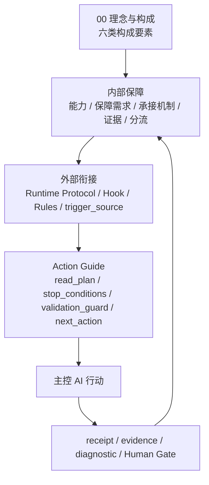
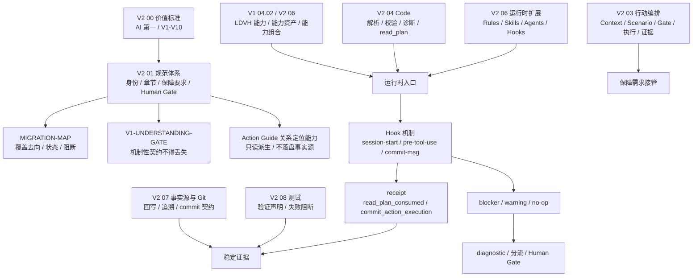
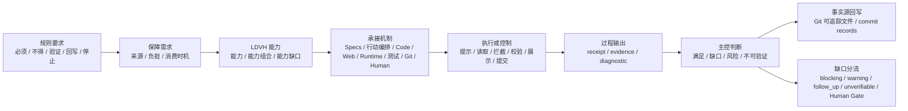
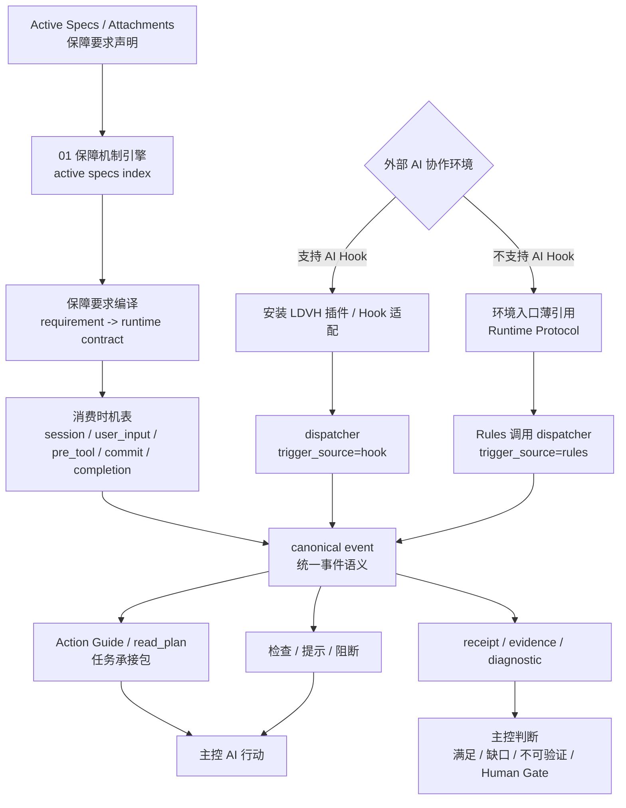
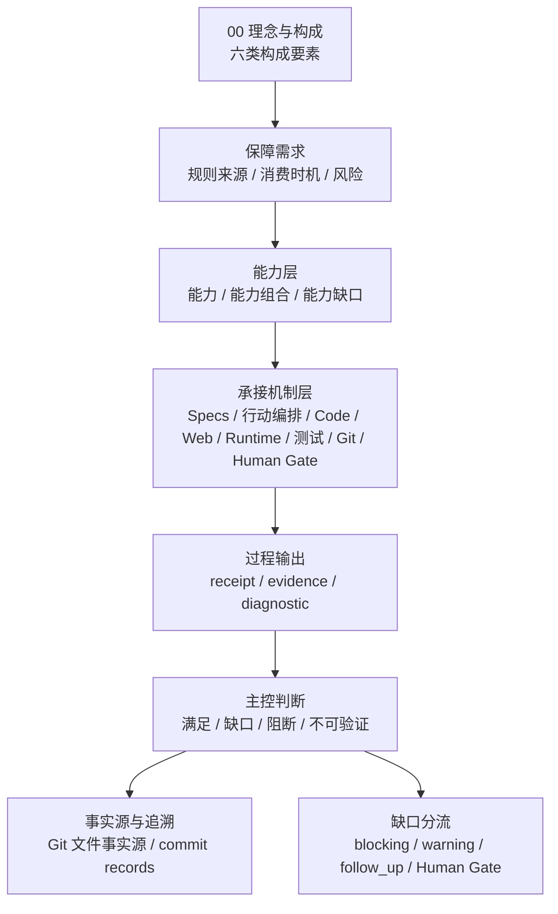
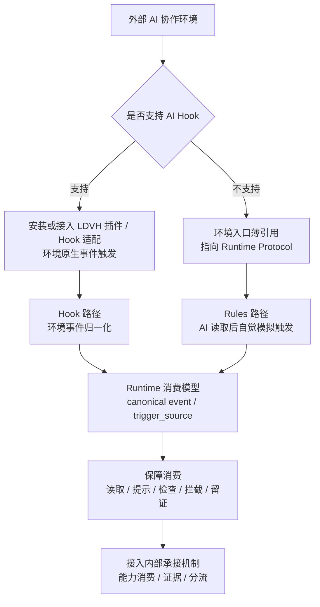
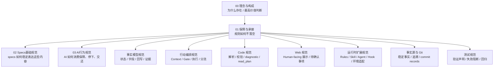
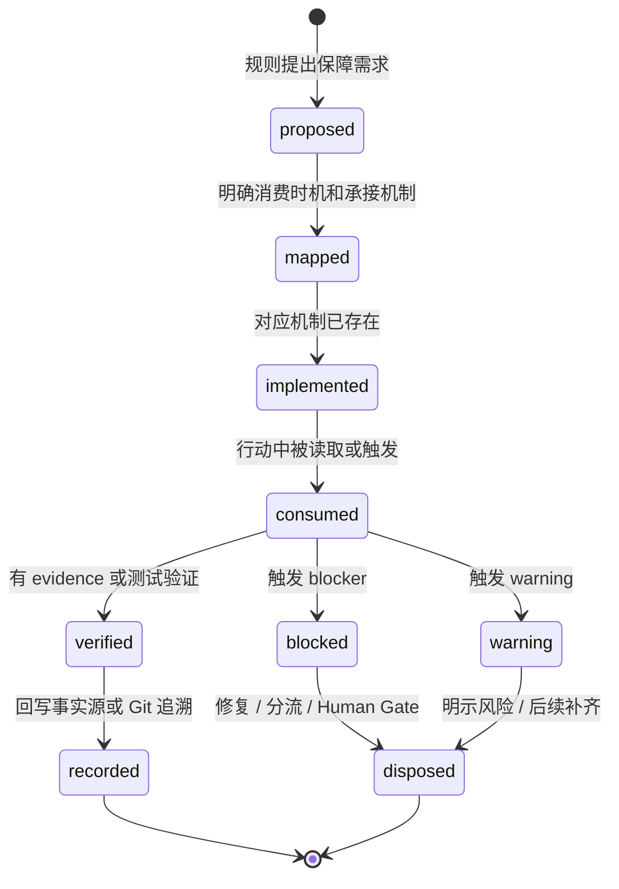
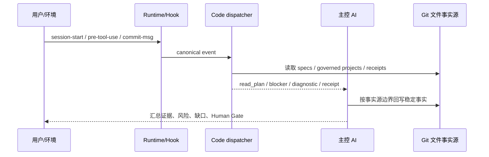

# 01 保障与承接讨论草稿

```yaml
draft:
  status: discussion_draft
  canonical_path: "01-保障与承接-讨论草稿.md"
  target_spec: "specs/01-保障与承接.md"
  purpose: "用于讨论 01 如何承接 V2 中分散出现的保障机制，并形成后续 specs 可消费的技术环节"
  fact_sources:
    - "specs/00-理念与构成.md"
    - "specs/01-保障与承接.md"
    - "v2-hook-mechanism.md"
    - "../ld-vibe-harness/history/specs-v2-migration/PLAN.md"
    - "../ld-vibe-harness/history/specs-v2-migration/MIGRATION-MAP.md"
    - "../ld-vibe-harness/history/specs-v2-migration/V1-UNDERSTANDING-GATE.md"
    - "../ld-vibe-harness/history/specs-v2-migration/V2-ACTIVATION-PLAN.md"
    - "../ld-vibe-harness/history/specs-v2-migration/ACTIVATION-STATUS-2026-06-23.md"
```

> 文件状态：讨论草稿。本文不是正式规范，不替代 `specs/01-保障与承接.md`。本文用于把 V2 的机制经验摊开，帮助逐项讨论 01 的定位、边界和图示。

## 1. 当前判断

00 不是只提出价值判断，而是先通过理念说明 LDVH 为什么存在，再设计六类构成要素来支撑 AI。问题在于：如果 00 之后直接进入 Specs 基础规范或 AI 行为规范，六类构成要素仍然缺少一个共同的“应用保障环节”。

这个环节不是具体实现，也不是第七类构成要素。它保障的是：00 设计出的规范体系、事实模型、行动编排、Code、Web 和运行时扩展，如何真正被后续规范、AI、Code、Runtime、测试、Git 和 Human Gate 应用起来。它应该回答：

1. 哪些规则需要保障；
2. 保障需求如何被表达成可消费结构；
3. 谁在什么时机消费它；
4. 由什么机制接住它；
5. 执行后留下什么 receipt、evidence 或 diagnostic；
6. 失败、缺口、不可验证和 Human Gate 如何处理；
7. 后续 specs 如何引用它，而不是各自重新发明一套保障机制。

因此，01 的核心角色应是：定义并提供 LDVH 的保障机制引擎。在内部，它读取 active specs 中声明的保障需求、消费时机、能力配置和承接规则，把这些声明编译为可消费的运行时契约；在外部，它通过 Runtime Protocol、Code、Hook/Rules、receipt、diagnostic、阻断和分流机制，让规则进入 AI 行动、技术机制、Human Gate 和事实源回写。

也可以压缩为一句讨论口径：01 定义 LDVH 如何形成内部保障能力，并通过外部衔接机制，让规则要求在 AI 行动、技术机制、Human Gate 和事实源回写中被真实承接。

当前更稳定的判断是：能力提供保障，链路完成承接，机制负责落地，证据证明发生过。

这里还需要修正一个前提：01 不能只说“具体实现后续介绍”。V2 的问题之一，就是技术承接出现太晚，导致理念、规范和行为要求有了，但缺少能先搭起来的架构骨架。V3 的 01 应前置一个最小可搭建的保障技术架构：它不锁死具体代码、目录、命令、页面或部署方式，但必须定义 Runtime Protocol、外部接入分流、canonical event、trigger source、receipt / evidence / diagnostic、read_plan / fallback、阻断与分流这些架构契约。

原则可以先写成：01 定义并提供保障机制引擎的最小可运行机制；后续 specs 主要声明可被引擎消费的规则、能力、消费时机和承接配置。只有构成要素专属能力的实现细节，才由 Code、Runtime、行动编排、测试、Web、Git 和环境适配等后续规范继续展开。

这里的“生效”也要分清：spec 转为 active 后，符合 01 契约的保障声明应自动进入 Code / Runtime 的索引、诊断、read_plan、阻断、receipt 和行动指南链路；但 active 不等于代码已实现、Hook 已安装、Rules 已同步、环境已支持、Human Gate 已过或保障已完整生效。

这里需要补入 V2 的一个关键概念：LDVH 能力。V2 的 `04.02-LDVH能力资产与保障机制规范.md` 和 V2 `06-运行时扩展规范.md` 都说明，保障不是只靠链路本身完成的。链路负责承接，能力负责提供保障。更准确的关系应是：

```text
00 构成设计
  -> 保障要求
  -> LDVH 能力 / 能力组合
  -> 承接链路
  -> 运行时触发 / 执行 / 检查 / 留证 / 分流
```

也就是说，01 不能只讲“规则如何不落空”，还要先说明 LDVH 用什么能力让规则有条件不落空。能力可以由规范体系、事实模型、行动编排、Code、Web、运行时扩展、测试、Git 和 Human Gate 共同形成；其中 Rules、Skill、Agent、Hook 等是运行时扩展承载物，不等同于全部 LDVH 能力。

01 可以按两个层面组织：

1. 内部保障：LDVH 自己的六类构成要素如何运转，如何形成能力、能力组合、证据和缺口分流；
2. 外部衔接：LDVH 如何接到 AI 协作环境、Human、Runtime、Hook、Rules、Git、测试、Web 和其它技术机制，使内部能力能被触发、消费、验证和回写。外部衔接至少要区分两种环境：支持 AI Hook 的环境，应安装或接入 LDVH 插件 / Hook 适配，由环境事件强制触发；不支持 AI Hook 的环境，应在环境入口放置薄引用，让 AI 读取 Runtime Protocol 后自觉模拟触发。

这两个层面不是两个互相隔离的模块，而是同一条保障与承接链路的内外两面。内部保障回答“LDVH 凭什么能保障”；外部衔接回答“这些保障如何被外部行动场景正确触发和消费”。

补充判断：Hook 应该在 01 提前出现。原因不是 01 要定义具体 Hook 实现，而是 Hook 代表“规则在运行时被触发、检查、拦截、留证”的技术概念。如果 01 不提前定义 Hook 的抽象位置，后续 AI 行为规范、Code 规范、运行时扩展规范和行动编排规范都会各自补一套入口概念，保障链路会再次后置和分散。

但 01 中出现的 Hook 应是架构契约，不应绑定 V2 的安装部署、目录结构、dispatcher 文件或行动编排成员。V3 中安装部署、运行时扩展和行动编排都可能重构；01 需要定义 Hook 在保障链路中的位置、作用、最小事件语义和生效边界。

## 2. 拟正式结构草稿

下面不是正式规范正文，而是按 02 的“固定头部 + 主体规则区 + 固定尾部”结构，把 01 先重排成可讨论版本。目标是让 01 的主体规则区从发现过程收敛为三层：内部保障、外部衔接、行动指南。

```text
1. 价值判断
2. 权威依据
3. 归口边界
4. 适用范围

5. 内部保障
6. 外部衔接
7. 行动指南

8. 保障措施
9. 验证方法
10. Human Gate
11. Stop Conditions
12. 待补齐事项
```

### 2.1 价值判断

01 的价值，是让 00 设计出的六类构成要素从理念和分工进入可应用状态。它不新增第七类构成要素，也不替代后续 Code、Runtime、行动编排、测试、Web、Git 或 Human Gate 的具体实现；它定义 LDVH 如何形成内部保障能力，并通过外部衔接机制，让规则要求在 AI 行动、技术机制、Human Gate 和事实源回写中被真实承接。

这里的核心口径是：能力提供保障，链路完成承接，机制负责落地，证据证明发生过。

### 2.2 权威依据

01 承接 `specs/00-理念与构成.md`。01 不得重定义 00 的存在理由、AI 第一服务对象、六类构成要素、事实源底层原则或 V1-V10。

01 先定义保障与承接的共同机制；02 负责说明这些内容在 specs 中如何稳定表达；03 负责说明 AI 如何消费保障、识别缺口、暂停和交还。

### 2.3 归口边界

01 归口定义：

1. LDVH 内部如何形成保障能力；
2. 保障需求、能力、承接机制、receipt、evidence、diagnostic 和缺口分流的共同语义；
3. LDVH 如何通过 Runtime Protocol、Hook / 插件路径、Rules / 薄引用路径接入外部 AI 协作环境；
4. Action Guide 如何成为 AI 当前行动的唯一承接入口；
5. 什么情况下不得声称保障已经生效。

01 不归口定义具体 Hook 安装方式、dispatcher 文件路径、完整 payload schema、Web 页面契约、测试用例、Git message 细节、事实模型字段或行动编排流程。相邻内容需要规则时，应进入对应构成要素规范。

### 2.4 适用范围

01 适用于所有需要说明“规则如何不落空”的内容，包括 specs 规则、AI 行为要求、事实对象状态要求、行动编排 Gate、Code 诊断、Web 展示、运行时入口、Hook、Rules、Skill、Agent、Git 追溯、测试验证和 Human Gate。

凡是正式 spec 提出必须、不得、验证、回写、停止、Human 确认、Code 检查、Web 展示或运行时入口要求，都应判断是否形成保障需求，并说明其内部保障、外部衔接、行动指南消费或缺口分流。

## 3. 内部保障

内部保障回答：LDVH 自己凭什么能让 00 的六类构成要素真实发挥作用。它关注 LDVH 内部的能力、能力组合、规则消费、证据和缺口分流。

### 3.1 内部保障定义

规则说明“应该怎样”。保障说明“如何防止规则落空”。能力说明“LDVH 凭什么能提供保障”。承接说明“由哪个构成要素、技术机制或人工门禁接住保障”。

内部保障链路可以先写为：

```text
00 构成设计
  -> 规则要求
  -> 保障需求
  -> LDVH 能力 / 能力组合
  -> 承接机制
  -> receipt / evidence / diagnostic
  -> 主控判断
  -> 事实源回写 / 缺口分流
```

### 3.2 LDVH 能力

LDVH 能力不是单个工具、Hook、Skill、页面或脚本。LDVH 能力是 LDVH 为减少 AI 负担、保障构成要素应用而形成的能力面。能力可以由规范体系、事实模型、行动编排、Code、Web、运行时扩展、测试、Git 和 Human Gate 共同形成。

能力资产或承载物只是能力的具体承载，例如 Rules、Skill、Agent、Hook、Code、Web、命令或测试。01 应定义能力、能力组合和能力缺口的共同口径；具体能力资产登记、安装、schema 和环境适配由后续归口规范承接。

### 3.3 保障需求

保障需求是规则进入技术环节的可消费表达，不是新事实源，也不是新价值来源。保障需求至少应说明：来源、要保障什么、减少哪类 AI 负担、消费时机、所需能力或能力组合、承接机制、证据要求、阻断条件、缺口分流和 Human Gate。

后续 specs 与 01 的关系，不是各自实现保障，而是向 01 定义的保障机制提供可消费配置。后续 specs 负责声明规则、能力需求、消费时机和证据要求；01 负责定义这些声明如何被读取、激活、调度、验证和追溯。

### 3.4 承接机制

承接机制可以由 Specs、行动编排、Code、Web、运行时扩展、测试、Git 和 Human Gate 组合完成。多个机制共同承接同一保障需求时，必须说明主承接位置、输出回指和事实源边界，不得形成互相竞争的权威副本。

承接机制输出默认只是过程输出。它必须回到主控 AI 判断、事实源边界和必要的 Human Gate，不能因为某个机制成功执行就声称规则已经满足。

### 3.5 Receipt、Evidence、Diagnostic

`receipt` 说明某个消费、确认、执行或写入动作发生过。`evidence` 支撑验证、关闭、追溯或 Human 判断。`diagnostic` 是对缺失、失败、风险、不可验证或不一致的结构化判断。

三者默认都不是最终事实源。需要长期追溯时，必须按事实源边界回写，或由 Git commit records 承接。receipt 不等于规则满足，evidence 不等于 Human 授权，diagnostic 不等于最终裁决。

### 3.6 缺口分流与生效边界

保障缺口应至少区分能力缺口、承接缺口、环境缺口、不可验证事项和 Human Gate 未决。缺口处理应使用 blocking、warning、follow_up、unverifiable 或 Human Gate，不得静默。

spec 转为 active 后，符合 01 契约的保障声明应自动进入 Code / Runtime 的索引、诊断、read_plan、阻断、receipt 和 Action Guide 链路；但 active 不等于代码已实现、Hook 已安装、Rules 已同步、环境已支持、Human Gate 已过或保障已完整生效。

## 4. 外部衔接

外部衔接回答：LDVH 如何接入 AI 协作环境、Runtime、Hook、Rules、Git、测试、Web 和 Human-facing 场景，使内部保障能力能被触发、消费、验证和回写。

### 4.1 外部衔接定义

外部衔接不是第二套保障体系，而是内部保障进入外部行动场景的入口层。它把 LDVH 的保障需求、能力和承接机制归一到 Runtime Protocol、canonical event、trigger source、receipt、diagnostic 和阻断分流中。

01 应提前定义外部衔接的技术概念，但不锁死具体实现。V3 的安装部署、运行时扩展和行动编排都可以变化；01 要稳定的是架构契约。

### 4.2 Runtime Protocol

Runtime Protocol 是 LDVH 对 AI 协作环境暴露的统一生命周期协议。不同环境可以有不同触发方式，但最终必须归一到同一套保障消费语义，不能形成两套规则。

01 应定义最小 canonical event 和 trigger source 语义。候选最小事件包括 `session-start`、`acknowledge-read-plan`、`user-input` 或等价入口、`pre-tool-use`、`git.commit-msg`、`external-output-intake`、`diagnostic-disposition` 和 `completion-claim`。

### 4.3 支持 AI Hook 的环境

支持 AI Hook 的环境，应安装或接入 LDVH 插件 / Hook 适配。环境原生事件先进入 Hook / adapter，再归一为 LDVH canonical event，由 dispatcher 或等价机制消费保障需求、生成 read_plan、检查、阻断、receipt 和 diagnostic。

Hook 在 01 中是运行时触发的保障消费入口。Hook 可以用于提示、读取、检查、拦截、生成 receipt 或 diagnostic；但 Hook 输出不自动成为事实源，Hook 成功不等于规则满足，Hook 不得替代 Human Gate、主控 AI 判断或具体实现规范。

### 4.4 不支持 AI Hook 的环境

不支持 AI Hook 的环境，应在环境入口放置薄引用，指向 Runtime Protocol。AI 读取后通过 Rules 路径自觉模拟触发同一套 Runtime 消费模型。

薄引用不是第二规则源，也不是把保障责任完全交给 AI 自觉。它只是让不支持 Hook 的环境仍能看见 LDVH Runtime Protocol，并用 Rules 路径进入同一套 canonical event、receipt、diagnostic 和阻断分流语义。

### 4.5 外部衔接不得固化的内容

01 不应固化具体 Hook 安装方式、插件目录结构、adapter 文件名、dispatcher CLI、payload 完整字段、receipt 文件路径、环境专属配置、Web 页面、测试用例或 Git commit-msg 细节。

这些内容应由 Code、运行时扩展、行动编排、测试、Web、Git 和环境适配规范承接。01 只定义它们必须回到同一套保障消费语义，并说明不得声称生效的边界。

## 5. 行动指南

行动指南回答：AI 每次行动前最终拿到什么。它是内部保障与外部衔接的 AI 消费形态，不是第三套系统。

### 5.1 Action Guide 定位

Action Guide 应归入 01 的机制层。它不是静态提示文本，而是保障机制根据 active specs、当前目标、消费时机、能力缺口、Human Gate 和环境入口生成或组织的行动约束。

Action Guide 是 AI 当前行动的唯一承接入口。后续 specs 可以配置 Action Guide 应引用哪些规则、流程、事实源和验证方式，但不得另建与 01 并列的行动入口机制。

### 5.2 吸收原知识地图能力

V3 不应继续保留“知识地图”作为独立体系。V2 中由知识地图承担的能力，应并入 Action Guide，成为 Action Guide 的只读关系定位能力。

Code 可以基于 active specs、附件、事实对象、关系和 Git 信息生成定位、关系、影响判断和来源回指，但这些输出不构成独立系统，也不得升级为事实源。它们只是 Action Guide 生成行动约束时使用的内部输入。

### 5.3 Action Guide 输入

Action Guide 的输入可以包括：active specs、授权附件、当前用户目标、target、cwd、session_id、trigger_source、read_plan_consumed 状态、能力缺口、Human Gate 状态、事实源回指、Code 关系定位输出和 Runtime receipt。

输入不足时，Action Guide 必须暴露 missing_fields、capability_gap、unverifiable 范围或 Stop Conditions，不能生成看似完整但不可验证的行动约束。

### 5.4 Action Guide 输出

Action Guide 至少应输出 AI 当前应该读取什么、先做什么、何时停止、如何验证、如何分流。候选字段包括 `task_read_plan`、`next_queries`、`stop_conditions`、`validation_guard`、`next_action`、`missing_fields`、`capability_gap`、`impact_summary` 和 `source_refs`。

若关系定位能力可用，应优先使用关系定位输出中的读取计划和影响判断；若关系定位不可用、无结果、来源不可回指或输出不足，Action Guide 必须使用 fallback read_plan，并显式暴露能力缺口或不可验证范围。

### 5.5 Action Guide 边界

Action Guide 不替代 AI 主控判断、Human Gate、事实源、Hook 实际拦截、测试验证或具体行动编排。Action Guide 输出是行动承接包，不是授权器、事实源或完成证明。

AI 按 Action Guide 行动时，仍必须保留价值判断、归口判断、风险判断、验证声明和 Human Gate 交还责任。

## 6. 三层关系图



这张图把三层关系压成一条链：内部保障说明 LDVH 凭什么保障，外部衔接说明保障如何被环境触发和消费，行动指南说明 AI 当下如何执行和停止。

## 7. 正式 01 初稿目录建议

```text
1. 价值判断
2. 权威依据
3. 归口边界
4. 适用范围

5. 内部保障
  5.1 内部保障定义
  5.2 LDVH 能力
  5.3 保障需求
  5.4 承接机制
  5.5 Receipt / Evidence / Diagnostic
  5.6 缺口分流与生效边界

6. 外部衔接
  6.1 外部衔接定义
  6.2 Runtime Protocol
  6.3 支持 AI Hook 的环境
  6.4 不支持 AI Hook 的环境
  6.5 不得固化的实现细节

7. 行动指南
  7.1 Action Guide 定位
  7.2 吸收原知识地图能力
  7.3 Action Guide 输入
  7.4 Action Guide 输出
  7.5 Action Guide 边界

8. 保障措施
9. 验证方法
10. Human Gate
11. Stop Conditions
12. 待补齐事项
```

## 8. 参考材料：V2 机制与历史判断

### 8.1 V2 中保障机制出现的位置

V2 不是没有保障机制，而是保障机制分散且出现较晚：

| V2 位置 | 承担的保障能力 | 对 01 的启发 |
|---|---|---|
| `PLAN.md` | 定义 V1-V10、六类构成要素、只读关系派生、迁移门禁和禁止事项 | 01 必须把构成要素的应用条件转成可执行、可验证、可禁止的承接规则；V3 应把 V2 的只读关系定位能力并入 Action Guide |
| `V1-UNDERSTANDING-GATE.md` | 要求迁移前确认 v1 机制性契约的去向、消费方、验证方式和 Human Gate | 01 应定义“机制不能因文件减少而消失”的保障口径 |
| `MIGRATION-MAP.md` | 用覆盖矩阵控制迁移来源、目标、状态、阻断和 Human 核对 | 01 应支持 coverage / takeover / blocker / review 这类承接状态 |
| `V2-ACTIVATION-PLAN.md` | 定义 active 切换前置条件、入口切换、回滚、历史化和完成标准 | 01 应定义保障从规则到入口切换、证据和回滚的共同链路 |
| `ACTIVATION-STATUS-2026-06-23.md` | 记录切换完成、验证结果、Web 后置、历史价值提取计划 | 01 应区分完成、后置、不可替代事实源和验证证据 |
| `04.01-规范保障声明规范.md` | 定义正式规范如何提出保障要求 | 01 应保留“规则先声明保障要求”的入口 |
| `04.02-LDVH能力资产与保障机制规范.md` | 定义 LDVH 如何用能力资产和能力组合保障规范要求 | 01 应吸收“能力提供保障”的中间层 |
| V2 `06-运行时扩展规范.md` | 定义运行时扩展承载物、能力保障链路、能力缺口分流和环境适配 | 01 应抽象能力、承载物、环境接入与承接链路的边界 |
| `v2-hook-mechanism.md` | 展示 session-start、read_plan、acknowledge、pre-tool-use、commit-msg、receipt 和阻断 | 01 应抽象 Runtime/Hook 如何消费保障需求，而不是只描述单一 hook 实现 |

最关键的 V2 经验是：保障不是一个点，而是一条链；链上任何一段缺失，AI 都容易把规则误认为“已经生效”。

同时，V2 的安装部署、运行时入口和行动编排结构不应被 01 直接继承。它们在 V3 中可以变化。01 应吸收的是 V2 暴露出的技术架构契约和保障问题：能力、能力组合、能力缺口、Runtime Protocol、外部接入分流、canonical event、trigger source、入口触发、上下文读取、规则消费、执行前检查、提交前检查、receipt、diagnostic、阻断和降级。

### 8.2 V2 机制盘点图



这张图说明：V2 的保障能力已经存在，但它们分散在多个规范和运行时入口中。V3 的 01 应把这些能力提前抽象为共同承接规则。

### 8.3 01 应定义的核心链路



这里的重点不是把所有实现写进 01，而是定义后续 specs 必须如何说明自己的保障链路。

### 8.4 01 最小可搭建技术架构

01 应先定义最小可搭建技术架构。这个架构允许 LDVH 在后续规范、能力资产和具体实现尚未完全成熟时，先具备统一入口、统一事件语义、统一回执证据和统一阻断分流。

必须在 01 定义：

| 架构项 | 01 中必须说明 |
|---|---|
| Runtime Protocol | LDVH 对 AI 协作环境暴露的统一生命周期协议；不同环境最终归一到同一套消费语义 |
| 外部接入分流 | 支持 AI Hook 的环境走 LDVH 插件 / Hook 适配；不支持 AI Hook 的环境走环境入口薄引用 + Rules 自觉触发 |
| canonical event | LDVH 内部消费的统一事件层；最小集合可先保留 `session-start`、`acknowledge-read-plan`、`pre-tool-use`、`git.commit-msg` |
| trigger source | 同一 canonical event 可来自 `hook` 或 `rules`，但不得形成两套规则 |
| read_plan 与 fallback | Runtime 应提供读取计划；无有效 read_plan 时必须有 fallback，AI 不得确认空 read_plan 后继续写入或提交 |
| receipt / evidence / diagnostic | 定义最小语义和事实源边界；receipt 不替代事实源、验证证据或 Human Gate |
| 最小阻断 | target 不明确、管辖项目写入前缺少读取消费证据、提交前缺少必要运行证据时，应阻断或交还 |
| 缺口分流 | 能力缺口、承接缺口、环境缺口、不可验证和 Human Gate 未决必须分流，不得声称已生效 |

可以在 01 命名但不展开：

| 名称 | 后续归口 |
|---|---|
| Hook adapter / payload normalization / dispatcher | Code 与运行时扩展 |
| session receipt 存储位置 / payload_present 烟测 | 运行时扩展、环境适配、测试 |
| target resolution / Git common-dir 身份匹配 | Code、Git 追溯、运行时扩展 |
| skill_plan / skill_plan_hint | Skill、Runtime、行动编排 |
| 固定运行时扩展登记 / 环境适配字段 / 部署检查 | 运行时扩展 |

必须后置到对应构成要素规范：

| 实现内容 | 后置原因 |
|---|---|
| 具体 Hook 安装方式、插件目录结构、环境专属配置路径 | 属于环境适配和部署实现 |
| dispatcher 文件路径、代码实现、CLI 参数和完整 payload 字段枚举 | 属于 Code / Runtime 实现 |
| receipt 文件真实路径和完整 schema | 属于运行时扩展、事实源边界和 Code schema |
| Web 页面契约、测试用例组织、Git commit-msg 校验细节 | 属于 Web、测试、Git 和 Code |
| 具体行动流程步骤和关闭判断 | 属于行动编排和事实模型 |

#### 8.4.1 保障机制引擎

01 的机制不应只是文本约定，而应形成 LDVH 保障机制引擎。这个引擎的最小职责是：

1. 扫描 active specs 和授权附件，建立 `active specs index`；
2. 读取 specs 中声明的保障需求、消费时机、能力配置、承接机制、证据要求和阻断条件；
3. 将保障声明编译为 Runtime Protocol、canonical event、read_plan、检查、阻断、receipt、diagnostic 和 Action Guide 可消费的结构；
4. 在 session、用户输入、工具调用前、提交前、外部输出接收、诊断处理和完成声明前等时机触发消费；
5. 输出 read_plan、fallback、stop_conditions、diagnostics、receipt、evidence 回指和 next_action；
6. 将能力缺口、承接缺口、环境缺口、不可验证事项和 Human Gate 未决分流到对应承接位置。

后续 specs 与 01 的关系不是各自实现保障，而是向保障机制引擎提供配置。后续 specs 负责声明规则、消费时机、能力需求、承接位置、证据要求和阻断条件；01 负责定义这些声明如何被读取、激活、调度、验证和追溯。Code、Runtime、行动编排、测试、Web、Git 等规范可以扩展各自归口的实现细节，但不得重新定义一套与 01 并列的保障生效机制。



#### 8.4.2 后续 specs 的配置字段

后续 specs 应以结构化声明接入 01 保障机制引擎。字段名称可以在 02 中规范化，但 01 应定义这些配置项的语义：

| 配置项 | 作用 |
|---|---|
| `requirement_id` | 稳定保障需求 ID |
| `source_spec` / `source_refs` | 来源规范、章节、附件或事实对象 |
| `requirement` | 要保障什么，减少哪类 AI 负担 |
| `consumption_timing` | 什么时候消费 |
| `canonical_event` | 对应运行时事件 |
| `mechanism` | 提示、读取、检查、阻断、Gate、回写或展示 |
| `capability` / `capability_gap` | 需要的 LDVH 能力、能力组合或缺口 |
| `evidence` | 证据或回执应回指哪里 |
| `blocking_conditions` | 什么情况下阻断当前行动或完成声明 |
| `diagnostic_policy` | warning、blocker、follow_up、unverifiable 如何报告和分流 |
| `human_gate` | 是否需要 Human 确认、授权或风险接受 |

#### 8.4.3 Action Guide

升级版行动指南应归入 01 的机制层。它不是静态提示文本，而是保障机制引擎根据 active specs、当前目标、消费时机、能力缺口、Human Gate 和环境入口生成或组织的行动约束。

V3 不应继续保留“知识地图”作为独立体系。V2 中由知识地图承担的能力，应并入 Action Guide，成为 Action Guide 的只读关系定位能力。也就是说，Code 可以基于 active specs、附件、事实对象、关系和 Git 信息生成定位、关系、影响判断和来源回指，但这些输出不再构成独立系统，而是 Action Guide 生成行动约束时使用的内部输入。

Action Guide 应包含 V2 只读关系定位能力提供的 `read_plan`、`next_queries`、`stop_conditions`、`impact_summary` 和来源回指，并把它们组织成 AI 当前应该读取什么、先做什么、何时停止、如何验证和如何分流的行动约束。

若 Action Guide 的关系定位能力可用，应优先使用关系定位输出中的读取计划和影响判断；若关系定位不可用、无结果、来源不可回指或输出不足，Action Guide 必须使用 fallback read_plan，并显式暴露能力缺口或不可验证范围。关系定位输出不得替代 Action Guide，Action Guide 也不得把关系节点、边或派生视图升级为事实源。

```text
用户输入
  -> AI 初步识别 intent / target
  -> 调用 01 保障机制引擎
  -> Code 读取 active specs，并按需生成 Action Guide 关系定位输出
  -> Action Guide 整合 read_plan / next_queries / stop_conditions / impact_summary
  -> 返回 task_read_plan / missing_fields / validation_guard / next_action
  -> AI 按 Action Guide 行动，并保留主控判断责任
```

Action Guide 不替代 AI 主控判断、Human Gate、事实源或具体行动编排。后续行动编排 specs 可以配置具体场景下 Action Guide 应引用哪些规则、流程、事实源和验证方式，但不得另建与 01 并列的行动入口机制。

### 8.5 内部保障底图



这张图只讨论 LDVH 内部如何形成保障能力：00 设计六类构成要素，规则提出保障需求，LDVH 通过能力和能力组合提供保障，再由承接机制、过程输出、主控判断、事实源追溯和缺口分流完成内部闭环。

### 8.6 外部衔接底图



这张图只讨论 LDVH 如何接入外部环境：最小技术架构提前出现，具体实现归口后置。Runtime Protocol、Hook、Rules、插件 / Hook 适配、环境入口、canonical event 和 trigger source 必须在 01 中出现，否则“外部衔接”没有可搭建的技术骨架；同时 01 必须提前说明外部环境有两种接入条件：

1. 支持 AI Hook 的环境：安装或接入 LDVH 插件 / Hook 适配，由环境原生事件触发，再进入 LDVH Runtime 消费模型；
2. 不支持 AI Hook 的环境：在环境入口放置薄引用，指向 Runtime Protocol；AI 读取后，以 Rules 路径自觉模拟触发同一套 Runtime 消费模型。

两条路径都应归一到同一套保障消费语义，不能形成两套规则。01 应定义 canonical event 的最小集合和 trigger source 语义；具体 payload、handler、dispatcher、receipt 路径、安装部署和环境适配由后续 Code、Runtime、测试和运行时扩展规范承接。

### 8.7 01 与后续 specs 的关系



建议口径：

1. 00 定义“为什么必须有保障与承接”；
2. 01 定义“保障与承接是什么，怎样表达，怎样分流”；
3. 02 定义“specs 中怎样写得可解析、可引用、可检查”；
4. 03 定义“AI 在行动中怎样遵守、判断、暂停、交还”；
5. 后续构成要素规范定义“本归口如何具体承接”。

其中 Hook 的归口建议是：

1. 01 定义 Hook 的抽象位置：运行时触发的保障消费入口；
2. 01 定义 Hook 不得替代什么：不得替代事实源、Human Gate、主控 AI 判断或具体实现规范；
3. Code / 运行时扩展规范定义 Hook 的具体事件、payload、adapter、dispatcher、receipt 存储和环境适配；
4. 行动编排规范定义 Hook 触发后如何进入 Context、Gate、执行、证据和分流；
5. 测试和 Git 规范定义 Hook 结果如何验证、追溯和提交。

### 8.8 01 应该收敛的概念

#### 8.8.1 规则、保障、能力、承接、实现、证据

| 概念 | 回答的问题 | 是否归 01 |
|---|---|---|
| 规则 | 应该怎样 | 不归 01 独占，由各 spec 定义 |
| 保障 | 如何防止规则落空 | 归 01 定义共同表达 |
| 能力 | LDVH 凭什么能提供保障 | 归 01 定义基础概念和分流边界，具体能力归各构成要素 |
| 承接 | 由谁、何时、用什么机制接住 | 归 01 定义共同边界 |
| 实现 | 具体代码、Hook、页面、命令、流程怎么做 | 不归 01，进入对应构成要素 |
| 证据 | 如何证明发生过、通过过、被确认过 | 01 定义基础语义，具体归事实源、Git、测试、行动编排 |

这里需要进一步区分：Hook 作为“技术概念”归 01 提前定义；Hook 作为“具体实现”不归 01。01 可以说 Hook 是运行时保障入口，但不能说必须使用某个安装方式、某个脚本、某个目录或某个 V2 事件清单。

能力也需要分层：

| 层级 | 含义 | 01 中的处理 |
|---|---|---|
| LDVH 能力 | LDVH 为减少 AI 负担、保障构成要素应用而具备的能力面 | 01 应提前定义 |
| 能力组合 | 多种能力共同保障一个要求 | 01 应定义组合与缺口分流口径 |
| 能力资产 / 承载物 | Rules、Skill、Agent、Hook、Code、Web、命令、测试等可维护或可触发承载 | 01 只定义边界，具体登记归对应构成要素 |
| 环境能力 | Codex、Claude Code、CI、IDE、Shell 等外部环境提供的入口或机制 | 不是 LDVH 能力本体，归运行时扩展适配 |

这意味着 01 中的 Hook 不只是“链路节点”，而是某类能力进入运行时触发入口的承载方式。Hook 的概念可以提前出现，但 Hook 资产、Hook 安装、Hook 事件映射和环境适配不应在 01 固化。

#### 8.8.2 Receipt、Evidence、Diagnostic

| 输出 | 定位 | 风险 |
|---|---|---|
| `receipt` | 说明某个消费、确认、执行或写入动作发生过 | 容易被误认为规则已经满足 |
| `evidence` | 支撑验证、关闭、追溯或 Human 判断的证据 | 容易被误认为 Human 授权 |
| `diagnostic` | 对缺失、失败、风险、不可验证或不一致的结构化判断 | 容易被误认为最终裁决 |

01 应明确：三者默认都是过程输出，不自动成为最终事实源。需要长期追溯时，必须按事实源边界回写，或由 Git commit records 承接。

### 8.9 01 最小内容建议

第一版 01 可以围绕八个问题组织：

1. 为什么 01 存在：保障 00 设计出的六类构成要素能够被真实应用；
2. 保障需求是什么：不是新事实源，不是第七构成要素；
3. LDVH 能力是什么：能力提供保障，能力资产或承载物只是能力的具体承载；
4. 最小字段是什么：需求 ID、来源、消费时机、能力/能力组合、承接机制、证据、阻断、分流；
5. 消费时机是什么：session start、行动前、写入前、提交前、接收外部输出、完成声明等；
6. 承接机制有哪些：Specs、行动编排、Code、Web、Runtime、测试、Git、Human Gate；
7. 输出怎么判断：receipt、evidence、diagnostic 的语义和不得替代边界；
8. 缺口怎么处理：能力缺口、承接缺口、blocking、warning、follow_up、unverifiable、Human Gate、Stop Conditions。

### 8.10 当前 01 可能还需要继续理清的问题

#### 8.10.1 01 是不是应该显式定义“保障需求生命周期”

候选生命周期：



待讨论：这个生命周期是否放入 01 正文，还是交给后续行动编排 / Code / 事实源规范承接。

#### 8.10.2 01 是否需要定义“承接强度”

可能存在四层强度：

| 强度 | 含义 | 例子 |
|---|---|---|
| `inform` | 提醒 AI 读取或注意 | read_plan、Rules 提示 |
| `check` | Code、测试或审查检查 | specs 字段校验、附件闭集检查 |
| `block` | 缺失时阻断行动或完成声明 | pre-tool-use、commit-msg、测试失败 |
| `gate` | 必须 Human 确认 | 高影响变更、风险接受、验收关闭 |

待讨论：承接强度是否应成为保障需求最小字段，还是只作为 `承接机制` 的属性。

#### 8.10.3 01 是否应该把 Hook 机制抽象成 Runtime 消费模型

结论倾向：应该。Hook 应作为 01 中提前出现的技术概念。

V2 Hook 不是 01 要照搬的实现细节，但它暴露了 01 必须回答的问题：



建议 01 只定义这类消费模型，并明确以下边界：

1. Hook 是运行时触发的保障消费入口；
2. Hook 可用于提示、读取、检查、拦截、生成 receipt 或 diagnostic；
3. Hook 输出不自动成为事实源；
4. Hook 成功不等于规则满足；
5. Hook 不得替代 Human Gate；
6. 具体 event、payload、dispatcher、receipt 文件位置、安装部署和环境适配交给运行时扩展和 Code 规范；
7. Hook 触发后的行动组织交给行动编排规范。

这样做可以让技术概念提前出现，同时避免把 V2 的安装部署和行动编排结构锁死到 V3。

### 8.11 建议讨论顺序

1. 先确认 01 的一句话定位：规则进入技术承接的共同入口；
2. 再确认 01 不承接什么：不写具体实现、不替代 Code/Web/Runtime/测试/Git；
3. 再确认核心链路图是否成立；
4. 再确认最小字段是否过重或缺项；
5. 再确认消费时机闭集；
6. 再确认 receipt/evidence/diagnostic 的边界；
7. 最后决定哪些图进入正式 01，哪些保留为讨论材料或附件。

基于子 Agent 审阅后的新讨论顺序可以改为：

1. 先确认 01 的一句话定位：内部保障能力 + 外部衔接承接；
2. 再确认四个核心概念：能力、保障、承载物、承接；
3. 再确认内部保障图：六类构成要素如何形成能力、证据和分流；
4. 再确认外部衔接图：Runtime、Hook、Rules、环境入口如何提前出现；
5. 再确认哪些技术概念进 01，哪些 V2 实现细节必须后置；
6. 最后再决定正式 01 的章节顺序和附件边界。

### 8.12 第一轮待定问题

| 问题 | 倾向 | 需要 Human 判断 |
|---|---|---|
| 01 是否命名为“保障与承接” | 是 | 已基本确认 |
| 01 是否放在 02 Specs 基础规范之前 | 是 | 已基本确认 |
| 01 是否显式使用 Mermaid 图 | 是 | 需决定哪些图进入正式规范 |
| “承接强度”是否进入最小字段 | 暂不确定 | 需要讨论字段负担 |
| “保障需求生命周期”是否进入正文 | 暂不确定 | 需要讨论是否过度实现化 |
| Hook 是否在 01 中出现 | 是，作为提前技术概念和 Runtime 保障消费入口 | 需继续限定不得固化 V2 实现 |
| 01 附件是否只保留表格/矩阵 | 是 | 应继续遵守附件不承载主规则 |
