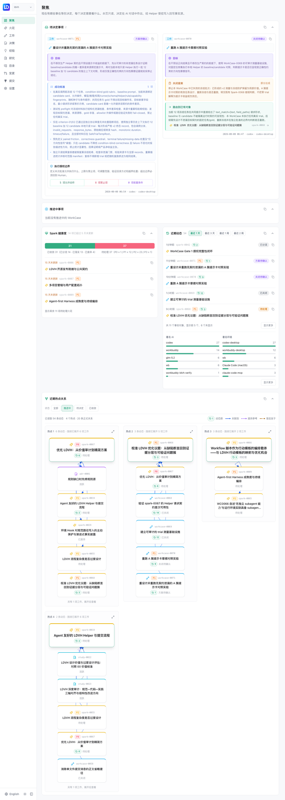
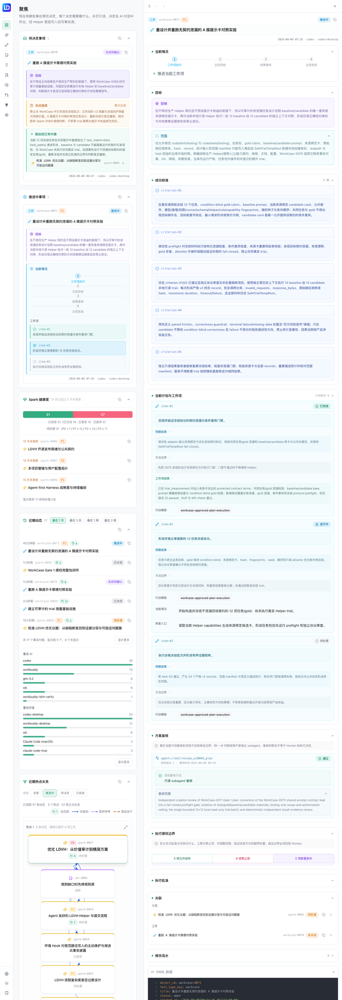
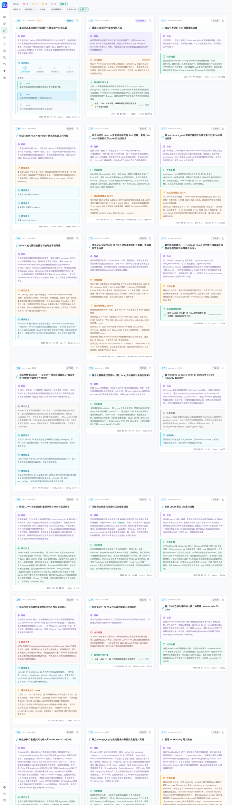

# LDVH — LD Vibe Harness

<p align="center">
  
</p>

**Version: v4.0.1** — 完善阶段增量发布。能力结构已建立，部分功能仍在收敛中，完善阶段将持续推进并在后续版本收敛稳定保证。

LDVH 以**环境 Skill（薄 Skill）**的身份部署到 AI 开发环境（如 Claude Code、Codex、Cindy、Trae 等），通过一个轻量路由文件将落入 LDVH 领域的工作引导至仓库中的 Helper CLI。**它是 AI 开发环境的"插件"而非独立运行的程序**——你不需要安装或启动任何服务，只需在 AI 环境启用 LDVH Skill，AI 便会自动按规则引导你完成受控操作。

LDVH 以 AI 执行者为第一服务对象，帮助 AI 在长期项目中保持**判断有据、行动可续、结果可验**；同时直接服务 Human，使决策提请清晰可决、授权执行受控可续、入档闭环节点可验，并让项目演进脉络可循。积累效用如何直观可见仍是当前明确待加强的能力，不因事实对象、提交或页面存在就宣称已经实现。

它由规范（Specs）、事实对象（Fact Objects）与行动模板（Action Templates）构成，以源码仓库为能力本体，通过薄 Skill、Helper CLI、必部署的 Git Hook、其承接的 Git Gate 和 Web 界面交付，适用于需要 AI 跨会话保持一致、Human 返回后能够核查并接续，以及在不同 AI 开发环境中复用规则的长期项目。

## 管辖项目与 `ldvh-base/`

当 LDVH 部署到你的项目时，AI 会在项目根目录下创建一个 **`ldvh-base/`** 文件夹，用于存放该项目的**事实对象（Fact Objects）**——即项目演进过程中产生的关键决策记录、验证证据、工作案例与经验教训等结构化信息。`ldvh-base/` 是 LDVH 管辖项目的"事实档案库"，所有事实对象按类型分目录存储（`adrs/`、`pitfalls/`、`sparks/`、`studies/`、`workcases/`），由 Git Gate 确保每次新增或修改都有完整的签名链和变更追溯。

部署后，你的项目将拥有自己的事实资产，与 LDVH 本体的 `ldvh-base/` 相互独立，互不干扰。

---

## 快速开始

### 取得源码

LDVH 默认不打包、不安装本体，也不需要 pip。源码仓库就是能力本体：

```bash
git clone https://github.com/dingminhua/ld-vibe-harness.git
cd ld-vibe-harness
```

若已经有源码仓库，记录其 remote（存在时）、当前 revision 与工作树状态。稳定源码入口是仓库根目录的 `ldvh`，不要用 PATH 中来源不明的同名命令或既有 distribution console entry point 替代，也不要构建或安装 wheel、sdist、editable distribution。

先用 `./ldvh capabilities </dev/null` 验证入口并发现当前公开能力。所有 Helper 入口均无条件读取 stdin 至 EOF，在 AI 环境或无 tty 的自动化中调用时必须闭合 stdin。若入口报告第三方库缺失，按 `requirements.txt` 准备运行依赖；这不等于打包或安装 LDVH 本体。

当前已验证平台为 **macOS** 与 **Windows**（受控写入，`file_only` 耐久，仅限 NTFS fixed drive）。Windows 的仓库入口、运行依赖、路径写法与 Git Hook 执行能力已在目标平台实测通过（证据见 study-0025）。其它平台按未验证范围处理。

### 更新

`git pull` 后在任一已接入环境告诉 AI「LDVH 更新了」即可：由 AI 按下述规则判断变化类型、只重放受影响部署件，并完成重验。手动判断时遵循：

- 规范与规则源更新：仓库入口现取现用；仍需按受影响范围复核行为，不安装 LDVH 包；
- `skill/SKILL.md` 变化：将各环境部署件与新模板逐字节比对，过期者重新部署；
- 源码 launcher、运行依赖声明、Git Hook 管理实现或 Git Gate 核心入口变化：验证源码入口，并按目标 common-dir 重新检查或部署承接 Git Gate 的 Git Hook；
- 上述处理后按 specs/09 §6.5 与 specs/attachments/09.Att.02 重验受影响范围，不沿用旧验证结论。

## 启动 Web（本地开发）

需要 Node.js（含 npm）。在仓库根目录执行：

```bash
cd web
npm ci
npm run dev
```

按当前本地开发脚本，前端固定监听 [http://127.0.0.1:5173](http://127.0.0.1:5173)；端口被占用时会启动失败。本地 API 默认使用 `3001`，可由 `PORT` 覆盖；如已通过环境变量调整 API 目标或端口，以实际输出和配置为准。

> `npm run dev` 会同时启动前端（Vite）与后端（nodemon + tsx）。在 Windows 上若需分开管理，可分别执行 `npm run client:dev`（前端）与 `npm run server:dev`（后端）。

## 界面一览

Web 界面帮助 Human 如实查看当前项目状态、待决定事项和可核查节点，不建立第二事实源。

<p align="center"><strong>感知中心 — 项目全貌：待决定事项、推进中工作、近期动态、Spark 池健康</strong></p>
<p align="center"></p>

<p align="center"><strong>聚焦视图 — 收缩侧边栏、展开扩展阅读面板，聚焦当前 WorkCase 的判定依据与执行计划</strong></p>
<p align="center"></p>

<p align="center"><strong>WorkCase 管理 — 卡片列表概览，按状态、优先级、进展筛选</strong></p>
<p align="center"></p>

---

### Windows 注意事项

- **前置要求**：`ldvh` 是 POSIX 脚本，Windows 上通过 `sh -c exec` 包装调用，要求系统中有 Git Bash 的 `sh` 在 PATH 中。
- **技能部署**：在 Cindy/Codex 环境（Windows）下，技能文件必须使用目录格式（`~/.codex/skills/<name>/SKILL.md`），不支持 Claude Code 原生的扁平 `.md` 格式。详见 `ldvh-base/pitfalls/pitfall-0007.yaml`。

### 接入 AI 开发环境

环境接入的完整流程包含四项工作：**环境接入（取得源码、确认必需入口、部署薄 Skill） → 管辖配置 → Git Hook 部署 → 验证**。

将以下提示复制给你的 AI 开发环境（如 Codex、Cindy、WorkBuddy、Trae 等）：

可复制给目标环境 AI 的提示：

> 请阅读 README，完成 LDVH 的环境接入、管辖配置、Git Hook 部署与验证，并如实报告已验证与未验证的范围。

执行该提示的 AI 请注意：权威流程不在本文件。取得并确认源码仓库后，先读取环境接入面附件，再经源码 launcher 的 `read-action-template-candidates` 定位，并经 `read-action-template-content` 读取当次环境接入行动模板，照模板执行；
全部入口的调用契约以 `specs/attachments/09.Att.01-环境接入面.md` 当次内容为准；
薄 Skill 部署件必须与 canonical 模板 `skill/SKILL.md` 逐字节一致；目标项目必须按 02 建立或核验管辖配置并取得当次解析结果；承接 Git Gate 的 Git Hook 必须部署到目标 Git common-dir。环境接入、管辖配置、Git Hook 部署与验证都是完整接入的必需工作，不能二选一。

AI 完成部署后应提示你执行以下操作：

1. **确认技能已加载** — 在 AI 环境设置中确认已部署的 LDVH Skill 已启用，且其可见会话范围覆盖目标会话
2. **确认管辖成立** — 对目标工作对象执行当次管辖解析，确认配置来源、结果与范围
3. **验证真实递达** — 启动一次新会话，确认 AI 实际经路由取得 LDVH 规则引导与行动模板，而非来自历史上下文恢复（hydrate）
4. **验证最终闸门** — 在共享目标 common-dir 的主 worktree 与一个 linked worktree（存在时）中触发代表性真实 Git 事件，确认 Git Gate 分别绑定 actual worktree、当次 Index 与 commit message

一次 common-dir 部署覆盖主 worktree、现有 linked worktree 和以后新建的 linked worktree；新 linked worktree 不需要重复部署。纳入接入目标的独立 clone 因 common-dir 不同，必须单独部署和验证；未纳入目标时不要求为验收而创建 clone。仅完成文件复制或 Git Hook 静态部署不等于完整接入已经成立。

### 诊断已有工作区

源码模式 doctor 由 `./ldvh doctor` 调用，参数合同以 09.Att.01 和 `./ldvh doctor --help` 为准。Doctor 只诊断当前源码仓库、显式工作区和已交付入口的静态状态，不扫描目标 AI 环境，也不证明环境已经接入或完成真实验证。

---

## 为什么需要 LDVH？

AI 在长期项目中常见的问题：

- **上下文断裂** — 新会话丢失了之前的判断和决策，需要重复讨论
- **经验丢失** — 踩过的坑没有记录，下次可能再犯
- **行动不可追溯** — 不清楚某个决定是怎么做出的，依据是什么
- **跨环境不一致** — 在不同 AI 开发环境中行为不同

LDVH 通过以下方式解决：

| 机制 | 作用 |
|---|---|
| **规范（Specs）** | 定义项目规则、事实类型和行动模板，作为 AI 行为的权威依据 |
| **事实对象（Fact Objects）** | 结构化记录决策（ADR）、失败经验（Pitfall）、待处理问题（Spark）、研究报告（Study）和工作项（WorkCase） |
| **薄 Skill** | 把落入 LDVH 领域的工作路由至 Helper CLI，AI 按需取得规则引导与行动模板 |
| **Helper CLI** | 提供可审计的只读查询和受控写入操作 |
| **Git Hook 与 Git Gate** | Git Hook 是完整接入必部署的 Git 原生事件入口；Git Gate 是其在真实 commit 中按 actual worktree、Index 与 message 执行的最终机械检查 |
| **Web** | 面向 Human 如实呈现当前来源、状态、待决定事项和可核查节点，不建立第二事实源 |

---

## 项目结构

```
├── code/               # 确定性执行层：Helper CLI、Git Gate
├── web/                # 面向 Human 的 Web 交互层
├── ldvh-base/          # 事实对象载体（ADR、Pitfall、Spark、Study、WorkCase）
├── specs/              # 规则、事实类型定义和行动模板
└── README.md
```

---

## 核心概念

### 规范驱动

所有行为由 `specs/` 下的规范文件定义，而非硬编码逻辑。规范文件是 AI 行为的权威来源。

### 事实对象

| 类型 | 用途 | 状态 |
|---|---|---|
| **ADR** | 架构决策记录 | active → retired |
| **Pitfall** | 踩坑经验与规避方法 | active → retired |
| **Spark** | 待处理的议题或缺口 | open → routed / implemented / discarded |
| **Study** | 研究报告 | active → retired |
| **WorkCase** | 有明确验收标准的工作项 | open → blocked / closed |

### 环境无关设计

LDVH 核心是环境无关的——它不绑定任何特定 AI 开发环境。源码仓库是能力本体，不需要把 LDVH 打成 Python 包。每个环境的 AI 接入只通过薄 Skill 实现：一个只含路由信息的轻量技能文件（canonical 来源为 `skill/SKILL.md`），把落入 LDVH 领域的工作引导至仓库中的 Helper CLI。完整接入还必须按 02 建立或核验管辖配置，并部署承接 Git Gate 的 Git Hook：它以 Git common-dir 为部署边界，但每次真实事件仍独立绑定实际 worktree、当次 Index 与 commit message。四项工作均需要独立验证。

---

## 详细文档

- [环境接入、管辖配置、Git Hook 部署与验证行动模板](specs/33-环境接入行动模板.md) — 给 AI 的最简提示、四项工作、执行步骤与授权
- [环境接入规范](specs/09-环境接入规范.md) — 接入成立条件和验证边界
- [环境接入面](specs/attachments/09.Att.01-环境接入面.md) — 源码仓库交付的环境无关入口与接入资产
- [事实模型基础规范](specs/05-事实模型基础规范.md) — 事实对象的完整 Schema 和生命周期

---

## 版本与发布

- 版本号遵循语义化版本（SemVer）：含新功能升 MINOR、只修 bug 升 PATCH；pre-release 用 `-alpha`/`-beta`/`-rc.N` 后缀。
- LDVH 为纯源码分发：发布即 git tag + CHANGELOG 更新，无 wheel/sdist 打包；tag 用 `v` 前缀且与版本号严格一致。
- **发布是 Human 决定**：打 tag 与 push（含 `--tags`）只在 Human 明确授权后执行；GitHub Release 页由 CI 自动创建，notes 取自 CHANGELOG 对应条目（见 [03 §9.10](specs/03-事实源与信息溯源规范.md)）。
- **hotfix**：线上问题在 `main` 直接修复并递增 PATCH 版本，随后回合并 `dev-v4`；远端 tag 回退属改写远端历史，需 Human 授权（force-push）。
- **发布就绪核对**：code 与 web 测试全绿（CI 通过）、ruff 无问题、版本声明点（CHANGELOG / README / `web/package.json` 及其 lockfile）一致、触及 `skill/SKILL.md` 或 Git Hook 部署件时 CHANGELOG 已醒目标注更新方式。
- 每次发布记录于 [CHANGELOG.md](CHANGELOG.md)，并同步到 [GitHub Releases](https://github.com/dingminhua/ld-vibe-harness/releases)。

---

## 许可证

本项目采用 [MIT License](LICENSE)。
