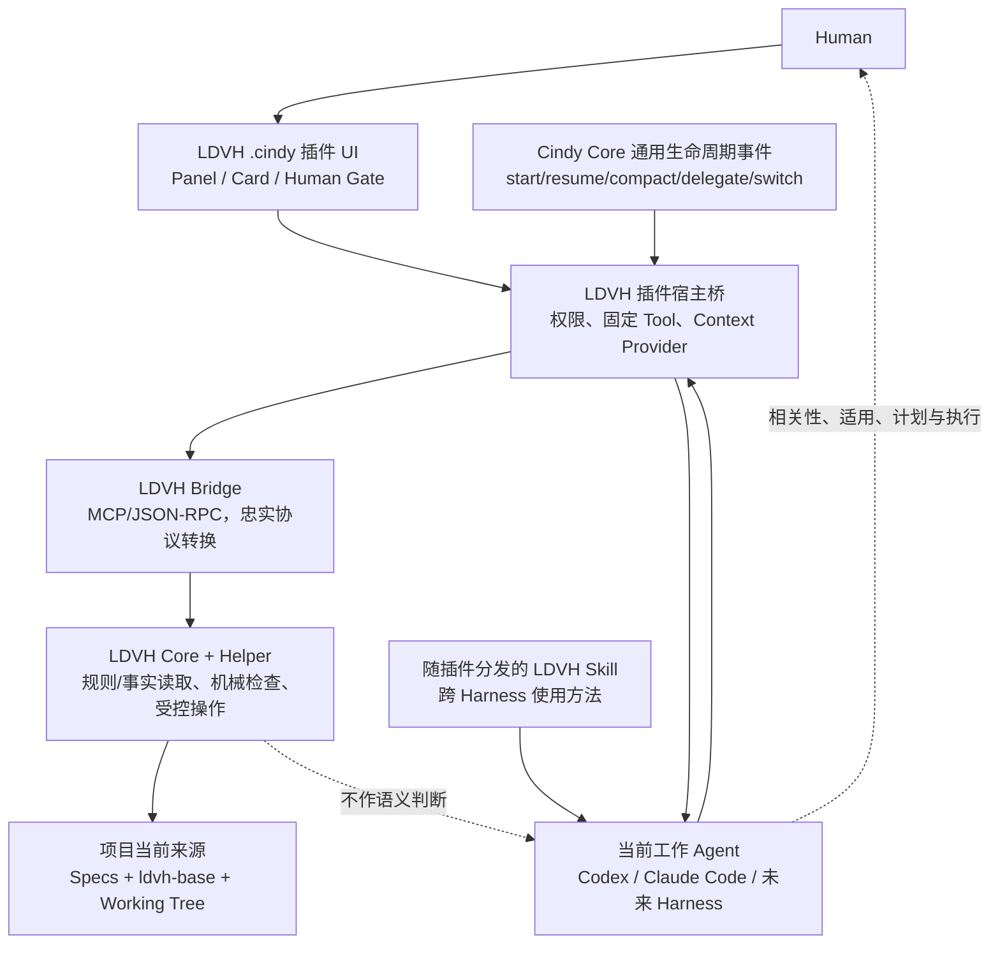

# Cindy × LDVH 融合架构研究

> 文档性质：已完成研究的 Study 候选稿，当前不是 LDVH `study` 事实对象。
> 观察时间：2026-07-28（Asia/Shanghai）。
> 外部对象：[`makecindy/cindy`](https://github.com/makecindy/cindy) `main` 分支公开客户端仓库。
> 当前限制：Cindy 服务端不在公开仓库中；本文只对公开客户端、公开规则与源码作判断。

## 研究问题

如果要做一个类似 Cindy 的本地 AI Agent 产品，并把 LDVH 作为核心差异能力，LDVH 应作为 Cindy 插件、独立 AI Agent，还是以其它方式存在？怎样分层才能同时保持 Cindy 的多 Harness 连续性和 LDVH 的规则、事实、Helper、Human Gate 与薄环境接入边界？

## 摘要与结论

结论是：**不要把 LDVH 建模为一个与 Codex、Claude Code 并列的独立 AI Agent。若只能在“插件”和“Agent”中二选一，应选插件；真正合适的目标架构则是“治理内核 + 插件产品面 + Skill 行为面 + 薄生命周期适配”的四层组合。**

LDVH 的核心身份应是与 Agent 无关的本地治理能力：规则与事实仍以项目当前来源为准，Helper/Code 提供确定性读取、检查和受控变更，当前执行任务的 AI 负责语义理解、适用判断和行动，Human 保留授权、取舍和验收。Cindy 插件负责安装、权限、工具桥、结构化 UI 与 Human Gate；随插件分发的 Skill 负责教不同 Harness 如何使用 LDVH；Cindy Core 只需增加一个通用、非 LDVH 专属的生命周期上下文提供者接口，使插件能在新建、恢复、压缩、委派和 Harness 切换时调用同一 LDVH work-context 核心。

这不是折中命名，而是职责分离：

- LDVH 不是新的“智能来源”，不应复制 Agent Loop；
- 插件是最合适的产品交付和人机交互载体；
- Helper/MCP 是最合适的确定性能力载体；
- Skill 是最合适的跨 Codex、Claude Code 的方法交付载体；
- 极薄的 Host adapter 是纯插件当前无法完整覆盖生命周期事件时所需的唯一 Core 扩展。

## 输入与边界

### 实际读取的外部资料

| 资料 | 本报告使用范围 | 不能支持的结论 |
|---|---|---|
| [Cindy 中文 README](https://github.com/makecindy/cindy/blob/main/README.zh-CN.md) | 产品定位、多 Harness、Memory/Skill/Automation/MCP/Plugin、本地与云端边界、公开仓库范围 | 不证明未公开服务端能力，也不证明路线图功能已经完成 |
| [Cindy 核心产品原则](https://github.com/makecindy/cindy/blob/main/docs/product-rules/core-product-principles.md) | Core、Agent、Skill、插件的正式职责边界，以及“连接而非重造智能”原则 | 不证明当前实现已经完全达到目标状态 |
| [Cindy 仓库地图](https://github.com/makecindy/cindy/blob/main/docs/dev-rules/repo-map.md) | Desktop、Mobile、maker-core、MCP、scheduler、project-context 等模块归属 | 不覆盖服务端与非公开组件 |
| [maker-core 与 Agent 行为规则](https://github.com/makecindy/cindy/blob/main/docs/dev-rules/maker-core-and-agent-behavior.md) | Agent 编排、MCP 注入、确定性代码、prompt cache、system prompt 门禁 | 不授权修改 system prompt 或 Core |
| [插件安全与作者契约](https://github.com/makecindy/cindy/blob/main/docs/dev-rules/plugin-security-and-authoring.md) | `.cindy` 插件沙箱、权限 slot、Skill、Node worker、UI 与 Host 边界 | 不代表所有计划中的插件能力均已实现 |
| [插件 manifest 与 slot 源码](https://github.com/makecindy/cindy/blob/main/apps/desktop/src/shared/ghost.ts) | 当前实际存在的 `tool`、`node`、`session-context`、`skill`、`agent`、`subscribe`、`panel` 等能力，以及订阅事件闭集 | 不证明这些能力适合直接承担 LDVH 全部语义 |
| [插件 Skill 落链源码](https://github.com/makecindy/cindy/blob/main/apps/desktop/src/main/cindy-brain/skillSlot.ts) | 插件可把同一 Skill 暴露给 Claude Code 与 Codex，且 manifest 与 SKILL.md 必须一致 | 不证明 Skill 能替代自动生命周期 Hook |
| [插件运行时源码](https://github.com/makecindy/cindy/blob/main/apps/desktop/src/main/cindy-brain/runtime/GhostRuntime.ts) | 插件独立沙箱进程、生命周期、崩溃隔离与熔断 | 不证明 Node worker 本身受到同等级系统沙箱约束 |
| [Orca 多 Agent 架构](https://github.com/makecindy/cindy/blob/main/docs/dev-rules/orca-team-architecture.md) | Lead/Worker 是完整会话、多 Agent 委派与上下文边界 | 不证明未来 workflow/side activity 规划已经完成 |

以上文件在本次读取时的 Git blob SHA 分别包括：README.zh-CN `65cb4999…`、产品原则 `97d6f1a3…`、仓库地图 `8b0a3ffe…`、maker-core 规则 `ed1c60c3…`、插件规则 `a45f5760…`、`ghost.ts` `ec06a737…`、`skillSlot.ts` `4673cb28…`、`GhostRuntime.ts` `7ea543c0…`、Orca 文档 `c22a087d…`。这些 SHA 用于说明本次观察的文件版本，不表示仓库整体 commit 身份。

### 使用的 LDVH 内部边界

本报告对 LDVH 的判断来自当前项目规则和本次实际 Helper 发现：

- `specs/00-理念与构成.md` §8.1–8.2：工作上下文渐进式交付、AI/Helper/Code/Human 分工和环境 Hook 薄引用；
- `specs/09-环境接入规范.md`：单一接入单元、环境无关核心、Helper 直接调用、工作上下文交付与能力不足交还；
- `specs/24-Study-研究报告.md`：外部研究、来源、边界、发现、建议和后续分流；
- `specs/31-事实对象判定与受控创建行动模板.md`：召回、查重、Human Gate、受控创建和写后回读。

当前 Helper 通用发现实际返回 `outcome=partial`。已发现 7 项公开操作，但事实模型、Study 类型、事实对象草案与受控创建相关操作没有进入当次公开能力范围。Helper 对本文路径的管辖解析已完成，但没有选中 governed-projects 配置，结果为 `config_status=missing`、`scope_status=scope_unknown`。因此本文只形成普通文档候选稿，不直接手写 `ldvh-base/studies/study-0016.md`，也不声明 LDVH Study 已创建或该路径已被证明受 LDVH 管辖。

### 未覆盖范围

- 未安装或运行 Cindy，没有做 UI、插件打包、权限弹窗、Node worker 或多端实机验证；
- 未读取 Cindy 非公开服务端，因此不判断云端任务、账号、同步和市场实现；
- 未验证 Cindy 当前插件是否能在远程 SSH 工作区执行本地 LDVH Helper；
- 未设计最终 `.cindy` manifest、协议字段、签名、升级或发布合同；
- 未获得 Cindy owner 对 maker-core、system prompt 或插件新 slot 的修改授权；
- 未把建议转化为 ADR、WorkCase、Spark 或实现。

## 关键发现

### 1. Cindy 的产品哲学天然排斥“再造一个 LDVH Agent”

外部观察：Cindy 明确把自己定位为多 Harness 与真实工作之间的连接层，首批支持 Claude Code 和 Codex，并允许同一任务在不同 Harness × Model 组合之间连续或协作。其核心产品原则明确区分：Agent 提供推理和执行；Skill 描述工作方法；插件承载富交互与专用能力；Core 只提供所有用户共同依赖的宿主基础设施。

项目启发：把 LDVH 实现成第三套 Agent Loop 会与 Cindy 的产品边界冲突，也会使“谁对当前工作负责”变得含糊。用户切换 Codex/Claude Code 或创建 Orca Worker 时，还要额外把任务交给 LDVH Agent，形成双重计划、双重上下文和双重完成判断。LDVH 真正需要的是让**当前负责工作的 Agent**有据可查、有能力可调、有边界可见，而不是夺走其执行主体身份。

直接影响：后续架构 ADR 应排除“LDVH 作为必经独立 Agent”的方向；如果将来使用专门 Agent 做规则审阅或事实整理，它只能是可选角色，不能成为 LDVH 的唯一入口、权威来源或授权者。

### 2. LDVH 与 Cindy 对 AI、Code 和插件的职责划分高度同构

外部观察：Cindy 的 maker-core 规则要求确定性判断、分支、校验、状态机、权限和错误处理用代码实现，语言理解与生成才交给模型；插件权限由 Host 代码强制，prompt 不构成安全边界。

项目启发：这与 LDVH 的职责边界相容：Helper/Code 只做来源已定义的确定性读取、检查和操作；AI 判断相关性、规则适用、语义充分性和行动；Human 决定授权、方向和验收；环境 Hook 只传递实际事件与核心结果。因此融合不需要发明“治理 Agent”，只需把 LDVH Helper 变成 Cindy 可稳定调用的本地能力。

直接影响：第一项实现应是 Agent-neutral 的 LDVH bridge，而不是新 Agent class。它应保留 Helper 原始 `outcome`、scope、coverage、sources、gaps 和 follow-up，不在桥接层重新解释为“允许/禁止/完成”。

### 3. 当前 `.cindy` 插件已经覆盖大部分 LDVH 产品面

外部观察：当前 `ghost.ts` 源码显示插件具有以下相关 slot：

| Cindy slot | 可承接的 LDVH 能力 | 边界 |
|---|---|---|
| `node` | 运行本地 JSON-RPC/MCP stdio bridge，调用已安装 LDVH Helper | Node worker 是高权限本地进程；不能复制 LDVH 规则或重写 Helper 语义 |
| `tool` | 在会话建立时向 Agent 注册固定 LDVH 工具 | 工具定义是会话快照，不应中途动态增删 |
| `session-context` | 在 Agent 调用插件工具时注入可信 session/workdir/本地只读状态 | 只在 tool-call 时提供，不能等同于 session-start 自动交付 |
| `skill` | 向 Claude Code 和 Codex 共同分发 LDVH 使用方法 | Skill 以 Agent 用户权限运行，不是沙箱安全边界，也不保证自动触发 |
| `panel`/`card` | 展示项目、WorkCase、规则来源、coverage、gaps、Human Gate 和验证结果 | UI 只能呈现和收集意图，不能代替 Host 授权或 AI 语义判断 |
| `subscribe` | 观察 `turn`/`session` 元数据，或在用户消息前/助手消息后执行有限 Hook | 当前事件闭集不足以表达 LDVH 要求的全部工作上下文恢复时机 |
| `agent` | 从受信用户交互或获准后台路径发起新回合 | 不应常态化地产生第二个“治理回合”或替代当前 Agent |

项目启发：插件非常适合成为 LDVH 的安装、权限、工具和 UI 外壳。尤其是 `node` 支持 `mcp-stdio`、`skill` 能同时落链到 Claude Code 与 Codex、`tool` 在会话建立时固定注入，这些都与 LDVH 的 Helper + 跨环境方法交付相匹配。

直接影响：MVP 可以先做一个 `.cindy` 插件，依赖或携带 LDVH 发行物，提供固定的只读工具、诊断面板和一份跨 Harness Skill；无需改造 Claude/Codex Agent Loop。

### 4. “纯插件”仍缺少 LDVH 所需的完整生命周期覆盖

外部观察：当前插件订阅只定义 `turn`、`session` 元数据主题，以及 `will-user-message`、`will-assistant-message` 两个拦截点。`session-context` 只在插件 tool-call 时注入。源码未显示针对 context compaction、session hydrate/resume、Agent delegation、Harness switch 的通用上下文提供者事件。

项目启发：LDVH 要求新的、恢复的、压缩后继续的或受委派的工作上下文获得与职责相称的规则引导，并且默认不无差别恢复项目事实。仅靠 Skill 让 Agent“记得主动调用”，或在 `will-user-message` 中把规则拼进用户原文，都不够稳健：前者不是自动交付，后者混淆用户输入与系统上下文，也无法覆盖没有新用户消息的恢复/委派场景。

直接影响：完整产品需要 Cindy Core 提供一个**通用 context-provider 扩展点**。它不包含任何 LDVH 语义，只在确定的宿主生命周期事件上把真实 payload 交给已授权插件，并把插件返回的结构化上下文作为独立上下文段交给目标 Agent。LDVH 插件只是第一个消费者。

建议的事件闭集至少包括：

- `session_start`
- `session_resume` / `session_hydrate`
- `context_compacted`
- `agent_delegated`
- `harness_switched`
- `workdir_changed`

其中哪些事件能由 Claude Code、Codex 和未来 Harness 精确提供，需要逐 Harness 对照实际协议；不能用相似事件名猜测映射。

### 5. LDVH 上下文不应进入易变 system prompt

外部观察：Cindy 明确要求 system prompt 改动先取得 owner 确认，并强调 Anthropic prompt cache 依赖稳定前缀；会话中途增删 MCP/tool 或把易变内容塞进稳定前缀都会破坏缓存与行为稳定性。

项目启发：LDVH 的规则切片、coverage、项目 binding、WorkCase 和 gaps 都可能随工作对象与 Working Tree 变化，不能硬编码进 Cindy 全局 system prompt。插件工具定义可以在会话创建时稳定注册，实际规则/事实内容应作为每次 lifecycle 或 turn 的独立、可标记来源的动态上下文交付。

直接影响：context-provider 的输出必须与 system prompt 分离，并在 UI/事件模型里有明确 provenance。默认只交付 `work-context-rule-orientation`；项目事实只有在当前目标明确进入事实消费分支后按需读取。不能把“插件已启用”写成“事实已恢复”。

### 6. 多 Agent 场景更需要共享治理内核，而不是专属治理 Agent

外部观察：Orca 的 Lead 与 Worker 都是完整会话，拥有独立模型、工具流、上下文和历史；未来还会有 side chat 与 workflow runner。它们的职责、回传和产物归属并不相同。

项目启发：单一 LDVH Agent 无法自然覆盖所有子会话，反而会成为上下文瓶颈。更稳的方式是让每个 Lead/Worker 在创建或恢复时通过同一 Helper 获得与其职责相称的规则引导，并按需取得事实。Helper 结果要带工作对象、scope 与 coverage，Lead 负责语义吸收和最终协同，不让 bridge 从 `cwd` 或父上下文推断任务绑定。

直接影响：context-provider 接口必须携带宿主认证的 session、parent/role、workdir、read-only/remote 信息；LDVH adapter 只投影这些实际字段。Worker 的创建不自动继承父会话全部项目事实，也不自动取得父会话的行动授权。

### 7. 远程工作区与发行物形态是首个工程风险

外部观察：Cindy 的 `session-context` 明确区分本地与远程 workdir；远程路径不能被插件当作本机路径。插件 Node worker 是用户级本地进程，当前公开客户端同时支持 SSH 远程 Agent 会话。

项目启发：本地插件直接运行本机 LDVH Helper，只能治理本机可见的真实 Working Tree。对 SSH 远程工作区，必须在远程目标运行同版本 LDVH 核心/Helper，或由可信远程服务桥接；把远程路径交给本机 Helper 会产生错误管辖和来源身份。

直接影响：MVP 应明确只支持 `workdir_is_local=true`，远程场景 fail closed 为“LDVH 自动接入不可用，但普通 Cindy 工作可继续”，并给出安装远程 Helper 的后续入口。不能静默回退到同名本机目录。

## 推荐架构

### 各层职责

1. **LDVH Core/Helper：治理内核**
   - 保持环境无关、Agent 无关；
   - 只执行当前来源已定义的确定性读取、检查和受控操作；
   - 返回结构化来源、scope、coverage、gaps、changes 与 verification；
   - 不把插件、Harness 或 UI 当作新的规则源。

2. **LDVH `.cindy` 插件：主产品身份**
   - 负责安装状态、版本、权限披露和更新；
   - 通过 `node` + `tool` 暴露 Helper bridge；
   - 通过 `panel`/`card` 展示规则来源、当前项目、事实候选、Human Gate 与验证；
   - 通过 `skill` 向不同 Harness 交付同一套使用方法；
   - 不在插件中复制规范正文、事实 Schema 或完成判断。

3. **LDVH Skill：Agent 使用说明**
   - 说明何时读取规则、何时进入事实消费、如何报告已验证/未验证/不支持；
   - 使用插件暴露的稳定工具，而不是硬编码本机路径；
   - 是按需方法入口，不冒充 lifecycle 自动注入。

4. **Cindy Core 通用 context-provider：极薄宿主扩展**
   - 只定义生命周期事件、可信 payload、预算、超时、失败和上下文回注协议；
   - 不知道 LDVH 的规范、事实类型、WorkCase 或 Human Gate；
   - 插件未安装、超时或返回 partial 时如实降级，不阻断无关普通工作；
   - 适合未来被安全、合规、项目知识等其它插件复用，因此仍符合 Core 纯粹性。

5. **当前工作 Agent：语义执行主体**
   - 根据 Human 目标、来源规则和当次事实判断相关性与适用性；
   - 调用 Helper、形成计划、执行、验证并交还；
   - 不因 LDVH 工具存在就自动获得行动授权。

### 为什么不是三个其它方案

| 方案 | 优点 | 关键问题 | 结论 |
|---|---|---|---|
| 纯独立 LDVH Agent | 可集中提示词与流程 | 重造 Agent Loop；多 Harness/多 Worker 上下文瓶颈；责任与完成判断冲突；用户多一次转交 | 排除为主架构 |
| 纯 Skill | 最轻、跨 Harness | 无自动生命周期、无结构化 UI、无可靠权限与协议边界，容易退化成“提示词治理” | 只作一层，不独立承担 |
| 纯 `.cindy` 插件（不扩 Core） | 安装、权限、工具、UI 都合适 | 当前无法完整覆盖 resume/compact/delegate/switch；用消息 rewrite 补洞会污染输入语义 | 可做 MVP，不是终态 |
| 四层组合 | 兼顾确定性、分发、UI、跨 Harness 与生命周期 | 需要新增一个经过严格设计的通用 context-provider 扩展点 | 推荐 |

## 建议

### 建议 A：先以插件为产品单位完成只读 MVP

- 目标对象类型：WorkCase。
- 预期目标：构建一个 `.cindy` 插件 PoC，连接已安装的 LDVH Helper；提供 `capabilities`、规则读取、管辖解析和 doctor 等只读能力，并显示原始 outcome/coverage/gaps。
- 初始范围：仅本地工作区、仅手动或 Skill 触发、无自动事实恢复、无事实写入、无 system prompt 改动。
- 验收条件：Codex 与 Claude Code 在同一项目中都能通过固定工具调用同一 Helper；插件面板能逐项显示来源与未完成范围；禁用插件后工具与 Skill 均撤销；错误不被改写为“未受管辖”或“已完成”。
- 创建/更新判断：当前没有已知对应 WorkCase 可无损承接时应新建；在创建前需先恢复 Helper 的事实候选/创建能力并完成查重。

### 建议 B：把生命周期能力设计成通用插件 slot，而不是 LDVH 特例

- 目标对象类型：ADR + WorkCase。
- 预期目标：定义 `context-provider`（暂名）slot 的事件、payload、输出 envelope、预算、超时、缓存、隐私、远程和 fail-open/fail-closed 边界。
- 验收条件：至少在 session start、resume/hydrate、compact、delegate 和 harness switch 上有可验证事件；插件只能看到声明并获授权的字段；返回上下文与用户原文、system prompt 分离；同一事件有可回指执行记录；插件不可作权限或完成裁决。
- 创建/更新判断：先形成 ADR 决定通用扩展点是否进入 Core，再以 WorkCase 实现。没有 Cindy owner 对 Core/system prompt 边界的确认前不进入代码修改。

### 建议 C：保持 LDVH 发行物独立，并设计本地/远程双目标

- 目标对象类型：WorkCase。
- 预期目标：插件 bridge 发现并校验 LDVH 发行物版本；本地运行本地 Helper，远程运行远程 Helper，结果携带实际目标和 Working Tree 身份。
- 验收条件：不从任意 cwd 猜 LDVH root；本地与远程结果不可串用；远程 Helper 缺失时明确 unavailable；插件升级与 LDVH Core 升级可独立回滚。
- 创建/更新判断：PoC 可先限制本地；一旦进入 SSH/mobile 产品范围就必须建立独立 WorkCase，不在本地分支上做静默兼容。

### 建议 D：允许“LDVH Reviewer Agent”作为可选角色，但禁止成为权威层

- 目标对象类型：Spark 或后续 ADR。
- 预期目标：探索在复杂规范变更、事实对象质量审核或多 Agent 验收中使用专门 Reviewer 的收益。
- 验收条件：Reviewer 只消费相同 Helper/来源，输出作为建议或 review；不能授权写入、替代 Human Gate、改变 Helper 结果或阻断其它 Agent 普通求解；移除该角色后 LDVH 基础能力仍完整可用。
- 创建/更新判断：只有真实复杂任务显示普通 Agent 反复遗漏相同审核时才创建 Spark/ADR；当前无需为架构完整性预先实现。

## 分阶段路线

### Phase 0：协议验证

- 冻结一个最小 LDVH bridge envelope；
- 验证 `.cindy` `node: mcp-stdio` 能忠实代理 Helper；
- 验证 `session-context` 的 workdir 与只读状态映射；
- 明确 LDVH 发行物的安装、发现、版本和失败提示。

### Phase 1：本地只读插件

- 固定注册 `ldvh_capabilities`、`ldvh_rule_context`、`ldvh_governance_scope`、`ldvh_doctor` 等工具；
- 分发 LDVH Skill；
- 提供来源/coverage/gaps 面板；
- 不自动恢复事实，不提供写操作。

### Phase 2：通用生命周期上下文

- 设计并实现 `context-provider` slot；
- 在 Cindy host 中映射各 Harness 的真实 lifecycle；
- 默认只调用 work-context rule orientation；
- 把动态上下文作为独立、带来源的内容交给 Agent；
- 建立 cold-start、resume、compact、delegate、switch 的端到端证据。

### Phase 3：按需事实与 Human Gate UI

- Agent 明确进入事实消费分支后才读取项目/WorkCase 候选；
- 面板支持分页、展开、conflict/unread/invalid/gap 显示；
- Human Gate 使用 Host 可信 UI 与明确授权 token，不用插件自报“已确认”；
- 只有 Helper 当前公开受控写操作可用时才开放创建/更新。

### Phase 4：多 Agent、远程与多端

- Orca Lead/Worker 按职责分别取得上下文；
- 明确父子会话授权、事实继承、回传和 provenance；
- 远程 Helper 与真实远程 Working Tree 绑定；
- Mobile 只承担查看、授权和控制，不假装在手机本地执行项目 Helper。

## 后续分流

| 研究结论/未决问题 | 建议承载 | 触发信号 | 可继续无需对象化的条件 |
|---|---|---|---|
| “插件优先、非独立 Agent、四层组合”架构决定 | ADR | Human 决定开始 Cindy-like 产品或 Cindy fork 的架构设计 | 仍停留在概念讨论，没有实现选择或资源投入 |
| 本地只读 `.cindy` PoC | WorkCase | 决定验证 Cindy 插件可行性，并能取得独立工作区/分支 | 未取得 Cindy 源码开发环境或不准备写代码 |
| 通用 `context-provider` slot | ADR 后接 WorkCase | 纯插件 PoC 证明生命周期覆盖不足，且 Cindy owner 同意讨论 Core 扩展 | Cindy 后续已提供等价通用事件/slot，可直接复用 |
| 远程 Helper 与 SSH Working Tree 绑定 | WorkCase | 产品范围包含远程 Agent 会话 | MVP 明确只支持本地且 UI 诚实拒绝远程自动接入 |
| 可选 LDVH Reviewer Agent | Spark → ADR | 真实案例持续显示专门审阅角色有可量化收益 | 普通当前 Agent + Helper + review 流程已经足够 |
| 本候选稿转为正式 LDVH Study | `study` 受控创建 | 当前规则源资格恢复、事实候选/创建操作重新公开、查重完成且受控创建可用 | 能力仍不可用；保留本普通文档并明确非事实对象 |

## 最终判断

用一句话概括：**让 LDVH 成为所有 Agent 共用的治理底座，让插件成为它在 Cindy 里的身体，让 Skill 成为它教 Agent 做事的方法；不要再造一个名叫 LDVH 的大脑。**

对第一版产品，选择“插件身份”最现实；对长期架构，LDVH 的真正身份应是 Agent-neutral governance runtime。插件是其安装与交互载体，不是语义权威；AI Agent 是其使用者和语义执行者，不是 LDVH 本身。
