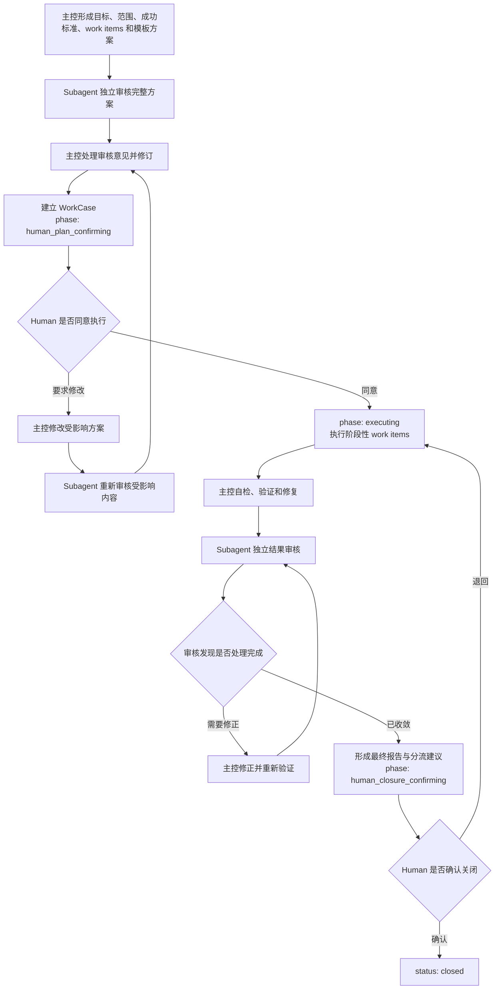

# V3 行动资产盘点与 V4 内部行动能力设计

> 记录性质：本文是阶段 6 的只读调查与内部行动能力设计记录，不是规则源，不授予任何具体行动模板当前效力，也不证明模板发现、选择、执行、环境接入或 Code 能力可用。
> 调查日期：2026-07-14。
> 当前结论：Human 已明确这些行动都是 LDVH 内部需要使用的能力，不要求用户逐个安装、启用或取舍；V3 行动资产已经按责任归并。阶段 5 的候选发现、精确展开和受控创建前置已经成立；“事实对象判定与受控创建”是下一个待定义模板，不按 V3 文件数量恢复模板。

## 1. 调查问题与依据

本次调查回答四个问题：V3 中哪些资产包含可复用行动结构；哪些内容其实属于规则、事实、Code、环境或一次性计划；同义流程应如何合并；已经确认需要的内部行动能力应由多少份模板承接并以什么顺序实现。

判断直接依据：

1. `ldvh-root`：行动模板只沉淀重复场景中的可复用行动结构，明确适用条件、关键步骤、验证入口和交还方式；
2. `action-template-foundation`：每个具体模板必须分别证明重复价值、稳定剩余结构、正反场景、独立失败、承载位置和净价值；
3. `source-of-truth-traceability`：过程输出不因模板执行而成为稳定事实；
4. `fact-model-foundation` 与 20–24：事实语义、字段、状态、来源和关系不能由模板重新定义；
5. `helper-cli-service` 与 `deterministic-code-execution`：公开服务和确定性实现不能由模板反向发明；
6. `V3-设计覆盖与V4下游审核清单`：V3 资产只取得历史输入身份，内部能力仍须形成正确的模板定义与统一消费边界。

本次只比较承载、能力覆盖和模板拆分，不建立 `template_key`、不恢复 V3 编号、固定阶段、厂商事件、全局提交格式、Skill 角色或 Hook 阻断规则。Human 对内部能力覆盖的确认不等于模板定义或实现已经成立。

## 2. 实际覆盖范围

| 资产组 | 已检查范围 | 在本次调查中的作用 |
|---|---|---|
| V3 正式行动模板 | `30` 安装配置与验证、`31` Git 提交、`33` 环境插件编写与更新，共 3 份 | 提取重复场景、步骤关系、Gate、验证和交还；删除 V3 专属协议与固定阶段 |
| V3 行动基础与相邻规范 | V3 `06`、安装与配置、事实源/Git、Code、测试等相邻责任 | 识别旧模板复制的规则、字段、事件和验证条件，不把它们恢复进模板 |
| V3 Python 实现 | 下游清单登记的 18 个模块，重点检查 install、verification、Git hook、commit、runtime、classifier、lifecycle 和 runner 责任簇 | 提取 check/plan/apply/verify、原子写入、回读、回滚和薄 adapter 等设计问题；不继承命令、路径、状态和 facade |
| Hook 与环境插件 | Git `commit-msg`、Codex/WorkBuddy 插件、manifest、hooks 配置和 shim | 区分“编写 adapter”“安装 adapter”“真实触发验收”三个不同责任；厂商字段留给环境接入 |
| V3 Skill 与团队材料 | `docs/skills/` 10 份 | 提取平台无关的进入条件、分工、复核、整合和失败交还；角色名、提示词、平台 metadata 不取得模板身份 |
| V3 事实实例 | 下游清单已经覆盖的 49 Spark、24 WorkCase、17 Study、2 Pitfall；重点回读行动模板、委派、复核、分流和环境责任簇 | 作为重复问题与失败模式证据；旧状态、orchestration、执行进度和待办不迁移 |
| V3 Code 实践文档与 tests | 安装向导、Git/Hook、环境插件实践和相应 tests | 识别可机械验证入口和实现边界；不把测试 fixture 或实践说明提升为规则源 |

覆盖采用“完整资产组登记 + 责任簇重点回读”，不是逐字复制全部历史内容。既有《V3 设计覆盖与 V4 下游审核清单》已经证明 92 个事实实例与 10 份 Skill 材料无静默漏组；本文在该覆盖基础上只做行动责任归并。

## 3. 归并原则

同一旧资产可以给多个内部行动能力提供证据，但只能按以下边界归口：

| 内容 | 当前归口 | 不进入具体模板的内容 |
|---|---|---|
| 领域规则、项目强制要求、状态、字段、Human Gate、完成条件 | 相应当前规范 | 模板只回指，不复制 |
| 可复用的进入条件、行动依赖、失败分流、验证安排和交还 | 形成正确定义后的具体行动模板 | 单次计划、执行进度和角色人设 |
| 稳定事实、状态、证据、决定和经验 | 事实模型允许的当前事实源 | transcript、轮询状态、receipt 和默认全量对象化 |
| 命令、锁、原子写入、解析、测试和诊断 | Code/tests 与稳定外部契约 | 旧命令名、路径、实现类和 fixture |
| 厂商事件、payload、安装接口、权限和真实触发 | 逐环境接入来源与 adapter 实现 | Codex/WorkBuddy 事件闭集和旧 shim |
| Skill/Agent metadata、角色名和提示词 | 环境、产品或普通研究资料 | 静态存在不证明当次可用，也不建立角色总规范 |

以下内容虽然反复出现，也不单独形成模板：

1. 通用“验证/完成”流程：验证必须由每个具体模板和相应来源定义，抽成横向模板会重新制造 V3 测试总规范；
2. session/pre-tool/completion 事件链：属于 Helper、Code 与环境接入，不是行动结构；
3. Action Guide、read plan 或 runtime 编译：属于规则信息读取与确定性 Code；
4. 固定输出格式、固定阶段数和固定角色团队：属于当次交互或平台产品设计；
5. 规范修改总流程：当前 01 已定义规范治理，独立复核能力可以复用；没有必要再复制一份 01 的“规范修改模板”。

## 4. 统一发现、读取和环境接入模型

行动模板与环境 Skill 的共同点是都向 AI 提供可复用行动知识；区别是模板属于 LDVH 中央规则源，不成为各环境分别安装和维护的 Skill 副本。目标链路为：

`每个环境一次安装 LDVH adapter/Hook → 同一 Helper → 当前行动模板来源 → AI 语义适用判断 → Code 确定性操作与结果`

该模型遵守以下边界：

1. 用户在一个环境中只安装、启用或配置一次 LDVH 接入单元，不逐个安装 Git 提交、独立复核、事实分流等 Skill；
2. 不同环境可以因 Hook API 不同而有不同薄 adapter，但全部调用同一 Helper，不复制模板正文和选择逻辑；
3. 一个 adapter 可以为环境协议注册多个 lifecycle 事件，“一次安装”不等于强迫所有环境只有一个原生事件；
4. Helper 负责从当前规则源派生模板候选、读取完整定义、保留来源与能力缺口；不建立第二份模板权威；
5. AI 根据任务、事实和当前来源完成语义适用判断；Code 不解释自然语言模板；
6. 用户不选择内部模板，只处理目标表达和实际来源保留的授权、方向、风险或验收；
7. 模板自动命中不授权副作用，也不证明 Code、Hook 或环境当次可用；
8. 模板更新后由统一 Helper 读取当前来源，不要求每个环境重新安装对应 Skill。

当前尚未定义或实现行动模板专用 Helper 公开操作，也没有 V4 环境 adapter。机制设计成立不等于统一入口已经可用；后续应先定义模板发现与内容读取契约，再实现 Helper，最后由逐环境薄 adapter 接入。

## 5. V4 内部行动能力覆盖矩阵

| 内部行动能力 | V3 主要证据 | 稳定剩余结构 | 与相邻能力的区分 | 当前建设位置 |
|---|---|---|---|---|
| 事实对象判定与受控创建 | Spark `0006/0011/0014/0029`，WorkCase `0011/0014`，Pitfall `0001`，V4 五类来源和阶段 5 创建链路 | 召回相邻事实与来源；判断是否由稳定位置承接、是否复用已有对象及新建时的类型；准备草案；AI 填写语义；Code 受控创建；回读；处置未承接内容 | 只处理新事实入口的承接判断和需要时的创建，不处理既有对象状态推进、关闭或多对象替代 | `definition-1-ready`：阶段 5 前置已成立，下一项串行定义 |
| 独立复核 | Spark `0010/0022/0042/0044`，WorkCase `0010/0013`，Studies `0002–0004/0011/0015–0017`，OpenSpecDocTeam 审核结构 | 固定审查对象、来源和问题；保持未参与实现的独立视角；按严重度和证据报告；主控逐项处置；保留未解决项 | 不承担实现和主控决定；与“委派执行”有不同的独立性、写入和完成条件 | `definition-2`：第二项定义，不能与委派能力混写 |
| Git 提交 | V3 `31`、WorkCase `0004`、commit validator、Git hook 和实践文档 | 确认授权与实际范围；检查 status/diff；按语义拆分；运行风险匹配验证；创建 commit；回读 commit 与工作树；交还残留 | 只组织 commit 行动，不定义全局 message 格式、push、远端 ref 或项目强制策略 | `definition-3`：第三项定义；项目规则缺失时不补造规则 |
| 委派与并行执行 | Spark `0022/0028/0030/0037/0042`，WorkCase `0010`，Study `0011/0015/0016` | 任务边界、输入、允许写入、禁止范围、能力依据、并行条件、回收、冲突处理、重新验证和主控交还 | 受委派者承担执行产出；独立复核者只审查。平台线程、worktree、subagent 只是当次能力选择 | `definition-4`：第四项定义，复用独立复核边界 |
| 事实对象状态转换与承接处置 | WorkCase `0014`、Pitfall `0001`、Spark `0007/0016/0029` 和五类状态来源 | 回读当前对象、直接关系与证据；区分普通更新、状态转换、终态、整体替代和剩余内容承接；形成单对象或多对象变更集；回读并交还未承接和未验证范围 | 只组织一次既有事实的领域变更；不执行 WorkCase 所表示的实际工作，不复制 20–24 的状态语义 | `required-blocked`：能力必须覆盖，等待受控单对象更新和项目级多对象变更集 |
| 安装、配置与验证 | V3 `30`、WorkCase `0018/0023`、install wizard/verification/hook installer | 发现当前状态；形成 plan；明确授权与写入；apply；实际回读；失败回滚；必要时断点后真实环境验收 | 安装一次 LDVH 接入单元；不负责编写 adapter，也不把文件存在当成环境接入 | `required-blocked`：能力必须覆盖，等待安装接口与环境验收边界 |
| 环境 adapter 编写与更新 | V3 `33`、Pitfall `0002`、Spark `0032/0033/0035/0046/0048`、Codex/WorkBuddy shim | 查官方协议；比较现状；定义薄映射；受控修改；静态与 fixture 验证；交还真实环境未验证范围 | 维护每个环境的单一薄接入单元；不复制内部模板，不负责部署和 integrated 验收 | `required-blocked`：能力必须覆盖，等待具体环境契约 |
| 结构化研究或专业文档交付 | 10 份 Skill/团队材料、Studies `0002–0005/0008/0009/0015–0017` | 需求澄清、检索、生成、审核、整合、交付在部分场景可复用 | Study 已定义稳定研究产物；普通文档与当次计划可承接执行，不应恢复角色团队和固定 A–F 流程 | `do-not-admit-now`：证据不足以证明 LDVH 核心模板净价值；未来有重复失败再重审 |

## 6. 第一项内部能力的定义边界

第一项内部能力暂用描述名“事实对象判定与受控创建”，尚不分配 `template_key`。Human 已确认“准入”和“分流”都是同一承接语义判断的内部分支，不作为与创建并列的独立阶段。该能力具有最直接的阶段依赖：五类事实语义已经收敛，Code 已提供 `prepare-fact-object-draft` 与 `create-fact-object`，但 AI 仍需要一个不复制 05/20–24 的稳定行动结构把承接判定、需要时的受控创建和交还串起来。

正式定义时至少必须证明：

1. 进入信号：出现需要跨行动或会话保留的信息，但尚未证明应新增哪类事实对象；
2. 排除条件：当前事项可直接处理、已有事实可无损更新、只是过程日志、普通文档更自然，或缺少可回指来源；
3. AI 责任：读取当前类型来源，召回和比较相邻对象，判断是否对象化与类型，填写自然语言字段、来源和证据，处理语义冲突；
4. Code 责任：只执行来源已定义的管辖、派生 Schema、候选草案、最终身份、机械检查、原子创建、回读和结构化结果；
5. Human 责任：只承担当次指令或来源实际保留的授权、方向选择与风险接受，不替代准入、字段有效性或技术验证；
6. 关键分支：复用现有事实、保持普通信息、建立一种新事实、输入不足、能力不可用、机械拒绝、写后回读失败；
7. 回写边界：只允许通过当前受控创建入口新建一个初态对象；不得顺带更新、关闭、替代或提交；
8. 验证与交还：区分模板适用、AI 语义判断、Code 创建成功、Git 未提交和上层事项未完成。

当前已知缺口必须保留在模板中，而不是被模板掩盖：Helper 已提供确定性候选发现/召回，但不会承担自然语言同义、相关性或 applicability 判断；AI 只能依据当前来源、类型化权威卡片和按需展开的事实完成语义比较。当前也没有事实对象更新、状态转换、多对象变更集和自动 Git 提交能力。

## 7. 事实对象生命周期控制架构结论

2026-07-14 针对“五类事实对象创建后如何流转，尤其 WorkCase 的复杂过程由谁控制”完成了领域建模、行动模板和确定性 Code/事务三路独立只读审议。三路均不建议让事实对象自身成为环境内部步骤的运行控制器，也不建议按五类分别复制五份流转模板。随后结合 V3 WorkCase 设计意图独立分析和 Human 对实际使用方式的澄清，确认初次结论对 WorkCase 做了过度瘦身：它把环境内部步骤与长时责任的阶段性工作项、质量关口和可恢复进度混为一谈。本节记录修正后的架构结论，不授予模板、公开操作或写入能力当前效力。

生命周期控制分为四层：

1. 20–24 是状态闭集、允许转换、终态含义、承接关系、Human Gate 和 Stop Conditions 的唯一领域权威；它们是声明式规则，不是运行中的流程引擎。
2. AI 依据对象、来源、证据和当前授权判断阻塞是否真实解除、成功标准是否满足、是否整体替代、是否完整承接和是否仍可安全消费；Code 不得根据自然语言猜测这些结论。
3. 一份跨五类的共同行动模板只组织一次状态转换与承接处置：召回和展开当前对象及直接关系、区分事实更正/普通更新/状态转换/新身份替代、回读对应类型来源、形成变更集、调用 Code、回读验证并交还未承接和未验证范围。模板不复制五类状态表和关系语义。
4. Code 负责身份、Schema、条件字段、机械允许的状态边、时间、目标存在性、入向基数、DAG、指纹与并发冲突检查，并在获准变更范围内原子写入和回读。Human 只处理当前指令或来源保留的授权、方向、撤回和风险接受，不审批每次内部模板选择。

WorkCase 必须严格区分三层：整体工作责任、共同服务该责任关闭判断的阶段性工作项、环境内部完成单个工作项的自由步骤。WorkCase 保存目标、范围、成功标准、当前生命周期阶段，以及每个阶段性工作项的独立目标、预期结果、当前状态、结果、证据、阻塞和最小恢复快照；它还保存创建方案独立审核、主控处置、Human 执行授权、主控结果自检、独立结果审核、最终报告、剩余责任承接和 Human 关闭确认。开发、研究、委派、复核、测试和提交的具体做法仍由当次计划与实际命中的行动模板组织。命令顺序、工具日志、临时 todo、AI 推理、单个工作项内部的自由实现步骤和模板运行事件不得写入 WorkCase。

五类对象共享变更骨架，不共享同一终态语义：Spark 处理 `routed/discarded`，WorkCase 处理 `open/blocked/closed` 与关闭结果，ADR/Pitfall/Study 处理 `superseded/retired`。“最终分流”不是五类共同阶段：Spark 是入口完整承接，WorkCase 是剩余责任处置，Study 正文的“后续分流”只是报告内容，ADR/Pitfall/Study 被规则或工作吸收也不自动进入终态。

### 7.1 五类对象逐类控制责任

本表中“类型规范控制”只表示声明式定义合法状态与不变量，不表示对象文件自身运行流程。行动模板只组织一次变更，不保存模板运行状态。

| 事实类型 | 类型规范控制 | AI 判断 | 行动模板控制 | 其它机制 | Code 写入边界 |
|---|---|---|---|---|---|
| Spark | `open → routed/discarded`、终态条件、`routed-to` 与 `supersedes` 关系语义 | 原始信息是否已被完整承接，或废弃理由是否成立 | 召回 Spark 与承接候选，组织 routed/discarded，需要时把新目标创建纳入同一变更集 | 承接位置中的实际工作由目标对象、普通文档、当次计划或其它模板继续；Spark routed 不表示下游完成 | 单对象终态可使用 CAS；同次新建承接对象时使用多对象原子变更 |
| WorkCase | 责任状态、推进阶段、阶段性工作项、双 Human Gate、创建审核、结果自检与独立审核、关闭和剩余责任承接 | 方案是否完整、审核意见是否处理、工作项结果是否成立、成功标准是否满足、审核发现是否修复、是否可申请执行或关闭 | 行动模板组织创建、执行委派、审核和状态转换，但不取得 WorkCase 状态语义，也不记录单个工作项内部步骤 | 高能力主控规划和收口，受委派 AI 自主完成明确工作项，独立 Subagent 审核，Human 在执行前与关闭前作决定；Web 派生阶段条与工作项概览 | 创建时原子写入审核记录和完整方案；工作项、阶段和当前快照使用受控更新；关闭及剩余责任承接必要时使用多对象变更 |
| ADR | `active → superseded/retired`、整体替代、无替代退出和永久 `supersedes` 历史边 | 是否整体替代、适用条件是否消失、是否只是部分改变，授权与退出依据是否充分 | 召回旧 ADR 与新决定，组织整体替代或退出，不组织规则吸收实施 | ADR 的规则吸收、Code 落地或文档更新由相应治理与实施行动承担；吸收不自动使 ADR 终态 | `retired` 可能是单对象；`superseded` 必须原子创建新 ADR、建立关系并终态化旧 ADR |
| Pitfall | `active → superseded/retired`、整体替代、失效退出与适用边界 | 根因、解决和验证是否仍可信，适用条件是否改变，新经验是否整体替代 | 在新验证、冲突或替代经验出现时组织状态转换，只引用 23 的领域条件 | 遇到类似问题时由候选召回提供可能经验，AI 判断当次适用；实际修复由当次行动承担 | `retired` 可能是单对象；整体替代必须使用新旧对象与关系的多对象原子变更 |
| Study | `active → superseded/retired`、整体替代、失效退出、版本/观察时点/applicability；正文“后续分流”不是状态 | 主要结论是否仍可安全引用，是否需要重新观察，新报告是否整体替代旧报告 | 组织整体替代或退出；不把研究建议自动转成新事实对象 | 实际研究过程保持在 WorkCase 或当次计划；建议是否形成 ADR、WorkCase 或规则必须分别重新判定 | `retired` 可能是单对象；整体替代必须原子创建新 Study、建边并终态化旧 Study |

### 7.2 V3 到 V4 的逐类架构变化

| 事实类型 | V3 | V4 | 架构变化的目的 |
|---|---|---|---|
| Spark | `pending → resolved/discarded`；`resolved_to` 承担类型化分流；Study 不得作为完整 `resolved_to` 目标 | `open → routed/discarded`；统一 `relations/source_refs/evidence_refs`；事实对象或普通稳定位置可共同承接 | 从对象内部的分流字段转为类型规范承接语义、统一关系和受控事务 |
| WorkCase | 七个状态混合责任状态和推进阶段；`orchestration` 同时容纳阶段目标、环境步骤、角色、review、确认和大量空占位 | 责任状态与推进阶段正交；恢复轻量阶段性 `work_items`、创建审核、结果审核和双 Human Gate；排除工作项内部步骤、工具日志、推理与运行事件 | 保留 V3 的中断恢复、跨模型交接、Human 可见进度和质量关口，删除造成对象膨胀与双层状态漂移的运行脚手架 |
| ADR | `active → archived/deprecated`；`archived` 与“已被稳定来源吸收”绑定 | `active → superseded/retired`；整体替代与无替代退出分开；吸收不自动终态 | 分开“决定当前性”、“整体替代”和“规则/实现吸收”三种不同事实 |
| Pitfall | `active → archived`；归档同时覆盖不再参考、被规则吸收和多种退出原因 | `active → superseded/retired`；整体替代与无替代退出分开；规则吸收不改变经验可用性 | 围绕“是否仍能安全复用”和“是否被整体替代”建模，而不是用归档概括一切 |
| Study | `active → archived`；归档表示不再作为当前入口；“后续分流”为固定正文章节 | `active → superseded/retired`；引入版本、`observed_at`、applicability 和整体替代语义；“后续分流”仍只是内容 | 把生命周期收紧到研究结论在何时、何版本和何适用范围内仍可安全引用 |

上述对照只记录当前架构判断和 V3 变化理由。五类的实际状态、字段、关系、成立条件和 Human Gate 仍以 20–24 为唯一当前来源；本表不得被 Code、模板或实现当作第二权威。

### 7.3 WorkCase 已确认的控制流程与记录边界

WorkCase 具有两个必须由 Human 作出的决定。第一处发生在主控处理创建方案的独立审核意见之后：WorkCase 此时已经建立并处于等待执行确认阶段，Human 需要看到目标、范围、成功标准、阶段性工作项、顺序或并行关系、行动模板选择、模板偏离、验证方式和重要风险；未经同意不得开始执行。第二处发生在全部工作项完成、主控自检修复、独立结果审核及其意见处理、最终报告和分流建议形成之后；未经 Human 确认不得关闭。

阶段性工作项不是环境步骤。它具有独立目标和预期结果，但仍共同服务同一 WorkCase 的关闭判断；若某个目标需要独立准入、授权、长期阻塞、取消、转交或关闭，则应拆为另一个 WorkCase。环境可以自由决定如何完成单个工作项，只在中断、压缩、执行者交接、阻塞或阶段结果形成时回写最小当前快照、结果、证据和阻塞，不记录命令流水和推理过程。

中断恢复所依赖的信息不能成为非 Git 临时文件或第二事实源。建议在 WorkCase 当前文件中为进行中的工作项维护可覆盖更新的 `current_summary` 和 `resume_from`；完成后由 `result_summary` 与 `evidence_refs` 吸收，历史变化由 Git 保留。Web 从 WorkCase 派生推进阶段条、工作项完成/进行中/阻塞计数、当前焦点和待 Human 决定事项，不以默认等权百分比制造虚假精度。

责任状态与推进阶段必须分开：`open/blocked/closed` 回答责任能否继续或是否终止，`human_plan_confirming/executing/controller_checking/independent_reviewing/closure_preparing/human_closure_confirming/closed` 回答当前质量控制位置。阻塞不能覆盖推进位置；例如 `status: blocked` 与 `phase: executing` 可以同时成立。Human 或审核导致目标、范围、成功标准、工作项目标/边界、依赖、模板选择或偏离、验证方式和重要风险发生实质变化时，受影响内容必须重新完成独立审核后才能再次申请执行授权。

事实写入层不建立通用 `advance-status`。建议先形成无副作用变更准备，再分为单对象 CAS 变更和同一管辖项目、同一实际 worktree 内的多对象原子变更集。新对象整体替代旧 ADR/Pitfall/Study、新 WorkCase 接替并关闭旧对象、Spark 指向同次新建承接对象，以及某对象终态化会使入向关系失效时，必须使用多对象变更集。首版不开放通用删除、跨项目事务或对不遵守锁协议的外部手工编辑声称全系统原子性。

实现前还存在一个 P1 前置：当前 `code/ldvh/facts/relations.py` 在静态回读时把 ADR/Pitfall/Study `supersedes` 的 source 强制为 `active`，但 22–24 要求替代关系建立后即使 source 后续终态也永久保留并继续占用 target 的唯一直接替代源基数。生命周期写入实现前，必须把“建边时的 source 状态”移到变更前后 diff/事务检查，静态读取只检查已建边的永久保留条件。

基于本次审议，事实对象相关模板维持两个责任边界：“事实对象判定与受控创建”处理独立初态对象，并必须承接 WorkCase 创建前的方案独立审核、主控处置和创建后等待 Human 执行确认；“事实对象状态转换与承接处置”处理创建后的领域状态转换、WorkCase 推进阶段、整体替代和剩余内容承接。只有新对象创建与旧对象终态/关系必须共同成立时，才进入后者的多对象替代分支。独立复核、委派与并行执行等模板可以被 WorkCase 流程调用，但不能重新定义 WorkCase 的阶段、工作项或双 Human Gate。该责任拆分、模板稳定身份和实现契约仍须在对应阶段按 06 正式准入。

## 8. 串行定义与实现顺序

内部能力覆盖已经确认，但具体模板的拆分、定义和实现继续串行，不允许多个工作线同时修改 06 共同边界或自行建立字段、阶段和角色：

1. 事实对象判定与受控创建：先把阶段 5 已成立的事实服务接入一个完整 AI 行动闭环；
2. 独立复核：固定审查输入、独立性、证据、发现和主控处置边界，为后续模板审核提供可复用结构；
3. Git 提交：只在当前 03 与项目实际规则内组织安全提交，不恢复 V3 全局格式和 Hook 门禁；
4. 委派与并行执行：在独立复核边界稳定后，再处理执行委派、共享工作树和冲突回收；
5. 事实对象状态转换与承接处置：等待受控单对象更新、项目级多对象变更集和上述 P1 修正；
6. 安装配置与验证；
7. 环境 adapter 编写与更新：最后两项等待阶段 7/8 的具体环境边界，不因 V3 模板存在提前启动。

每项定义都必须重新回到 06 §5 和 §11，至少走查一个代表性成功场景、一个相近反例和一个独立失败场景。该审核不是让用户选择是否安装或启用功能，而是确保内部模板不重复、不越权并具有可执行边界。上一项只证明自身；不得把其字段、步骤、Gate 或实现复制给下一项。

## 9. 本次明确不作出的声明

1. 没有任何具体 V4 行动模板已经 `active`；
2. 内部建设顺序不等于模板适用、行动授权或执行计划；
3. V3 `30/31/33`、Skill、Hook、Code 和历史事实没有取得 V4 当前效力；
4. 不存在由 Code 自动完成的模板语义选择、自然语言查重、来源充分性或 Human Gate 判断；
5. 不建立模板中央登记文件；未来稳定发现仍须从各模板唯一定义来源的“行动模板声明”派生；
6. 本文不要求恢复 V3 固定七段结构、四阶段安装、三事件 lifecycle、角色团队、固定输出格式或全局 commit message。

## 10. 下一步和完成判据

阶段 5 前置已经成立。下一增量直接定义第一项内部能力；完成判据为：模板拆分与承载位置成立；适用、排除和失败场景清楚；Code/AI/Human 分工不越界；与 05、20–24、Helper 和 03 的引用无冲突；唯一定义来源与稳定身份方案明确；代表性成功、反例和失败场景走查通过；独立复核没有未解决的高优先级问题。

只有上述条件成立，才修改正式规则源建立第一个 `template_key`。如果这项能力无法由一份模板在不复制事实语义或补造召回能力的前提下成立，应调整拆分或把部分责任交给已有规则、Helper 与 Code；不得把结构审核失败误写成已确认的内部能力不再需要。
