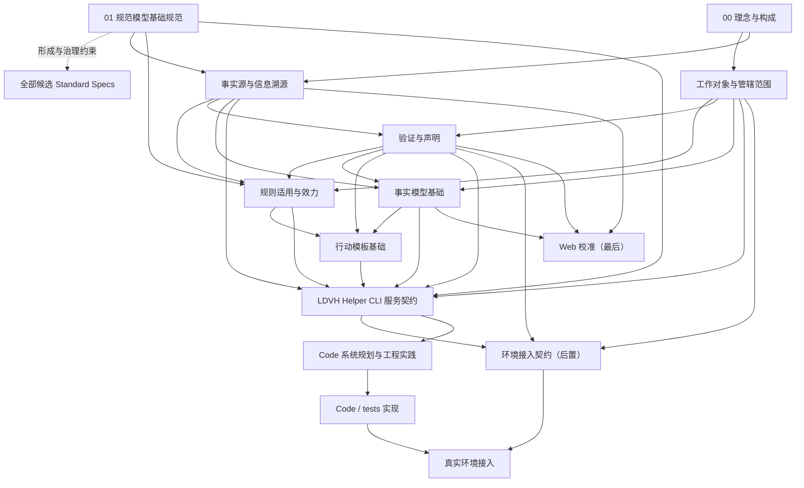

# V4 Specs 责任闭包与依赖结构提案

> 记录性质：V4 剩余 Specs 的架构提案，不是规则源，不授权产品行为。
> 提案状态：责任闭包已按 2026-07-12 Human 确认完成修订；本文中的候选名称、英文表达、`spec_key`、依赖和顺序只用于后续起草，不因本提案取得规则效力。
> 当前基线：`dev-v4` 已提交的 00、01 及 01 授权的双语术语附件；架构调查记录截至提交 `bc761a5f`。
> 记录日期：2026-07-12

## 1. 目的

本提案在继续编号或起草正式规范之前，回答五个问题：

1. V4 还必须承担哪些稳定责任；
2. 哪些责任需要独立 Spec，哪些应合并、延后或交给附件、Schema、Code 和行动模板；
3. 每项责任负责什么、明确不负责什么；
4. 语义依赖、建设顺序和编号顺序如何分开；
5. 哪些真正是需要 Human 决定的架构选择。

本文不起草具体规则，不为未来全部规范预分配编号，不新建 Code 或 tests，也不改变 Web 和 `icons/` 的冻结边界。

## 2. 责任闭包原则

候选责任只在同时满足以下条件时建议成为独立 Spec：

1. 能用一个稳定问题表达其唯一责任；
2. 与相邻责任存在独立失败场景，不能由其他责任自动推出；
3. 变化原因、消费方式或验证入口足以独立；
4. 拆分能降低 AI 的定位、理解、边界或维护负担，没有只为目录整齐制造额外流程；
5. 能明确归入 00 定义的五类构成要素，没有形成第六类构成要素。

低频迁移、内部维护、特定厂商事件、具体命令和单一实现细节，默认不单列顶层 Spec。

01 对所有标准规范提供文档身份、结构、关系、规则表达和规则源资格的形成与治理约束。这不表示每份规范都必须把 `specification-model-foundation` 机械写入 `basis`；`basis` 只保留理解、判断或维护当前责任直接且必要的语义依据。

本提案中的独立 Spec 都是直接细化 `ldvh-root` 下不同稳定责任的同级候选，不根据编号、建设先后或消费方向构造人为的多层规范树。实际起草时，只有存在真实直接结构归属才改变 `parent_spec`；语义依据继续使用 `basis` 独立表达。

## 3. 已生效基础

| 稳定职责标识 | 当前文件 | 已承担责任 | 边界 |
|---|---|---|---|
| `ldvh-root` | `specs/00-理念与构成.md` | LDVH 存在理由、根级构成、Helper CLI 基础服务形式、事实源、V1-V8、上位验证、Human Gate 和 Stop Conditions | 不承担下位细化规则或具体实现 |
| `specification-model-foundation` | `specs/01-规范模型基础规范.md` | 正式规范及授权附件的身份、结构、关系、规则表达、当前规则源、渐进式披露和双语术语治理 | 不承担规则适用与效力、AI 行为、Helper 服务或 Code 实现 |

`specs/attachments/01.Att.01-LDVH双语术语表.md` 是 01 授权的当前附件，不单独承担一项顶层规范责任。

## 4. 推荐的当前必需责任

以下八项责任建议各由一份独立标准规范承担。中英文名称和 `spec_key` 只是候选，目前不进入双语术语表。

| 责任标签 | 候选规范与 `spec_key` | 唯一问题 | 主要负责 | 明确不负责 |
|---|---|---|---|---|
| `SUBJECT_RESOLUTION` | 《工作对象与管辖范围规范》（Work Objects and Governance Scope Specification）; `work-object-governance-scope` | 当前事项涉及什么工作对象，哪些进入 LDVH 管辖 | 用户目标、显式 target、路径、`cwd`、Git 和环境依据的优先级；单一命中、明确非管辖、无法确认、多对象或混合对象的结果与最小范围 | 具体规则效力、Helper 命令、安装、Hook、adapter、配置写入和路径算法 |
| `SOURCE_TRACE` | 《事实源与信息溯源规范》（Source of Truth and Traceability Specification）; `fact-source-traceability` | 信息是什么角色，来自哪里，如何回指和进入稳定事实 | 稳定事实、当次依据、证据、过程输出、派生结果、缓存与视图的角色；Git 承载、回指、吸收、回写和溯源 | 重新定义 00 的事实源或 01 的规则源；事实对象字段；证据充分性；Git 提交步骤或 message 格式 |
| `RULE_EFFECT` | 《规则适用与效力规范》（Rule Applicability and Effect Specification）; `rule-applicability-effect` | 哪条来源规则对当前对象适用，命中后产生什么效力 | 候选、命中、不命中、无法判断和冲突；义务、所需能力、验证、Human Gate、Stop Conditions、能力缺口和最小作用范围 | 改变 01 的规则源资格；工作对象发现；AI 文风与输出；Helper 命令；Code 算法；具体领域规则 |
| `VERIFY_CLAIM` | 《验证与声明规范》（Verification and Claims Specification）; `verification-claims` | 现有依据能够证明什么对象、范围、环境和时间下的结论 | 设计、实现、接入、验证、可用和完成等正交声明维度；已证实范围、未证实范围、残留风险、时效和 Human 验收边界 | 具体领域的通过条件；测试框架、覆盖率和文件组织；事实实例存储；规则适用判断 |
| `FACT_MODEL` | 《事实模型基础规范》（Fact Model Foundation Specification）; `fact-model-foundation` | 哪些稳定内容值得对象化，如何持久组织 | 事实对象准入、稳定身份、字段、状态、关系、证据引用、实例边界和状态转换 | 重定义事实源或证据充分性；Helper session、runtime receipt、缓存或临时编排；具体工作流程 |
| `ACTION_TEMPLATE` | 《行动模板基础规范》（Action Template Foundation Specification）; `action-template-foundation` | 重复场景的可复用行动结构如何表达 | 模板身份、适用条件、输入、前置条件、关键步骤、验证、回写、交还，以及对来源规则、事实对象和 Code 能力的引用边界 | 重新定义领域规则；自行取得规则权威；保存运行状态；形成全局固定工作流；直接执行行动 |
| `HELPER_CLI` | 《LDVH Helper CLI 服务契约规范》（LDVH Helper CLI Service Contract Specification）; `helper-cli-service-contract` | AI 可以通过基础服务入口请求什么，结果表示什么 | 面向 AI 的统一服务边界；任务和工作对象输入；能力发现；命令族、响应 envelope、来源回指、渐进式披露选择、当前 Human 指令与已启用协作偏好的角色标记、`no-op`、歧义、部分可用、能力缺口、错误和受控副作用语义 | 创造规则、事实或模板语义；把协作偏好提升为规则；内部模块和算法；环境事件协议；为 Web 提供中转 |
| `CODE_SYSTEM` | 《Code 系统规划与工程实践规范》（Code System Planning and Engineering Practices Specification）; `code-system-engineering-practices` | Code 如何在实现前完成规划，并以模块化、可测试、可维护方式实现确定性能力 | 实现前系统规划门槛；模块职责、依赖方向、接口与数据契约、Schema 所有权、测试策略、错误与诊断、受控写入、可观察性、复杂度与规模约束、重构触发和经核验后吸收的行业最佳实践 | 重定义 Helper 外部服务或领域 Schema 语义；用单一行数上限取代设计判断；承载真实源代码；定义厂商环境协议 |

## 5. 后置但不能遗漏的责任

| 责任标签 | 候选规范与 `spec_key` | 责任边界 | 当前处理 |
|---|---|---|---|
| `ENV_INTEGRATION` | 《环境接入规范》（Environment Integration Specification）; `environment-integration` | 定义通用 adapter envelope、环境事件映射、能力声明、安装、检查、真实触发验证和回滚边界；不重定义 Helper、管辖解析或规则效力，不把某厂商生命周期提升为全局闭集 | 现在只固定责任位置；等 Helper 契约稳定后起草通用契约，真实 adapter 和环境接入在 Code 实现后进行 |
| `WEB` | 《Web 信息呈现与交互规范》（Web Information Presentation and Interaction Specification）; `web-information-interaction` | 面向 Human 呈现事实、状态、风险、证据、待确认和验收信息；从相应信息源独立读取，不经过 Helper，不创造事实或规则 | 继续冻结，不编号、不起草、不修改 Web 资产；事实源、事实模型、验证声明和稳定读取边界成立后最后校准 |

## 6. 三组关键边界

### 6.1 不建立广义 AI 行为总规范

Human 于 2026-07-12 确认，V4 不为了保留 V3 名称而建立独立《AI 行为规范》，也不建立《AI 规则履行规范》。原候选内容都有更准确的责任归口：

1. 规则是否适用、命中后产生什么义务，归《规则适用与效力规范》及具体来源规范；
2. 事实、推测、证据和如实声明的边界，归事实源与信息溯源、验证与声明及具体来源规范；
3. Human Gate、暂停、交还和能力缺口，归 00、实际来源规范和 Helper 服务契约；
4. 重复场景的行动结构归行动模板，未命中规则或模板的普通求解继续保持自主。

“矩阵型答复是否使用 SVG”等可随时调整的输出、交互或协作偏好，不默认提升为 LDVH 永久规则：

1. 只在当前交互需要时，直接使用作用范围清楚的 Human 当前指令，不必持久化；
2. 需要跨会话、按项目或按工作对象保留时，在事实模型中证明一种候选“AI 协作偏好/Profile”事实类型，由事实实例承载当前作用范围和启用/关闭状态；
3. ADR 可以记录为什么选择某种偏好或投递、检查机制，但不承载当前开关，也不因决策记录自动产生规则效力；
4. 如果某项可变配置需要“必须执行”的效力，正式来源规范必须先定义该参数、适用范围、优先级和效力；事实实例只提供当前值，不因作为开关而变成第二规则源。

Human 当前指令和已启用协作偏好只在其作用范围内影响可自主决定的表达或协作方式，不得覆盖已适用来源规则的强制要求、Human Gate 或 Stop Conditions；发生冲突时必须如实报告并按来源规则处理。

当前不再增设顶层“AI 行为机制规范”。Helper 可以在未来服务契约中区分来源规则、Human 当前指令和已启用协作偏好并提供给 AI；Code 和环境机制只在已规划、已实现、已接入且可验证的范围内投递、检查或反馈。

### 6.2 事实源、事实模型和验证声明分开

三项责任分别回答：

1. 事实源与信息溯源：信息是什么角色，来自哪里，能否进入稳定事实；
2. 事实模型：稳定内容如何对象化保存；
3. 验证与声明：现有依据能够支持多大范围的结论。

三者的变化原因、消费方和验证方式不同，任意两者都不能推出第三者。合并会重现 V3 对信息权威、持久结构和证据支持范围的混用。

### 6.3 Helper、Code 实践层与真实实现分开

《LDVH Helper CLI 服务契约规范》定义面向 AI 的外部服务语义，不定义内部模块和算法。

《Code 系统规划与工程实践规范》定义 Code 构成要素内的实践层，当前不再拆成“Code 架构规范”和“Code 实践规范”两份顶层 Spec，也不建立“Code 实现规范”。真实实现只位于 Code 和 tests。

未来系统规划可以使用 `code-system-plan` 授权附件承载稳定的模块职责表、依赖矩阵、公共接口登记、Schema 所有权、测试映射和质量预算。核心规则、适用范围、准入、验证、Human Gate 和 Stop Conditions 必须由父规范正文先定义；带有独立叙事和决策理由的完整规划不得整体塞入附件。调查材料仍是 `docs/` 或未来 Study 输入，只有被正式吸收的要求才有规则效力。

## 7. 不再单列顶层 Spec 的责任

| 原候选或 V3 类型 | 推荐归口 |
|---|---|
| AI 规则履行和通用行为总规范 | 不建立独立顶层 Spec；规则效力归规则适用与效力，特定行为要求归具体来源规范，Helper 只提供当前适用信息 |
| AI 输出、交互和协作偏好 | 当次需要由 Human 当前指令承载；跨会话稳定需要时在事实模型下证明可启停的协作偏好/Profile 事实类型；ADR 只记录选择理由和机制取舍 |
| 测试与验证总规范 | 声明语义归《验证与声明规范》；具体成立条件归各来源规范；测试工程归 Code 实践层 |
| 安装与配置总规范 | 管辖输入的语义和适用边界归工作对象规范，Schema 只作机器表达；环境安装与回滚归环境接入；重复步骤归行动模板 |
| Git 提交总规范 | Git 溯源语义归事实源与信息溯源；只有证明重复价值后才建立项目启用的提交行动模板 |
| Spark、WorkCase、ADR、Pitfall、Study 顶层规范 | 先在事实模型下证明其作为事实类型的准入价值；类型语义必须由事实模型正文或其授权附件定义，Schema 只能镜像机器契约；不因 V3 存在而自动恢复 |
| capability registry | 身份与服务暴露归 Helper；状态语义归验证与声明；实现归 Code 和环境接入 |
| runtime、session、receipt 和 cache 总规范 | 默认作为 Helper 或 Code 的临时过程状态，不进入事实模型；只在有独立失败场景时局部设计 |
| “保障与衔接”总兜底规范 | 不再建立；规则效力、Helper、验证和环境各自承担唯一责任 |

## 8. 依赖结构

依赖分为两类：

1. 形成与治理约束：01 统一约束标准规范的身份、结构和规则源资格，但不自动成为每份规范的语义 `basis`；
2. 语义依赖：只表示理解下游责任所必需的上游定义。下图是责任层设计输入，不应原样复制为未来每份 YAML 的 `basis`。

Web 与 Helper 之间没有架构服务边。Web 依赖稳定的信息源、事实模型、验证声明和必要的独立读取能力，不通过 Helper 服务 Human。

## 9. 建设波次与编号

| 波次 | 建设对象 | 进入下一波的条件 |
|---:|---|---|
| 0 | 已生效的 00、01 和双语术语附件 | 已完成 |
| 1 | 《工作对象与管辖范围规范》 | 管辖输入、结果、范围和非责任确认 |
| 2 | 《事实源与信息溯源规范》 | 信息角色、回指、吸收和 Git 溯源边界确认 |
| 3 | 《验证与声明规范》 | 证据支持范围、正交声明维度、未验证和残留风险语义确认 |
| 4 | 《规则适用与效力规范》 | 管辖对象、来源规则和统一验证声明语义下的命中、效力、冲突和缺口已确认 |
| 5 | 《事实模型基础规范》 | 稳定事实对象的准入、身份、状态、关系和实例边界确认 |
| 6 | 《行动模板基础规范》 | 可复用行动结构、适用条件、验证、回写和交还边界确认 |
| 7 | 《LDVH Helper CLI 服务契约规范》 | 上游语义契约可被统一服务入口稳定组织 |
| 8 | 《Code 系统规划与工程实践规范》及结构化核心系统规划 | 行业资料已核验，核心规划、模块、依赖、接口、测试和质量约束已生效，并为后续环境 adapter 保留明确扩展边界 |
| 9 | 模块化核心 Code 和 tests 垂直切片 | 只实现已有稳定契约的能力，并按实际验证声明范围 |
| 10 | 《环境接入规范》的通用 adapter 契约 | 不绑定厂商的服务调用、target 映射和接入验证边界确认；只阻塞环境 adapter 与接入切片，不反向阻塞已有契约的核心 Code |
| 11 | 具体环境 adapter、安装/回滚行动模板和真实端到端接入 | 实际触发、回读、失败诊断和回滚已按相应环境验证 |
| 12 | Web 校准 | 事实源、事实模型、验证声明和独立读取边界已稳定 |

当前只固定 00 和 01 的编号。本责任闭包已获得确认，下一步可把《工作对象与管辖范围规范》固定为 02；其余编号随责任逐份确认，不一次性预占，不继承 V3 编号。编号只服务 Human 导航，不表示权威、依赖或构成要素层级。

## 10. Code 启动条件

V4 Code 和 tests 继续暂停。首批实现开始前，至少必须同时满足：

1. 要实现的语义能力已有生效的来源规范或契约；
2. 《Code 系统规划与工程实践规范》已吸收经当前行业资料核验、符合 00 和 V1-V8 的实践要求；
3. 当前 V4 系统规划已明确模块职责、依赖方向、公共接口、Schema 所有权、测试层次与映射、质量预算和重构触发条件；
4. 首个垂直切片的可证明范围、未实现范围和验证入口已明确；
5. 未要求兼容 V3 Code、tests、字段、路径、命令或输出。

具体环境 adapter、安装和接入切片还必须等待《环境接入规范》及其相应契约生效；该后置条件不反向阻塞已经拥有稳定来源契约和核心系统规划的非环境 Code 切片。

行数可以作为风险信号或重构触发因素，但不得在没有语言、职责、复杂度、依赖、变更频率、测试性和可导航性背景时，被作为唯一准入或失败条件。

## 11. Human 已确认的结构决定

Human 于 2026-07-12 确认：

1. 不建立独立《AI 行为规范》或《AI 规则履行规范》；
2. 稳定强制要求仍由 00、规则适用与效力、验证与声明、Helper 契约和具体来源规范分别承担；
3. 可变输出、交互和协作偏好不默认固化为永久规则；当次偏好使用 Human 当前指令，需要跨会话保留时归入未来事实模型下可启停的协作偏好/Profile 候选事实类型；
4. ADR 记录机制选择和取舍理由，不承载当前开关，不自动产生规则效力；
5. 事实实例只有在正式来源规范已定义参数化效力时，才能提供当前开关或参数；它本身不成为第二规则源。

以下结构判断已能由 00、01、V3 失败样本和当前 Human 决定稳定推导，执行者建议不再增加 Human 审核负担：

1. 事实源与信息溯源、事实模型、验证与声明保持三项独立责任；
2. Helper 外部服务、Code 系统与工程实践、环境接入保持三项独立责任；
3. Code 系统与工程实践当前合并为一份 Spec，结构化系统规划在父规范授权后使用附件承载；
4. 工作对象与管辖范围保持独立且第一个起草；
5. 环境接入与 Web 当前后置，Web 继续冻结。

## 12. 责任闭包确认后的第一步

本责任闭包已按 Human 确认完成修订。下一步只固定一项：

1. 将《工作对象与管辖范围规范》确定为 V4 02；
2. 按 01 模板起草其职责、适用范围、管辖输入、结果语义、验证、Human Gate 和 Stop Conditions；
3. 不同时预建其他空规范，不开始 Code/tests，不修改 Web 或 `icons/`。
