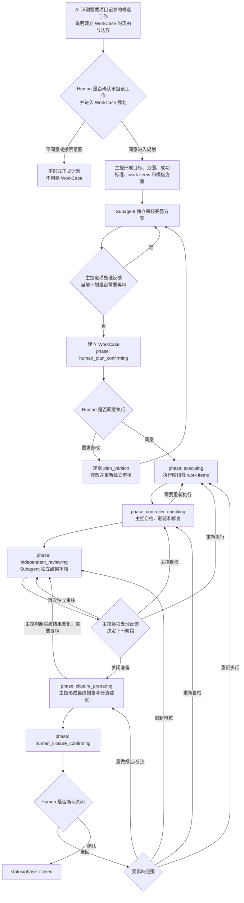

# WorkCase / 工作项

```yaml
ldvh_spec:
  spec_key: "workcase-fact-type"
  spec_id: "21"
  spec_kind: "spec"
  title: "WorkCase / 工作项"
  status: "active"
  canonical_path: "specs/21-WorkCase-工作项.md"
  parent_spec: "fact-model-foundation"
  relation: "refines"
  positioning: "定义 WorkCase 事实类型的对象边界、Schema、阶段性工作项、生命周期、Human 对建立项目记录的选择、完整质量控制链、来源、关系、验证与关闭规则"
  scope: "管辖项目中经 Human 明确确认需要作为项目记录管理，已经形成明确可验证目标，并需要持续保存计划、阶段结果、当前推进、质量关口与终态判断的单一工作责任"
  basis:
    - "fact-model-foundation"
    - "source-of-truth-traceability"
    - "action-template-foundation"
  authorized_attachments: []
```

> 文件状态：`active`。本文是 `workcase` 事实类型的唯一定义来源；它不使 WorkCase 读取、创建、校验、迁移、Helper、Code、tests、行动模板或 Web 能力自动成立。任何非当前 WorkCase 资料、实例和实现都不取得当前效力。

## 1. 价值判断

WorkCase 把一项已经由 Human 确认需要推进并作为项目记录管理、且已经形成明确目标、范围和成功标准的工作，保留为可持续回读、可分阶段交付、验证、阻塞与关闭的当前事实。它使后续 AI 不必依赖聊天记忆重建“为什么项目决定承担这项工作、要完成什么、分成哪些阶段结果、当前进展如何、什么阻止继续、经过哪些质量关口、依据什么关闭”。WorkCase 是否成立不取决于工作持续时间、工作项数量或实现复杂度；Human 是否明确选择将它作为项目记录管理，才是进入 WorkCase 准入判断的必要前提。

一个 WorkCase 只承担一个能够独立判断关闭的工作责任。共同服务该责任关闭判断、具有明确阶段目标和预期结果的工作项保留在 WorkCase；需要独立准入、授权、长期阻塞、取消、转交或关闭的目标形成其它 WorkCase。命令顺序、工具调用、临时 todo、AI 推理和单个工作项内部如何实现仍属于环境自由执行，不进入 WorkCase。

WorkCase 的阶段性工作项、创建方案审核、执行授权、主控自检、独立结果审核、关闭报告与确认共同形成从工作意图、计划、执行、结果到关闭的完整质量控制链。创建审核防止目标、范围、拆分和方法在执行前发生偏移；Human 执行批准确认当前计划值得实际执行；主控自检防止执行结果偏离计划和成功标准；独立结果审核防止主控只用自述证明自己；Human 关闭确认保留对整体结果和剩余责任的最终判断。任一环节的错误都可能使后续工作整体偏移；因此 Human 选择建立 WorkCase，就同时选择这条完整链路，不得因工作时间短、实现简单或只有一个 work item 而跳过其中的审核、批准或验证。WorkCase 保留这些可消费的当前事实，同时排除通用 `orchestration` 容器、环境内部步骤、工具日志、角色脚手架、重复确认位置、空占位和对象内 revision history。

WorkCase 主要服务 V1 快速定位、V2 充分理解、V3 边界识别、V4 稳定推进、V5 据实判断、V6 工作接续、V7 清晰沟通和 V8 持续积累。行动模板组织可复用的行动方法，WorkCase 保存这一项已经纳管的工作实际采用的阶段目标、当前结果与关口；两者不能互相替代。新增成本包括查重、持续回写、Schema、审核与消费维护；通过正交的责任状态和推进阶段、条件字段、版本绑定、禁止内部步骤与 Git 历史去重，把记录和治理成本限制在当前工作实际需要的信息上。不能证明该净收益的工作不准入 WorkCase。

## 2. 规范依据

本文直接依据：

1. `fact-model-foundation`：规定事实类型、统一字段、来源、证据、关系、状态、变更和验证的共同边界；
2. `source-of-truth-traceability`：规定管辖项目当前事实源、Working Tree、来源回指和稳定事实边界；
3. `action-template-foundation`：规定可复用行动结构与单次运行记录不应反向成为事实对象 Schema，同时允许具体事实类型定义自身需要稳定保留的阶段目标和质量关口。

既有行动编排只用于识别真实需求与失败模式。WorkCase 保留已证明有消费价值的中断恢复、阶段结果、独立审核，以及对象建立后的执行批准与关闭确认双 Human Gate；对象建立前仍先取得 05 对事实对象创建行动要求的 Human 当前授权，不恢复非 canonical 路径、整个嵌套结构、空占位、运行日志或写入能力。

## 3. 职责边界

本文负责定义：

1. `workcase` 的类型语义、对象粒度、准入和排除边界；
2. WorkCase 的唯一当前承载位置、完整 Schema、责任状态、推进阶段和关闭口径；
3. 目标、范围、成功标准、阶段性工作项、最小恢复快照、创建审核、执行批准、主控自检、独立结果审核、当前摘要、验证、阻塞、来源、证据和关系的领域语义；
4. WorkCase 工作意图确认、创建、执行前确认、阶段推进、更新、更正、拆分、合并、关闭、删除和停止使用的边界；
5. WorkCase 的验证要求、对象建立后的执行与关闭双 Human Gate、Stop Conditions 和最小失败范围。

本文不负责定义：

1. 单个工作项内部的实施步骤、命令、工具调用、临时 todo、AI 推理、运行事件或完整执行日志；
2. 具体 AI 模型、平台线程、子 Agent API、工具运行状态或环境内部编排实现；
3. Helper API、CLI、Web 表单、Hook、文件分配算法或迁移兼容；
4. 其它事实类型、普通文档、规范、Git 提交或行动模板的内容；
5. 仅因 WorkCase 存在而产生的执行、写入、提交、发布或风险接受授权。

主控 AI 负责先确认 Human 当前指令是否已经明确要求由项目承担并建立 WorkCase；尚未明确时，向 Human 交还相应建议，取得工作意图确认后再形成方案、处理审核意见、委派和汇总工作项、自检修复、处理结果审核并准备关闭；独立审核者不得用主控自述代替实际审查；受委派执行者可在工作项边界内自主选择实现步骤；Human 负责对象创建前的工作意图确认、执行前的当前计划批准与最终关闭确认。Code 只可按当前来源检查固定结构、值闭集、版本绑定、引用和转换条件。WorkCase 不是命令或工具运行引擎，也不是聊天计划副本。

## 4. 适用范围

一个目标只有同时满足以下条件，才可以形成 WorkCase：

Human 对“这项工作需要作为 WorkCase 建立项目记录”的明确选择是准入的必要前提，但不单独替代其余目标、边界、来源和净收益检查。工作持续时间、预计会话数、工作项数量和实现复杂度都不是独立的准入或排除条件。

1. Human 已明确确认该工作应由项目继续推进并作为 WorkCase 建立项目记录；这项确认只授权 AI 进入计划形成、独立审核和受控创建，不表示 Human 已批准尚未形成的具体计划；
2. 已经存在清楚、可执行且能够独立判断关闭的单一目标；
3. 范围、排除边界和至少一项可检查成功标准能够明确表达；
4. 需要将计划、阶段结果、当前推进、质量关口或终态判断作为项目当前事实持续保存；这种需要可以来自跨行动、会话或执行者恢复，也可以来自验证、授权、依赖、阻塞或独立关闭要求；
5. 已召回并比较当前 WorkCase、Spark 与相邻稳定事实，没有可无损更新的现有对象；
6. 来源能够按目标、范围和成功标准所需精度回指，未知内容没有被补造；
7. 对象化减少的恢复、验证和关闭漂移高于持续回写与 Schema 维护成本。

以下内容不得形成 WorkCase：当前行动即可完成且无需稳定回读的小任务；只有模糊问题或信息缺口、尚无可验收目标的输入；临时 todo、Agent plan、命令清单、review checklist 或执行日志；长期规则或普通文档正文；纯结果报告；没有独立身份与关闭需要的提醒；无终点的周期运行入口。

工作可在当前行动或当前会话内完成，不会因此自动被排除；只要 Human 已明确选择建立项目记录，且其余准入条件成立，仍可形成 WorkCase。反之，工作预计跨越多个行动或会话，也不会因此自动准入。

Spark 与 WorkCase 的分界不取决于“以后是否可能做”。Spark 尚无确定承接位置或清楚验收边界；WorkCase 已经有可执行目标、范围与成功标准。把 Spark 分流到 WorkCase 必须分别满足 Spark 完整承接和本文准入，不得自动升级。

## 5. WorkCase 类型定义

### 事实类型声明

| fact_type_key | summary | definition_ref |
|---|---|---|
| `workcase` | 经 Human 明确确认需要作为项目记录管理，具有明确可验证目标，并保存当前推进、质量关口与终态判断的单一工作责任 | `workcase-fact-type::5. WorkCase 类型定义` |

### 类型专属结构定义

| structure_key | meaning | not_meaning | constraints |
|---|---|---|---|
| `workcase-item` | 共同服务同一 WorkCase 关闭判断、具有明确阶段目标和预期结果的内部工作单元 | 不表示命令步骤、临时 todo、工具调用、AI 推理或独立 WorkCase | 每项具有稳定 item 身份、目标、预期结果、方法边界和状态；依赖只引用同一对象内 item；状态条件字段形成闭集 |
| `workcase-review` | 独立审核者对一个明确计划版本或结果版本提供的第二视角、咨询性判断、反馈及主控处置记录 | 不表示审核者拥有流程推进或否决权，也不表示主控自检、Human 批准、工具验证或审核者执行了被审对象 | 必须标明审核对象版本、独立审核者、范围、时间、咨询性结论、实际反馈和主控逐项处置；不得创建空审核占位 |
| `workcase-human-approval` | Human 对一个明确计划版本或结果版本作出的执行或关闭批准记录 | 不表示技术验证、风险自动消失、后续版本获批或普通对话确认 | 只记录实际批准；拒绝或修改要求通过当前摘要和方案修订处理，不写伪批准；批准必须绑定准确版本和时间 |
| `workcase-success-criterion` | current profile 中具有稳定局部身份的一项成功标准定义 | 不表示结果、证据、工作项或数组位置 | criterion_id 在同一 WorkCase 内唯一稳定；statement 是 Human 当前计划直接消费的可观察条件 |
| `workcase-success-result` | 对 current profile 一项成功标准的当前结果判断和依据 | 不表示 Code 已证明自然语言结论或 Human 已验收 | 必须按 criterion_id 精确覆盖当前定义；结果和证据只证明各自实际范围 |
| `workcase-review-basis` | Reviewer 实际检查的确定性主体投影与内容指纹 | 不表示审核独立性、结论效力、Git revision 或流程决定 | projection_key 使用闭集；subject_fingerprint 由 §6 规定的 canonical 投影形成 |
| `workcase-audit-entry` | 被当前详细审核替代后仍需保留的紧凑审核价值和主控处置摘要 | 不表示草案全文、聊天记录、revision history 或当前详细 review | 只承载 pre_creation_plan、superseded_plan、superseded_result 三类；finding 使用稳定 ID 成对保存主题和处置 |
| `workcase-audit-finding` | 一项已由 Controller 处理的历史审核发现及其最终去向 | 不表示未处理意见、当前结果或 Reviewer 的流程决定 | finding_id 唯一；主题、处置、复审结果和最终去向必须同项保存，不使用平行数组 |
| `workcase-residual-responsibility` | 当前 WorkCase 停止推进后仍适用的一项具体责任 | 不表示建议、风险、关系目标已完成或下游自动承接 | 使用 residual_id；routed 必须在摘要中明确后续承接的事实对象与责任边界，accepted_stop 必须明确 Human 接受停止的原因、未完成事项与风险边界 |
| `workcase-nonbinding-followup` | 有后续参考价值但不属于当前关闭责任的非约束建议 | 不表示残余责任、承接关系、Spark 或新 WorkCase | 不自动建立关系或事实对象；是否以后对象化必须重新按相应来源判断 |
| `workcase-improvement-observation` | 执行中具有跨阶段恢复或明确后续消费价值、已经完成价值判断和终态处置的改进观察 | 不表示普通推理、工具噪声、未收敛想法、自动范围扩张或自动建档 | 单一结果版本最多 20 项；topic_key 唯一；V1–V8 净价值和语义去重由 Controller 判断，Code 只检查结构与引用 |

### 类型字段使用绑定

| field_key | presence | constraint_ref |
|---|---|---|
| `object-id` | required | `workcase-fact-type::5. WorkCase 类型定义` |
| `fact-type-key` | required | `inherit` |
| `title` | required | `workcase-fact-type::5. WorkCase 类型定义` |
| `created-at` | required | `inherit` |
| `updated-at` | required | `workcase-fact-type::8. 对象变化与授权边界` |
| `status` | required | `workcase-fact-type::6. 对象语义与生命周期` |
| `urls` | conditional | `workcase-fact-type::7. 外部网址、自然语言证据与关系` |
| `relations` | conditional | `workcase-fact-type::7. 外部网址、自然语言证据与关系` |
| `current-summary` | required | `workcase-fact-type::6. 对象语义与生命周期` |
| `workcase-resume-from` | conditional | `workcase-fact-type::6. 对象语义与生命周期` |
| `workcase-waiting-on` | conditional | `workcase-fact-type::6. 对象语义与生命周期` |
| `priority` | conditional | `workcase-fact-type::6. 对象语义与生命周期` |
| `disposition-summary` | conditional | `workcase-fact-type::6. 对象语义与生命周期` |
| `closed-at` | conditional | `workcase-fact-type::6. 对象语义与生命周期` |
| `workcase-goal` | required | `inherit` |
| `workcase-scope` | required | `inherit` |
| `workcase-success-criteria` | conditional | `workcase-fact-type::6. 对象语义与生命周期` |
| `workcase-profile` | conditional | `workcase-fact-type::6. 对象语义与生命周期` |
| `workcase-success-criterion-definitions` | conditional | `workcase-fact-type::6. 对象语义与生命周期` |
| `workcase-success-criterion-results` | conditional | `workcase-fact-type::6. 对象语义与生命周期` |
| `workcase-audit-summary` | conditional | `workcase-fact-type::6. 对象语义与生命周期` |
| `workcase-residual-responsibilities` | conditional | `workcase-fact-type::6. 对象语义与生命周期` |
| `workcase-nonbinding-followups` | conditional | `workcase-fact-type::6. 对象语义与生命周期` |
| `workcase-improvement-observations` | conditional | `workcase-fact-type::6. 对象语义与生命周期` |
| `workcase-phase` | required | `workcase-fact-type::6. 对象语义与生命周期` |
| `workcase-plan-version` | required | `workcase-fact-type::6. 对象语义与生命周期` |
| `workcase-items` | required | `workcase-fact-type::6. 对象语义与生命周期` |
| `workcase-creation-reviews` | required | `workcase-fact-type::6. 对象语义与生命周期` |
| `workcase-execution-approval` | conditional | `workcase-fact-type::6. 对象语义与生命周期` |
| `workcase-result-version` | conditional | `workcase-fact-type::6. 对象语义与生命周期` |
| `workcase-controller-check-summary` | conditional | `workcase-fact-type::6. 对象语义与生命周期` |
| `workcase-result-reviews` | conditional | `workcase-fact-type::6. 对象语义与生命周期` |
| `workcase-closure-approval` | conditional | `workcase-fact-type::6. 对象语义与生命周期` |
| `workcase-validation-summary` | conditional | `workcase-fact-type::7. 外部网址、自然语言证据与关系` |
| `workcase-blocking-summary` | conditional | `workcase-fact-type::6. 对象语义与生命周期` |
| `workcase-closure-outcome` | conditional | `workcase-fact-type::6. 对象语义与生命周期` |

### 类型专属字段定义

| field_key | field_path | JSON type | meaning | not_meaning | constraints |
|---|---|---|---|---|---|
| `workcase-goal` | `goal` | string | WorkCase 期望达成并可独立判断关闭的单一目标状态 | 不表示标题、当前进展、步骤、成功标准或结果 | 必填非空；必须能够与范围和成功标准共同产生独立关闭判断；实质改成另一目标时新建对象 |
| `workcase-scope` | `scope` | string | WorkCase 承诺覆盖的内容、重要约束和明确排除边界 | 不表示当前进展、完整计划、实现细节或来源全文 | 必填非空；边界变化时同步复核目标、成功标准、授权和对象身份 |
| `workcase-success-criteria` | `success_criteria` | array | 共同构成目标达成判断的可观察条件闭集 | 不表示执行步骤、todo 状态、证据、测试命令或关闭结果 | 至少一项非空唯一字符串；每项可独立检查；不嵌入 checklist 标记或可变完成状态 |
| `workcase-profile` | `workcase_profile` | string | 选择 WorkCase 当前控制契约的显式兼容 profile | 不表示计划版本、结果版本、Git revision、对象版本或迁移完成 | 当前唯一值 `control-contract-v1`；存在后不得移除或降级；缺省只按 §6 的精确生效边界解释 legacy |
| `workcase-success-criterion-definitions` | `success_criterion_definitions` | array | current profile 的稳定成功标准定义闭集 | 不表示结果、证据、工作项或旧 success_criteria 的别名副本 | current profile 必填且至少一项；成员使用 `workcase-success-criterion`；与 legacy `success_criteria` 互斥 |
| `workcase-success-criterion-results` | `success_criterion_results` | array | current profile 对当前成功标准逐项形成的结果闭集 | 不表示 Reviewer、Human 或 Code 已自动确认结论 | 进入 independent_reviewing 起必填；成员使用 `workcase-success-result`，按 criterion_id 精确唯一覆盖当前定义 |
| `workcase-audit-summary` | `audit_summary` | array | 在不依赖中途 Git commit 的情况下保留被替代审核的紧凑价值和 Controller 处置连续性 | 不表示当前详细 review、草案全文、审核次数展示或 revision history | current profile 创建时至少包含 pre_creation_plan；计划/结果升版清除旧详细审核时追加对应 superseded entry；audit_id 和 finding_id 不可改写 |
| `workcase-residual-responsibilities` | `residual_responsibilities` | array | 关闭准备中识别的仍适用具体责任闭集 | 不表示 followup、一般风险、目标已完成或路由自动成立 | 成员使用 `workcase-residual-responsibility`；没有残余时省略；routed 项必须被 routed-to 关系显式映射 |
| `workcase-nonbinding-followups` | `nonbinding_followups` | array | 不影响当前责任关闭、但具有明确参考价值的后续建议 | 不表示未完成责任、关系、自动创建或下游授权 | 成员使用 `workcase-nonbinding-followup`；没有时省略；任何后续对象化重新走 31 |
| `workcase-improvement-observations` | `improvement_observations` | array | 已完成准入、去重、V1–V8 净价值判断和处置的持续改进观察 | 不表示推理日志、临时修正、工具输出、自动扩张计划或自动路由 | current profile 条件出现；成员使用 `workcase-improvement-observation`；单一结果版本至多 20 项，同 topic_key 先合并压缩 |
| `workcase-phase` | `phase` | string | WorkCase 当前处于哪一个方案确认、执行、质量控制或关闭确认位置 | 不表示责任是否阻塞或终止、完成比例、命令阶段或模板运行事件 | 必填；闭集和转换条件由 §6 定义；必须与 status 正交且不得用 summary 代替 |
| `workcase-plan-version` | `plan_version` | integer | 当前目标、范围、成功标准、工作项及其依赖、方法和模板偏离共同形成的计划绑定身份 | 不表示 Git revision、对象版本、审核次数、修订历史、执行进度或面向 Human 的计划摘要 | 必填且从 1 单调递增；任何影响 Human 执行判断的计划覆盖字段变化必须递增；创建审核和执行批准只对同版本有效；向 Human 交付时必须直接展示当前计划内容，不得用版本号代替 |
| `workcase-items` | `work_items` | array | 当前计划中共同服务 WorkCase 关闭判断的阶段性目标与结果集合 | 不表示环境内部步骤、独立事实对象、命令清单或完整运行日志 | 必填且至少一项；成员使用 `workcase-item`；item_id 唯一，依赖无缺失、自指或环；不得用数组顺序暗示未声明依赖 |
| `workcase-creation-reviews` | `creation_reviews` | array | 创建及执行批准前对当前计划版本完成的独立审核与主控处置记录 | 不表示审核者决定是否创建或提交 Human，也不表示 Human 已批准执行、主控自检或结果审核 | 必填且至少一项；成员使用 `workcase-review`；只保留当前 plan_version 的实际审核，旧版本由 Git 追溯；全部当前审核的联合 scope 必须覆盖 §6 规定的完整计划，主控必须逐项处置反馈；结论值不自动推进或否决 |
| `workcase-execution-approval` | `execution_approval` | object | Human 对当前计划版本开始执行的明确批准 | 不表示创建批准、技术验证、关闭批准或后续计划版本继续获批 | 仅在 Human 实际批准后出现；成员使用 `workcase-human-approval` 且 subject_version 等于当前 plan_version；计划版本变化时立即失效并移除，phase 回到 human_plan_confirming；若这条批准记录本身被 Human 明确否认或撤回，只能按本节的受控撤回动作清除，不能手改 |
| `workcase-result-version` | `result_version` | integer | 工作项结果、主控自检及当前关闭报告共同形成的结果绑定身份 | 不表示 plan_version、Git revision、结果审核次数，也不表示 Code 已根据普通字段差异判定实质变化 | 首次从 executing 进入 controller_checking 时建立为 1；只在主控判断实施结果发生需要重新审核的实质变化时单调递增；结果审核与关闭批准只对同版本有效 |
| `workcase-controller-check-summary` | `controller_check_summary` | string | 主控逐项检查成功标准、工作项结果、验证、残余问题并完成修复后的当前自检说明 | 不表示独立结果审核、Human 验收或工具日志 | controller_checking 后必填非空；必须说明检查覆盖、发现、修复和未验证范围，并由当前 自然语言验证说明 支持 |
| `workcase-result-reviews` | `result_reviews` | array | 独立审核者对当前结果版本提供第二视角以及主控处理反馈的记录 | 不表示审核者决定返回、复审、进入关闭准备或提交 Human，也不表示创建审核、主控自检或 Human 关闭确认 | 由 independent_reviewing 阶段形成且至少一项；成员使用 `workcase-review`；只保留当前 result_version 的实际审核，旧版本由 Git 追溯；主控必须逐项处置反馈；离开 independent_reviewing 后 reviewer、reviewed_at、subject_version、scope、conclusion 和 feedback 不得被主控替换、追加或改写，controller_resolution 可由主控更新；结论值不自动推进或否决 |
| `workcase-closure-approval` | `closure_approval` | object | Human 对当前结果版本、最终报告和分流建议作出的关闭批准 | 不表示技术验证、Git 已提交、下游责任完成或后续结果版本获批 | 仅在 Human 实际批准关闭后出现；成员使用 `workcase-human-approval` 且 subject_version 等于当前 result_version；写入与 status/phase 进入 closed 必须属于同一受控变更 |
| `workcase-resume-from` | `resume_from` | string | 当前非终态推进阶段在中断、压缩或执行者交接后继续的最小明确入口 | 不表示完整执行步骤、历史日志或单个工作项自己的恢复点 | status 非 closed 时必填非空；与 summary 共同覆盖当前 phase 的已完成范围、下一动作和所需输入；阶段变化时覆盖更新 |
| `workcase-waiting-on` | `waiting_on` | string | 当前阶段正在等待的 Human 决定、独立审核、外部能力、证据或其它明确条件 | 不表示普通下一步、低优先级或历史阻塞 | 实际等待时条件出现且非空；等待解除后移除；Human 确认阶段必须说明等待的具体 Human Gate，blocked 仍由 blocking_summary 表达整体阻塞 |
| `workcase-blocking-summary` | `blocking_summary` | string | WorkCase 当前不能继续的具体事实、影响范围和解除条件 | 不表示低优先级、普通剩余工作、失败历史或终态理由 | 非空；解除条件必须可观察且有依据；不保留已经解除的历史阻塞占位 |
| `workcase-closure-outcome` | `closure_outcome` | string | WorkCase 在当前身份下停止推进时的结果分类 | 不表示状态、成功标准验证详情、终态理由或 Git 已提交 | 闭集 completed、partial、cancelled、not-achieved；各值的互斥语义与成立条件由 §6 唯一定义 |
| `workcase-item-id` | `item_id` | string | 同一 WorkCase 内稳定识别一个阶段性工作项的局部身份 | 不表示事实对象身份、数组序号或执行者身份 | 必填；匹配 `item-[0-9]{2,}`；同一 WorkCase 内唯一，形成后不得因排序、状态或执行者变化而改变 |
| `workcase-item-goal` | `goal` | string | 该工作项需要达成的阶段目标 | 不表示 WorkCase 总目标、命令、方法或结果 | 必填非空；必须直接服务 WorkCase goal 与至少一项 success criterion |
| `workcase-item-expected-result` | `expected_result` | string | 该阶段目标完成时应形成的可观察结果 | 不表示实现步骤、验证证据或完成声明 | 必填非空；必须能据此判断工作项是否形成阶段结果 |
| `workcase-item-status` | `status` | string | 工作项当前未开始、进行、阻塞、完成或取消的状态 | 不表示 WorkCase status/phase、执行百分比或环境任务状态 | 必填；闭集 pending、in_progress、blocked、completed、cancelled；条件字段由 §6 定义 |
| `workcase-item-depends-on` | `depends_on` | array | 当前工作项开始或完成所依赖的同一 WorkCase 工作项身份 | 不表示事实对象关系、文件依赖或默认数组顺序 | 条件出现；成员为唯一非空 item_id；不得缺失、自指或形成环；无依赖时省略 |
| `workcase-item-approach-summary` | `approach_summary` | string | Human 可理解的阶段方法、执行边界和重要安排 | 不表示工作项内部命令清单、完整计划或执行日志 | 必填非空；应说明必要的委派、并行边界和验证入口，但保留环境内部自主实现空间 |
| `workcase-item-template-keys` | `template_keys` | array | 当前工作项计划采用的已成立行动模板稳定 key | 不表示模板自动适用、已经执行或环境 Skill | 条件出现；成员唯一非空；只引用当前可定位模板；没有适用模板时省略并由 approach_summary 说明普通求解路径 |
| `workcase-item-template-deviation-summary` | `template_deviation_summary` | string | 当前工作项偏离所列行动模板稳定结构的范围、原因和风险 | 不表示普通实现选择或未选择模板 | 仅实际偏离时出现且非空；必须足以供独立审核和 Human 判断；偏离不得绕过来源规则或 Human Gate |
| `workcase-item-current-summary` | `current_summary` | string | 当前进行中或阻塞工作项已经形成的事实、尚未完成范围和当前焦点 | 不表示历史日志、推理过程或最终结果 | in_progress/blocked 时必填；变化时覆盖当前快照，不追加流水 |
| `workcase-item-resume-from` | `resume_from` | string | 中断、压缩或执行者交接后恢复该工作项的最小明确入口 | 不表示完整步骤清单或未经验证的结果 | in_progress/blocked 时必填；必须能由新执行者结合对象和来源继续，不复制已完成过程 |
| `workcase-item-blocking-summary` | `blocking_summary` | string | 该工作项当前阻塞事实、影响和解除条件 | 不表示 WorkCase 整体阻塞或低优先级 | 仅 item status=blocked 时必填；解除后移除；WorkCase 是否 blocked 仍按 §6 独立判断 |
| `workcase-item-result-summary` | `result_summary` | string | 已完成或取消工作项的当前阶段结果、实际边界或停止原因 | 不表示 WorkCase 已完成、验证充分或命令日志 | completed/cancelled 时必填；必须据实说明预期结果满足范围和残留问题 |
| `workcase-review-reviewer` | `reviewer` | string | 实际承担独立审核的 AI 执行者、任务或可区分审查身份 | 不表示模型能力已经验证或主控可以自审 | 必填非空；必须能够区分主控；不得写 `independent`、`subagent` 等无法区分实际审核者的占位 |
| `workcase-review-reviewed-at` | `reviewed_at` | string | 审核结论作为当前 WorkCase 受控记录正式形成的规范时点 | 不表示被审计划/结果形成时间，也不保证重现更早对话时间 | 必填带时区 RFC 3339 date-time，不得晚于对象 updated_at；专属便利操作使用当次唯一 event_at，历史更正只能按普通受控更正据实回指 |
| `workcase-review-subject-version` | `subject_version` | integer | 本次审核实际覆盖的 plan_version 或 result_version | 不表示 Git revision 或审核次数 | 必填正整数；所在 creation_reviews/result_reviews 决定其引用的版本域 |
| `workcase-review-scope` | `scope` | string | 本次独立审核实际检查的对象、问题和未覆盖边界 | 不表示 WorkCase scope 或默认全量审核 | 必填非空；不得用“全部”替代实际检查范围 |
| `workcase-review-conclusion` | `conclusion` | string | 独立审核者对当前版本完整性、风险和准备度给出的咨询性判断 | 不表示流程推进或否决决定，也不表示主控已经修复、Human 已批准或技术状态成立 | 闭集 pass、pass_with_followups、changes_required、blocked；四种值均必须由主控结合反馈逐项处置，不得被 Code 或流程自动解释为推进、驳回、复审或阻塞决定 |
| `workcase-review-feedback` | `feedback` | array | 审核者实际提出的发现、风险、反例或建议 | 不表示主控处置或聊天全文 | 必填且至少一项非空唯一字符串；即使 pass 也必须记录实际检查后的关键反馈，不允许空审核凭据 |
| `workcase-review-basis-member` | `review_basis` | object | 本次 review 实际绑定的确定性主体投影和指纹 | 不表示 Git revision、审核结论、独立性或 Controller 处置 | current profile review 必填；成员使用 `workcase-review-basis`；legacy review 省略 |
| `workcase-review-controller-resolution` | `controller_resolution` | string | 主控对本次全部审核反馈逐项接受、修正、拒绝或承接的处理结论，以及是否复审和进入哪一阶段的主控判断 | 不表示审核者同意、Human 批准或技术验证 | legacy review 和创建时 current review 必填；对象内 current result review 可由 Reviewer 先形成而暂缺，离开 independent_reviewing 前必须由 Controller 补齐；按 feedback 原顺序编号处置 |
| `workcase-criterion-id` | `criterion_id` | string | current profile 内稳定识别成功标准的局部身份 | 不表示数组位置、事实对象身份或结果 | 匹配 `criterion-[0-9]{2,}`，同一对象唯一；statement 修改时可保留 ID，增删或换 ID 属于计划覆盖变化 |
| `workcase-criterion-statement` | `statement` | string | Human 直接检查的一项当前成功标准陈述 | 不表示结果、证据或完成状态 | 必填非空且同一对象内不得重复；必须可独立检查 |
| `workcase-result-criterion-id` | `criterion_id` | string | 指向当前成功标准定义的稳定引用 | 不表示数组位置或自然语言匹配 | 必须精确引用当前 success_criterion_definitions；结果集合不得重复或缺失 ID |
| `workcase-result-outcome` | `outcome` | string | Controller 对该成功标准当前结果的分类 | 不表示 Code 或 Reviewer 自动裁决 | 闭集 `satisfied`、`not_satisfied`、`not_verified`；真实性由 Controller 依据证据判断 |
| `workcase-result-summary` | `summary` | string | 说明该 criterion 结果、覆盖和未验证边界 | 不表示证据定位或 Human 验收 | 必填非空；不得用枚举值代替实际说明 |
| `workcase-review-projection-key` | `projection_key` | string | 选择本次审核的确定性主体投影 | 不表示 phase、结论或复审决定 | 闭集 `plan_current`、`result_implementation`、`result_with_closure_report`；creation review 只用 plan_current |
| `workcase-review-subject-fingerprint` | `subject_fingerprint` | string | 绑定本次审核实际覆盖内容的 canonical SHA-256 | 不表示 Git identity、对象身份、语义等价或审核必须永远等于以后变化的当前主体 | 64 位小写十六进制；Reviewer 记录首次形成或在 independent_reviewing 中更新时，必须等于该次受控变更 after snapshot 按 §6 对 projection_key 形成的指纹；creation review 还必须持续等于当前计划投影 |
| `workcase-audit-id` | `audit_id` | string | 同一 WorkCase 内稳定识别一项紧凑审核摘要 | 不表示审核次数或版本号 | 匹配 `audit-[0-9]{2,}` 且唯一；形成后不可改写 |
| `workcase-audit-subject-kind` | `subject_kind` | string | 说明被摘要的是创建前计划、旧计划版本或旧结果版本 | 不表示当前 review 类型 | 闭集 `pre_creation_plan`、`superseded_plan`、`superseded_result` |
| `workcase-audit-subject-version` | `subject_version` | integer | 被摘要计划或结果的正整数版本 | 不表示 Git revision | 必填正整数；pre_creation_plan 使用首次计划版本 |
| `workcase-audit-review-count` | `review_count` | integer | 被压缩的实际独立审核记录数量 | 不表示修改次数或审核质量 | 必填正整数，不得凭空增加 |
| `workcase-audit-entry-summary` | `summary` | string | 概括审核机制对该主体产生的实际价值 | 不表示详细反馈或当前计划/结果 | 必填非空，面向后续消费而非保存过程 |
| `workcase-audit-findings` | `findings` | array | 保存实际产生并已处置的重要审核发现 | 不表示空审核占位 | 条件出现；成员使用 `workcase-audit-finding`；没有实际发现时省略 |
| `workcase-audit-finding-id` | `finding_id` | string | 稳定识别一项被摘要的审核发现 | 不表示数组位置 | 匹配 `finding-[0-9]{2,}`，同一对象 audit_summary 内唯一 |
| `workcase-audit-finding-topic` | `topic` | string | 简明说明发现涉及的问题主题 | 不表示详细反馈全文 | 必填非空 |
| `workcase-audit-controller-disposition` | `controller_disposition` | string | Controller 对该发现的终态处置 | 不表示 Reviewer 决定 | 闭集 `accepted`、`corrected`、`rejected`、`carried` |
| `workcase-audit-resolution-summary` | `resolution_summary` | string | 说明处置如何落实及剩余边界 | 不表示完整修改历史 | 必填非空 |
| `workcase-audit-rereview-outcome` | `rereview_outcome` | string | 说明该发现是否实际触发再次独立审核 | 不表示 Code 自动判断复审 | 闭集 `performed`、`not_required` |
| `workcase-audit-final-route` | `final_route` | string | 说明该发现最终进入当前内容、后续、残余或拒绝 | 不表示关系自动成立 | 闭集 `current_plan`、`current_result`、`nonbinding_followup`、`residual_responsibility`、`rejected` |
| `workcase-residual-id` | `residual_id` | string | 同一 WorkCase 内稳定识别一项残余责任 | 不表示事实对象身份 | 匹配 `residual-[0-9]{2,}` 且唯一 |
| `workcase-residual-summary` | `summary` | string | 说明仍适用的具体责任及边界 | 不表示建议、风险或目标已完成 | 必填非空且可独立判断承接 |
| `workcase-residual-disposition` | `disposition` | string | 残余责任当前承接结论 | 不表示目标已完成 | 闭集 `routed`、`accepted_stop`；routed 必须有关系映射，accepted_stop 不得映射 |
| `workcase-followup-id` | `followup_id` | string | 稳定识别一项非约束后续建议 | 不表示事实对象身份 | 匹配 `followup-[0-9]{2,}` 且唯一 |
| `workcase-followup-summary` | `summary` | string | 可供以后重新判断的建议内容 | 不表示当前责任 | 必填非空 |
| `workcase-followup-rationale` | `rationale` | string | 说明建议价值及为何不属于当前关闭责任 | 不表示已批准或已路由 | 必填非空 |
| `workcase-observation-id` | `observation_id` | string | 稳定识别一项已处置改进观察 | 不表示运行事件序号 | 匹配 `observation-[0-9]{2,}` 且唯一 |
| `workcase-observation-topic-key` | `topic_key` | string | 用于同一结果版本机械防重复的规范化主题 key | 不表示语义相似度已由 Code 判断 | 匹配稳定 key 格式且唯一；语义同主题由 Controller 合并 |
| `workcase-observation-summary` | `summary` | string | 说明可恢复、可消费的观察事实 | 不表示推理过程或工具日志 | 必填非空；只登记影响成功标准、跨阶段恢复或有明确后续消费价值的事项 |
| `workcase-observation-ownership` | `ownership` | string | Controller 判断该观察属于当前范围、相邻项目还是外部责任 | 不表示自动路由 | 闭集 `current_scope`、`adjacent_project`、`external` |
| `workcase-observation-value-dimensions` | `value_dimensions` | array | 说明观察对 00 V1–V8 哪些价值维度产生净收益 | 不表示 Code 已作价值判断 | 至少一项、唯一，成员闭集 V1–V8 |
| `workcase-observation-net-value-summary` | `net_value_summary` | string | Controller 对记录收益和治理成本的净价值判断 | 不表示自动准入 | 必填非空 |
| `workcase-observation-disposition` | `disposition` | string | 观察的终态处置分类 | 不表示事实对象自动变化 | 闭集 `absorbed_current_scope`、`nonbinding_followup`、`residual_responsibility`、`rejected` |
| `workcase-observation-disposition-ref` | `disposition_ref` | string | 指向实际吸收 item、followup 或 residual 的局部 ID | 不表示关系或目标事实对象 | absorbed 引用 item；followup/residual 分别引用对应 ID；rejected 禁止出现 |
| `workcase-observation-disposition-summary` | `disposition_summary` | string | 说明处置依据、边界和是否影响计划 | 不表示普通工作日志 | 必填非空；若改变计划覆盖内容必须先按 plan_version 规则回 Human Gate |
| `workcase-approval-subject-version` | `subject_version` | integer | Human 本次批准所针对的准确 plan_version 或 result_version | 不表示以后版本自动获批 | 必填正整数；所在 execution_approval/closure_approval 决定版本域，必须等于对象当前相应版本 |
| `workcase-approval-approved-at` | `approved_at` | string | Human 批准作为当前 WorkCase 受控记录正式形成的规范时点 | 不表示技术状态成立，也不保证重现更早对话时间 | 必填带时区 RFC 3339 date-time，不得晚于对象 updated_at；专属便利操作使用当次唯一 event_at，历史更正只能按普通受控更正据实回指 |
| `workcase-approval-summary` | `summary` | string | Human 批准的对象、范围、限制和附带条件 | 不表示 AI 对 Human 意图的扩张解释 | 必填非空；只记录实际批准范围，不能用“同意”隐藏版本、限制或偏离 |
| `workcase-approval-source-refs` | `source_refs` | array | 回指 Human 当前决定或授权来源 | 不表示 Code 已核验技术结果，也不允许 AI 自行补造批准 | 可选；出现时至少一项，每项复用 04 授权附件的来源回指字段闭集；只记录实际 Human 来源与明确作用范围 |

### Schema 与对象载体

WorkCase 对象使用 UTF-8 YAML，一文件一对象，当前权威位置固定为管辖项目仓库中的 `ldvh-base/workcases/<object_id>.yaml`。`object_id` 必须匹配 `workcase-[0-9]{4,}`；文件名必须与 `object_id` 完全一致，分配后的身份不得因标题、路径、状态或内容改变。`title` 只简短识别工作责任，不复制 `goal` 或 `summary`。未知或不适用的条件字段必须省略，不使用 `null`、空字符串、空数组、占位时间、默认状态或默认关系。

完整 Schema 由统一登记的 `fact-object` 直接字段、本节绑定、跨类型共享定义和类型专属字段/结构定义组合。WorkCase 不得出现 `orchestration`、`execution_items`、`revision_history`、重复 confirmation 位置、请求时间镜像、角色/工具运行状态、`residual_risks`、`followup_refs`、按目标类型拆分的关系字段或其它未登记内容；不得用本节结构包裹命令、推理、日志或未登记扩展字段。

### current control contract profile 与兼容边界

`control-contract-v1` 的精确生效边界是 `2026-07-20T07:30:00+08:00`。`created_at` 早于该边界且没有 `workcase_profile` 的对象是 legacy WorkCase，可以继续按其既有字段形态、批准和生命周期原样读取、推进与关闭；`workcase-0001`、`workcase-0002` 及在生效边界前创建的 `workcase-0003` 不因本文变更失效，也不得补造不存在的审核、criterion、证据或观察。`created_at` 等于或晚于该边界的新对象必须显式携带 `workcase_profile: control-contract-v1`；缺少 profile 不得借 legacy 兼容继续创建或成为 mechanically valid 新对象。该边界不是 commit 时间、文件 mtime 或 Git 状态。

current profile 使用 `success_criterion_definitions`，禁止 `success_criteria`；legacy 恰好相反，并禁止 current profile 新增的 criterion result、audit、residual、followup、observation 和 review_basis 字段。已经存在的 open/blocked legacy 可以由 Controller 按实际消费价值选择显式升级，但普通内容更新不自动升级。升级必须在一个受控变更中写入 profile、把原成功标准转换为带稳定 ID 的定义、递增 `plan_version`、回到 `human_plan_confirming`、移除旧执行批准和结果包、形成当前计划的重新独立审核并重新进入 Human Gate；不得把升级伪装成纯格式迁移或沿用旧批准。closed legacy 不升级、不重开、不补写历史。current profile 一旦出现不得移除、改回 legacy 或换成未知值。

current profile 的创建审核必须同时具有 `review_basis.projection_key: plan_current`、与当前计划投影相等的 `subject_fingerprint` 和完整 `controller_resolution`；对象创建前的多轮价值压缩到 `audit_summary` 的 `pre_creation_plan` 条目。对象内 result review 在 `independent_reviewing` 可以先由 Reviewer 写入自身字段、feedback 和 review_basis，暂不写 `controller_resolution`；Reviewer 记录首次形成、追加或更新的同一受控变更必须把其 fingerprint 与该次 after snapshot 的所选 result 投影核对。Controller 只能随后补充或更新 `controller_resolution`，离开本阶段前全部 review 都必须完成处置。此后同一 result_version 的当前投影与 review fingerprint 出现差异，只说明当前内容已经不同于当时审核主体；whole-object validator 不得据此自动使审核失效，是否仍适用、是否升版和复审由 Controller 判断并在处置与阶段选择中负责。Reviewer conclusion、Controller 处置内容和 projection key 均不自动改变 phase、决定复审或替代 Human Gate。

审核主体投影使用 UTF-8 compact canonical JSON、object key ASCII 排序、稳定 local ID 数组按 ID 排序、来源原文s 与 relations 按 canonical identity 排序，并取 64 位小写十六进制 SHA-256。三种 `projection_key` 唯一表示：

1. `plan_current`：`goal`、`scope`、current criterion definitions，以及 work_items 的 item_id、goal、expected_result、depends_on、approach_summary、template_keys、template_deviation_summary；
2. `result_implementation`：计划投影，加上 work item 当前 status/result/evidence、success criterion results、controller check、顶层实现 evidence 和 improvement observations；
3. `result_with_closure_report`：实施结果投影，再加 validation_summary、closure_outcome、disposition_summary、residual responsibilities、nonbinding followups 和 routed-to responsibility mappings。

三个投影都排除 reviews、audit_summary、status/phase、priority、summary/resume_from/waiting_on/blocking、Human approvals、object identity 和 Code 托管时间。`subject_version` 继续单独绑定 plan/result version，不进入 digest。因而补充关闭报告不会自动使 `result_implementation` review 失效；Controller 希望取得关闭报告第二视角时显式选择 `result_with_closure_report`。

`audit_summary` 只保存被替代审核产生的可消费价值，不保存草案或聊天过程。计划或结果升版并移除旧详细 reviews 时，同一受控更新必须追加相应 `superseded_plan` 或 `superseded_result` 条目；finding_id 把主题、Controller 处置、复审结果和最终去向保持在同一成员中。Git history 在实际 commit 后仍可提供额外历史依据，但审核连续性不以当次已存在 commit 为前提。

### Helper 公开操作

| operation_key | summary | effect | arguments_contract | result_contract |
|---|---|---|---|---|
| `update-workcase` | 对一个已精确读取的 current-profile WorkCase 应用显式顶层变化和闭集托管记录，由 Helper 确定性形成完整 after 并执行机械校验、CAS、原子写入与回读 | `may_change_state` | `workcase-fact-type::current-profile WorkCase 专属受控变更输入字段` | `workcase-fact-type::current-profile WorkCase 专属受控变更结果字段` |

`update-workcase` 是 current profile 的单对象安全便利层，不是新的授权来源、状态机或流程决定者。`update-fact-object` 保持既有兼容，继续服务其它事实类型、legacy WorkCase 和已经形成完整目标的 current WorkCase；调用方选择专属操作不能跳过本文的来源、审核、Human Gate 或 Controller 判断。

### current-profile WorkCase 专属受控变更输入字段

本操作复用 04 的共同请求和 05 的唯一项目、实际 worktree、共同类型锁与 CAS 边界。领域 `arguments` 使用以下字段闭集：

| 字段 | JSON 类型 | 必填性与空值 | 含义与边界 |
|---|---|---|---|
| `workspace_root` | string | 可选；出现时为非空绝对路径 | 复用 02 的配置选择，不表示对象位置 |
| `fact_ref` | object | 必填；字段闭集与 05 §11.1 的稳定三元组相同，`fact_type_key` 固定为 `workcase` | 精确选择一个当前对象，不接受路径、标题或别名 |
| `expected_content_fingerprint` | string | 必填 64 位小写十六进制 string | 绑定最近一次完整读取的同一 worktree 载体 bytes |
| `set` | object | 必填；可以为空，但 `set`、`remove`、`managed_records` 不得同时为空 | 顶层字段到完整目标值的映射；对象或数组值整项替换，不做递归 merge 或 JSON Patch |
| `remove` | array | 必填；成员是唯一非空顶层字段名，可以为空 | 明确要求 after 中不存在的普通字段；不得与 `set` key 交叉 |
| `managed_records` | object | 必填；使用下述字段闭集，可以为空 | 只构造本文明确交给 Helper 托管的审核、处置与批准记录 |

`set` 与 `remove` 只能引用当前派生 WorkCase Schema 已登记的顶层字段。`object_id`、`fact_type_key`、`created_at`、`updated_at`、`workcase_profile`、`creation_reviews`、`result_reviews`、`execution_approval`、`closure_approval` 和 `closed_at` 禁止由普通 delta 触碰；`plan_version` 与 `result_version` 可以由 Controller 在 `set` 中显式给出，但禁止进入 `remove`。请求结构、字段闭集、类型、重叠或恒定组合约束错误使用 `invalid_request`；普通字段值或最终 after 不满足当前 Schema、phase、transition、关系或 CAS 时使用 `rejected`，Code 不根据自然语言替调用方修正。

`managed_records` 使用以下字段闭集；五个字段均可选，省略等同于 `null`，但出现时必须满足表中类型和非空要求。单次请求按数组成员和非空 singleton 合计最多 16 项：

| 字段 | JSON 类型 | 调用方内容 | Helper 机械派生 |
|---|---|---|---|
| `replace_creation_reviews` | array 或 null | 每项精确包含 `reviewer`、`scope`、`conclusion`、`feedback`、`controller_resolution` | 整体替换当前计划审核；写入统一 `reviewed_at`、after `plan_version`、固定 `plan_current` basis 与 subject fingerprint |
| `append_result_reviews` | array 或 null | 每项精确包含 `reviewer`、`scope`、`conclusion`、`feedback`、`projection_key`；projection 只允许 `result_implementation` 或 `result_with_closure_report` | 追加当前结果审核；写入统一 `reviewed_at`、after `result_version` 和所选 after projection fingerprint；不得生成 Controller 处置 |
| `resolve_result_reviews` | array 或 null | 每项精确包含基线 `review_index` 和 `controller_resolution`；index 不得重复 | 只新增或替换 expected fingerprint 绑定的对应 current review 的 Controller 处置，Reviewer 自有字段保持不变 |
| `execution_approval` | object 或 null | 包含 `summary` 与可选 `source_refs`；来源项复用 04 授权附件的来源回指字段闭集，内容必须是 Human 本次实际决定 | 写入 after `plan_version` 和统一 `approved_at` |
| `closure_approval` | object 或 null | 包含 `summary` 与可选 `source_refs`；来源项复用 04 授权附件的来源回指字段闭集，内容必须是 Human 本次实际决定 | 写入 after `result_version`、统一 `approved_at`，并在同一合法 closed 快照写 `closed_at` |

调用方不得在托管记录中提交 `reviewed_at`、`approved_at`、`closed_at`、`updated_at`、`subject_version`、`review_basis` 或 `subject_fingerprint`。Helper 不生成、解释或验证 Reviewer、Controller 或 Human 决定的自然语言真实性；它只把调用方本次正式提交的真实决定形成受控记录。需要保留更早历史发生时点时，调用方必须退出本便利层，按 05 与 32 的普通受控更正边界形成完整目标；Helper 不根据正文判断一项输入是否“历史”。

构造顺序固定为：先对 before 应用普通 `set/remove`，再执行由显式版本变化触发的固定 reset，再形成 `managed_records`，最后填入唯一 event fields；任何更早步骤的冲突不得依赖后一步覆盖来消解。组合约束如下：

1. `set.plan_version` 只有精确等于 before `plan_version + 1` 时才表示计划升版；它必须与 `replace_creation_reviews`、实际计划覆盖字段变化、`set.phase=human_plan_confirming` 和 Controller 提供的 `superseded_plan` audit continuity 同次成立。计划升版精确移除 `execution_approval`、`result_version`、`success_criterion_results`、`controller_check_summary`、`result_reviews`、`improvement_observations`、`residual_responsibilities`、`nonbinding_followups`、`closure_approval`、`validation_summary`、`closure_outcome` 和 `disposition_summary`，且不得在同次托管动作中重新形成。`set` 包含任一固定 reset 字段属于恒定冲突并使用 `invalid_request`；`remove` 可以重复声明这些字段应不存在，结果与固定 reset 相同。reset 后只允许同次形成新的 `creation_reviews`；work items、evidence、relations 与 audit 自然语言由 Controller 明确提交，Helper 不判断哪些内容只支持旧计划。
2. `set.result_version` 在 before 尚无结果版本时只能精确建立为 `1`；已有版本时只能精确递增 `1`。递增已有结果版本时精确移除 `result_reviews` 与 `closure_approval`，旧 reviews 存在时要求 Controller 提供 `superseded_result` audit continuity；同次禁止追加、处置 result review 或形成关闭批准。Helper 不根据普通结果字段差异决定是否升版。
3. `replace_creation_reviews` 只能与计划升版出现；`append_result_reviews` 与 `resolve_result_reviews` 互斥，Reviewer 记录形成与 Controller 处置必须分成两个 CAS。新增 result review 的同次 delta 不得改变其显式选择的 subject projection；review index 只指 expected fingerprint 所绑定的 before 数组，CAS 冲突后不得重放。处置动作只允许新增或替换 `controller_resolution`，已有值不使请求自动无效。
4. `execution_approval`、`withdraw_execution_approval` 和 `closure_approval` 都是 singleton，分别不得与任何其它托管动作同次出现。`withdraw_execution_approval` 只处理“已记录的批准并非 Human 实际批准，或 Human 明确撤回”的更正：它必须从 `executing` 回到 `human_plan_confirming`，保持 plan_version 和计划覆盖内容不变，移除 execution_approval，并把全部 work item 恢复为 pending；只有尚未形成任何结果包时才能使用，不能借此抹去已发生的执行或结果。关闭批准还要求调用方在普通 delta 中显式形成 `status=closed`、`phase=closed` 并移除终态禁止字段；Helper 不替 Controller 或 Human 决定关闭。`closure_approval` 不存在可先写后失效的中间态，只能与 `closed_at` 同次形成。
5. phase、status、计划/结果内容、是否复审、是否进入 Human Gate 和 audit continuity 的语义内容全部由 Controller 显式决定；任何 review conclusion 均不得触发隐式 set、remove、升版、推进或否决。

请求中的 `fact_ref.fact_type_key` 不是 `workcase` 属于 `invalid_request`。请求结构有效并声明 workcase，但安全读取后的载体 identity/type 不一致、当前对象不存在、不是 `control-contract-v1` 或 expected fingerprint 已过期时，本操作零写入并使用 `rejected`；legacy WorkCase 继续使用通用完整目标更新，不由本操作升级。

有效请求在 Helper 服务边界只形成一个带时区 RFC 3339 `event_at`。它表示本次审核、处置或批准在当前事实对象中正式形成受控记录的规范时点，不声称重建更早对话时间。应用普通 delta、固定 reset 和全部 managed records 后，必须先排除尚未形成的 event fields 与 receipts 比较领域候选和 before；没有任何领域变化时统一返回 `no_change`，`event_at` 为 `null`、`managed_record_receipts` 为空，不重写载体。managed action 的存在不单独构成状态变化。实际发生变化时同一 event_at 用于 `updated_at`、本次新形成的 `reviewed_at`/`approved_at`、合法关闭的 `closed_at` 和本操作生成的 Working Tree observation；该值必须严格晚于当前 `updated_at`，否则使用 `rejected` 且零写入。

### current-profile WorkCase 专属受控变更结果字段

成功与 `no_change` 的领域 `result` 使用以下字段闭集：

| 字段 | JSON 类型 | 含义与边界 |
|---|---|---|
| `actual_ref` | object | 05 §11.1 的稳定三元组 |
| `canonical_path` | string | 当前类型来源定义的 Git 相对 POSIX 路径 |
| `previous_content_fingerprint` | string | 请求成功比较的 before 载体 SHA-256 |
| `content_fingerprint` | string | 写后回读或 no-change 当前载体 SHA-256 |
| `event_at` | string 或 null | 实际更新的唯一事件时点；`no_change` 固定为 `null` |
| `before_state` | object | 只含 `status`、`phase`、`plan_version`、`result_version`；不存在的 result version 为 `null` |
| `after_state` | object | 与 `before_state` 相同闭集 |
| `changed_fields` | array | 唯一顶层字段名 string，按 Unicode code point 字典序排列；不回显正文 |
| `managed_record_receipts` | array | 成员使用下述闭集；`no_change` 固定为空 |

`managed_record_receipts[]` 使用判别联合；共同必填字段为 `action`（下表闭集）与 `subject_version`（正 integer）：

| `action` | 额外必填字段 | 禁止字段 | 形成条件 |
|---|---|---|---|
| `creation_review_replaced` | `review_index`：非负 integer；`projection_key`：固定 `plan_current`；`subject_fingerprint`：64 位小写十六进制 string | — | 每个新 creation review 一项，index 是 after 数组位置 |
| `result_review_appended` | `review_index`：非负 integer；`projection_key`：`result_implementation` 或 `result_with_closure_report`；`subject_fingerprint`：64 位小写十六进制 string | — | 每个新 result review 一项，index 是 after 数组位置 |
| `result_review_resolved` | `review_index`：非负 integer | `projection_key`、`subject_fingerprint` | 每个实际新增或替换 Controller resolution 的 review 一项 |
| `execution_approval_recorded` | — | `review_index`、`projection_key`、`subject_fingerprint` | 实际形成 execution approval 时一项 |
| `execution_approval_withdrawn` | — | `review_index`、`projection_key`、`subject_fingerprint` | 在尚未形成结果包时受控撤回或更正一条错误记录的 execution approval 时一项 |
| `closure_approval_recorded` | — | `review_index`、`projection_key`、`subject_fingerprint` | 实际形成 closure approval 与 closed_at 时一项 |

固定 plan/result reset 不单独生成 receipt；其实际效果由 `changed_fields` 和前后 state 表达。receipt 成员不得增加表外字段，也不回显审核、处置或批准正文。

领域结果不返回完整 WorkCase 或审核、批准正文；调用方需要当前对象时重新使用 `read-fact-objects`。单次最多 16 项托管动作，固定 conformance fixture 中成功 `result` 的 canonical JSON 不得超过 4096 UTF-8 bytes。响应档位不得改变上述 `result`、实际 after、授权判断或写入；相同 before 与冻结 `event_at` 下，`compact` 和 `diagnostic` 必须产生相同最终载体 bytes。

锁目录或锁文件在进入共同类型锁前因权限或只读文件系统不可用时，必须在 target、allocator 与 counter 均未改变的情况下返回 `unavailable`，使用稳定诊断 code `controlled_write_lock_unavailable`，说明失败阶段、协调根角色、所需访问、未变化范围和恢复条件；不得回退到 worktree-local、临时目录或无锁。未知实现异常仍使用 bounded `error`，不泄露原始异常正文。`capabilities` 是读取入口，不得为了证明瞬时可写而创建锁或目录；没有观察到确定性权限缺口只表示可以尝试调用，不保证随后动态锁获取成功。

## 6. 对象语义与生命周期

一个 WorkCase 只表达一个能够独立判断关闭的工作责任。`goal` 和 `scope` 定义承诺；legacy 的 `success_criteria` 或 current profile 的 `success_criterion_definitions` 定义整体验收边界；`work_items` 把当前责任分解为可交接的阶段结果，`summary` 维护整体当前快照。工作项内部执行步骤由环境自主决定；WorkCase 只记录阶段目标、依赖、方法边界、当前恢复点、结果和证据。

责任状态 `status` 与推进阶段 `phase` 是两个正交维度。`status` 回答责任当前能否继续或是否终止；`phase` 回答它处于执行批准、实际执行、自检、独立审核或关闭确认的哪个位置。不能用 `blocked` 覆盖阶段，也不能用阶段冒充授权或完成。

WorkCase 的正式计划形成与对象创建存在一个对象外前提：Human 已通过当前指令明确确认该工作值得由项目承担并建立 WorkCase；当前指令尚未包含该决定时，AI 先基于只读召回说明建议理由与边界，再请求 Human 确认。该确认沿用 05 对事实对象创建行动授权的共同边界，只回答“是否承担并进入 WorkCase 规划与记录”，允许 AI 形成并独立审核计划以及受控创建对象；它不批准尚未形成的 `plan_version`，不形成 `execution_approval`，也不建立对象内 phase。Human 不确认或撤回该工作意图时，AI 不进入正式计划、Subagent 创建审核和对象创建流程；需要保留的未收敛入口按其实际语义留在当前上下文或另行判断是否满足 Spark 等承载位置。

本文所称“双 Human Gate”只指 WorkCase 对象建立后的当前计划执行批准与最终结果关闭确认。对象创建前的工作意图确认承接 05 对当次事实对象写入授权的共同边界，不因 WorkCase 生命周期另造第三个对象内 Human Gate；三项判断的对象分别是工作意图、具体计划和实际结果，不得互相替代。

Human 选择建立 WorkCase 表示选择由本文完整管理该工作的当前计划、执行结果、审核、批准与关闭；工作持续时间短、实现简单、只有一个 work item 或 Code 能验证部分结果，都不改变已经生效的审核、批准与关闭边界。不需要这条完整链路的工作不建立 WorkCase，不在建立后通过跳过关口将它降级为普通工作记录。

状态闭集为：

| status | 语义 | 必须成立 |
|---|---|---|
| `open` | 目标已经准入，仍有未完成内容；可以继续完成当前 phase 允许的准备、确认或执行活动 | `priority` 必填，blocking_summary、closure_approval、closed_at 禁止；结果包字段是否出现由 phase 决定；summary 明确当前 phase、焦点和剩余工作 |
| `blocked` | 仍有未完成内容，但明确的外部依赖、Human 决定、授权、证据或能力缺口使当前不能继续 | `priority`、`blocking_summary`、对应自然语言说明必填，closure_approval、closed_at 禁止；结果包字段是否出现由 phase 决定 |
| `closed` | Human 已确认该 WorkCase 身份下不再继续推进，不等于成功、已提交或下游责任完成 | phase=closed；priority 与 blocking_summary 省略；result_version、controller_check_summary、result_reviews、closure_approval、validation_summary、closure_outcome、disposition_summary、closed_at、对应自然语言说明必填 |

新建 WorkCase 必须已经取得 Human 对工作意图和建立项目记录的明确确认，并在该授权范围内完成计划形成、创建方案独立审核和主控对审核反馈的处置；初始 `phase` 固定为 `human_plan_confirming`，`execution_approval` 禁止出现。初始 `status` 可以是 `open` 或 `blocked`：正常等待对象建立后的计划执行批准不构成 blocked；只有另有具体、可证且使方案确认也无法继续的条件时才可 blocked。`closed` 不能作为普通新建初态。

正常转换只有 `open → blocked`、`blocked → open`、`open → closed` 和 `blocked → closed`。`closed` 不直接重开；后来出现的新工作建立新 WorkCase，确属替代时在 disposition_summary 中说明替代的旧对象。原终态记录本身错误时按 05 的事实更正规则修正，不把更正伪装成重新推进。

推进阶段闭集与进入条件如下：

| phase | 当前含义 | 进入与保持条件 |
|---|---|---|
| `human_plan_confirming` | WorkCase 已建立，独立创建审核和主控处置已经形成，等待 Human 判断是否按当前计划执行 | 当前 plan_version 的 creation reviews 联合覆盖完整计划且主控已逐项处置反馈；review conclusion 不代替主控判断；execution_approval 禁止；Human 要求计划覆盖字段修改时递增 plan_version、重审并继续保持本阶段 |
| `executing` | Human 已批准当前计划，工作项正在按依赖推进 | execution_approval.subject_version 等于当前 plan_version；至少一项工作项尚未 completed/cancelled；只允许在依赖满足后进入 in_progress；首次执行不得预先携带结果上下文，从结果循环返回时可保留 result_version、controller_check_summary 和主控判断仍适用的 result_reviews，但不得在本阶段凭空新增或改写 Reviewer 自有字段。若批准记录被 Human 明确否认或撤回，且未形成结果包，只能受控回到 human_plan_confirming，不得把更正伪装成计划升版 |
| `controller_checking` | 全部工作项已形成 completed/cancelled 结果，主控正在逐项核对、验证、修复并判断下一阶段 | result_version 必填；全部 work item 为 completed/cancelled；controller_check_summary 在离开本阶段前必填；从 independent_reviewing 返回时可保留该阶段已形成的当前版本 reviews；主控据实际影响选择重新执行、再次审核或在既有当前版本 reviews 仍适用时进入 closure_preparing |
| `independent_reviewing` | 主控发起对当前结果版本的独立审核，审核者提供第二视角、问题和建议 | controller_check_summary 与当前 result_version 必填；result_reviews 只能在本阶段或离开本阶段的同一受控变更中首次形成；四种 conclusion 均不自动改变 phase/status；主控逐项处置后决定返回 executing、controller_checking、继续或再次本阶段、或进入 closure_preparing；从 closure_preparing 返回复审时可保留待审的关闭报告 |
| `closure_preparing` | 主控已取得当前结果版本的实际独立审核和反馈，并主动选择形成最终验证报告、关闭结果和分流建议 | 当前 result_reviews 至少一项、绑定当前 result_version 且主控逐项处置已记录；review conclusion 不构成机械门槛；validation_summary、closure_outcome、disposition_summary、关系和自然语言字段 由主控在本阶段新增或完善，这些关闭准备动作不自动使已有 reviews 失效；离开前报告完整 |
| `human_closure_confirming` | 主控已形成完整报告和分流建议，并主动判断当前结果足以提交 Human 关闭确认 | 当前 result_version、验证总结、关闭分类、处置、当前版本结果审核和承接完整；进入本阶段是 Controller 决定，不是 Reviewer conclusion 或 Code 自动结果；closure_approval 禁止；Human 退回时按受影响范围回到 executing、controller_checking、independent_reviewing 或 closure_preparing |
| `closed` | Human 已批准当前结果版本并在同一受控变更中关闭 | status=closed；closure_approval.subject_version 等于当前 result_version；全部终态字段和剩余责任承接成立 |

对 current profile，上表再收紧如下：创建时 `audit_summary` 至少有一项 `pre_creation_plan` 且 creation review 的 review_basis 指纹等于当前 `plan_current`；进入 `independent_reviewing` 前 `success_criterion_results` 必须对全部 criterion 精确覆盖；result review 的 projection_key 只能是两种 result 投影。`closure_preparing` 中，Controller 只登记已经满足准入、完成去重和终态处置的 improvement observations；普通推理、即时修正和工具噪声留在当次执行，不进入对象。观察只有在影响当前成功标准、跨阶段恢复或具有明确可定位后续消费价值时才准入，每个 result_version 最多 20 项，同 topic_key 先合并压缩，不允许 pending。

`absorbed_current_scope` 只能吸收已批准范围内的修正；实际触及目标、范围、criterion 或其它计划覆盖字段时，先按计划升版、重新独立审核并回 Human Gate。`nonbinding_followup`、`residual_responsibility` 必须分别引用已经存在的 local followup/residual ID；`rejected` 不得保留 disposition_ref。没有满足完整准入和终态处置的观察，只能暂时进入 work item 的 current_summary/resume_from，不能用半成品 observation 扩张对象。

关闭准备必须区分残余责任和非约束后续。`routed` residual 必须被至少一条 `routed-to.残余摘要中的承接说明` 显式映射；`accepted_stop` 表示 Human 将在关闭 Gate 中看到并判断未分配停止，不得被关系映射。nonbinding followup 永不产生 relation、Spark 或 WorkCase；以后确需对象化时重新按 31 完成查重、准入和授权。



流程图用于帮助 Human 和 AI 快速理解；阶段闭集、转换条件和必填字段以上表及本节文字为规范依据。图中最前面的 Human 工作意图确认发生在正式对象和 phase 之前；其后的计划执行批准与关闭确认才是本文所称的对象内双 Human Gate。图中只画对象建立后的 phase，`open ↔ blocked` 是覆盖在非终态 phase 之上的 status 变化；blocked WorkCase 仍须沿结果分类、独立审核和第二 Human Gate 对应的 phase 路径才能 closed，不另造一条 blocked phase 边。工作意图确认和两处对象内 Human Gate 都不得由审核、技术验证、模板选择或主控自述代替。

工作项状态条件如下：

| item status | 必须出现 | 禁止出现 |
|---|---|---|
| `pending` | 基础必填字段 | current_summary、resume_from、blocking_summary、result_summary、自然语言验证说明 |
| `in_progress` | current_summary、resume_from | blocking_summary、result_summary；以自然语言说明实际观察与边界 |
| `blocked` | current_summary、resume_from、blocking_summary、自然语言验证说明 | result_summary |
| `completed` | result_summary、自然语言验证说明 | current_summary、resume_from、blocking_summary |
| `cancelled` | result_summary | current_summary、resume_from、blocking_summary；以自然语言说明实际观察与边界 |

工作项 blocked 不自动使 WorkCase status=blocked；只有当前 phase 内没有任何可继续活动，且具体条件确实阻止整个责任推进时，才将 WorkCase 置为 blocked。工作项只有在已获批准的计划明确预设取消条件且该条件实际成立时，才可直接进入 cancelled；其它取消改变计划承诺，必须递增 plan_version、重新独立审核并重新取得 Human 执行批准。中断、上下文压缩和执行者交接前，进行中或阻塞工作项必须更新 `current_summary` 与 `resume_from`；正常连续执行不要求为每条命令或每个内部步骤更新。恢复快照在工作项完成或取消时由结果与证据吸收并移除，Git 保留历史变化。

计划版本覆盖 goal、scope、legacy success_criteria 或 current success_criterion_definitions、work_items 的目标、预期结果、依赖、方法边界、模板选择、偏离以及非预设取消。这些已登记覆盖字段的确定性差异必须递增 plan_version，移除旧 `execution_approval`、`result_version`、`success_criterion_results`、`controller_check_summary`、`result_reviews`、`improvement_observations`、`residual_responsibilities`、`nonbinding_followups`、`closure_approval`、`validation_summary`、`closure_outcome` 和 `disposition_summary`，把 creation reviews 整体替换为新计划已经完成的审核与主控处置，把受影响 work item 恢复为符合新计划的状态，并回到 human_plan_confirming。current profile 同一更新还必须把被替代审核压缩进入 audit_summary；只支持旧结果包的 相关结果与关系 由 Controller 根据实际含义显式移除，Code 不作该语义判断。legacy 的旧值在实际形成 commit 后可以由 Git 追溯。这项机械防护只防止已审核和已批准计划被静默改写，不由 Code 解释自然语言是否语义等价。plan_version 只用于当前计划、审核与批准绑定；早期草案的详细修改过程不得挤占当前计划交付，只需在 audit summary 或当前审核处置中简要说明审核产生了什么价值。

结果版本由 Controller 负责语义判断。工作项结果、controller_check_summary、validation_summary、closure_outcome、disposition_summary、相关关系与 自然语言验证说明 发生普通字段差异，不自动意味审核失效或 result_version 必须递增。只有 Controller 根据实际影响判断实施结果发生了需要重新审核的实质变化时，才递增 result_version 并重新发起 independent_reviewing；旧版本 result_reviews 与 closure_approval 不得绑定新版本。在 closure_preparing 中形成或完善验证总结、关闭分类、处置和分流建议是 Controller 的正常职责，不自动使本阶段前已形成的当前版本 reviews 失效。Human 要求修正结果或报告但没有改变计划覆盖内容时，不得递增 plan_version，不得移除仍有效的 creation_reviews/execution_approval，也不得把未受影响的 completed/cancelled 工作项恢复为待执行；Controller 根据实际影响决定是否递增 result_version、是否复审以及返回哪一 phase。

creation reviews 对当前计划的联合覆盖至少包括 goal、scope、适用 profile 的成功标准定义、全部 work items、item 依赖/并行边界、方法、行动模板选择与偏离、验证方式和重要风险；result reviews 对当前结果版本的联合覆盖至少包括全部 item 结果、criterion results、主控自检、已实施的验证、未验证范围、改进观察和残余问题。关闭准备中后续形成的 closure_outcome、disposition_summary、residual/followup 与 routed-to 建议由 Controller 负责综合；Controller 判断其改变了需要审核的实施结果时才升版复审。窄范围审核不得伪冒全量覆盖，但 pass、pass_with_followups、changes_required 或 blocked 均只是 Reviewer 观点；Controller 必须对每项反馈记录处置与复审判断。

WorkCase 顶层 `summary`、`resume_from` 和按需出现的 `waiting_on` 共同形成当前阶段恢复快照，覆盖所有非 closed phase。进入新阶段、形成需要跨会话保留的中间结果、委派或交接、上下文压缩前以及返回 Human 等待决定前必须更新；意外中断只能保证恢复到最近一次已写入并回读的检查点。单个 in_progress/blocked item 还必须保留自己的精确恢复点，两层快照不得复制命令流水。

阶段允许转换闭集如下，未列出的转换均不成立：

| from | to | 触发者与前置条件 | 必须失效或更新 |
|---|---|---|---|
| 创建前候选 | `human_plan_confirming` | Human 已确认工作意图和建立项目记录，主控在该授权内完成当前计划的独立审核与反馈处置，并受控创建 WorkCase | 写入 plan_version、当前 creation_reviews、work_items 和阶段恢复快照；execution_approval 禁止 |
| `human_plan_confirming` | `human_plan_confirming` | Human/审核要求实质计划修改，或主控据新来源修订 | 递增 plan_version，按本节清除旧审核、批准与结果包，重新独立审核 |
| `human_plan_confirming` | `executing` | Human 明确批准当前 plan_version | 同一变更写 execution_approval 并更新阶段恢复快照；首次进入时结果上下文禁止 |
| `executing` | `human_plan_confirming` | 已记录的 execution approval 被 Human 明确否认或撤回，且尚未形成结果包 | 不升 plan_version、不改变计划覆盖内容；受控移除 execution_approval，把所有 work item 恢复为 pending，并重新等待 Human 对当前计划的明确批准 |
| `executing` | `controller_checking` | 全部 work item 为 completed/cancelled，主控开始形成或更新结果包 | 首次进入时建立 result_version=1；返回执行后再进入时保持单调且由主控判断是否升版；更新顶层恢复快照 |
| `controller_checking` | `executing` | 主控判断需要重新执行受影响工作项 | 重开受影响 item；可保留 result_version、controller_check_summary 及主控判断仍适用的已有 reviews；不得在 executing 新增或改写 Reviewer 自有字段 |
| `controller_checking` | `independent_reviewing` | 主控形成 controller_check_summary 和当前证据，并决定发起独立审核 | 更新恢复快照；当前版本未有实际审核时必须经过本边，不得在 controller_checking 补造 review |
| `controller_checking` | `closure_preparing` | 当前 result_version 已实际经过 independent_reviewing，该阶段形成的 reviews 在转换前后均存在，主控处置反馈后判断无需复审 | 保留 Reviewer 自有字段；可更新 controller_resolution 和关闭准备恢复点；不得在本边首次新增、替换或追加 review |
| `independent_reviewing` | `independent_reviewing` | Reviewer 形成当前版本审核，或主控处置反馈后决定再次审核 | 可在本阶段形成实际 result_reviews、更新 controller_resolution 或按主控判断升版并重新发起审核；conclusion 不自动改变 phase/status |
| `independent_reviewing` | `controller_checking` | 主控处置审核反馈后决定回到自检，无需重开工作项 | 保留当前版本已形成 reviews 及 Reviewer 自有字段；主控据实际影响决定是否升版、清理失效审核并复审 |
| `independent_reviewing` | `executing` | 主控处置审核反馈后决定重新执行工作项 | 重开受影响 item；可保留主控判断仍适用的当前版本 reviews；主控据实际影响决定是否升版与复审 |
| `independent_reviewing` | `closure_preparing` | 主控已逐项处理当前版本实际审核反馈，并主动判断可进入关闭准备 | 保留当前版本 reviews 与 Reviewer 自有字段；更新关闭准备恢复点；conclusion 不作机械门槛 |
| `closure_preparing` | `independent_reviewing` | 主控希望对当前结果或关闭报告取得额外第二视角，且判断实施结果未发生需要升版的实质变化 | 保持 result_version，保留当前版本已有 result_reviews 和待审报告；进入审核阶段后形成新增 review |
| `closure_preparing` | `independent_reviewing` | 主控判断实施结果发生了需要重新审核的实质变化 | 主控递增 result_version，不沿用旧版本 result_reviews/closure_approval，保留待审的当前报告并重新发起审核 |
| `closure_preparing` | `human_closure_confirming` | 主控已形成完整验证报告、关闭分类、处置和承接建议，并主动判断当前结果足以提交 Human | 更新 summary/resume_from/waiting_on；closure_approval 禁止；Reviewer 或 Code 不得自动触发本边 |
| `human_closure_confirming` | 任一非终态 phase | Human 退回，目标阶段由主控根据受影响范围决定 | 若改计划覆盖字段则按 plan_version 级联失效；结果或报告变化是否需要升版复审由主控判断；更新恢复快照 |
| `human_closure_confirming` | `closed` | Human 明确批准当前 result_version，且全部终态条件成立 | 同一受控变更写 closure_approval、closed_at、status/phase=closed，并移除 resume_from/waiting_on |

`open ↔ blocked` 只改变责任状态，不改变 phase；解除阻塞通常先恢复 open 再继续阶段转换。`blocked → closed` 只允许在 Human 取消、替代或接受停止且仍完整经过结果分类、独立审核、分流和第二 Human Gate 的同一终止事务中发生，不得绕过阶段闭集。closed 不允许正常重开。

`closure_outcome` 使用以下互斥语义。先判断是否在足以评价成功标准前被明确撤回，是则使用 `cancelled`；其余情况按成功标准的实际满足程度选择 `completed`、`partial` 或 `not-achieved`：

| closure_outcome | 成立条件 | 不得冒充 |
|---|---|---|
| `completed` | 全部成功标准均有充分满足依据；原范围内没有未满足或未验证项 | 有部分完成但仍遗留原成功标准 |
| `partial` | 至少一项成功标准已充分满足且至少一项未满足或未验证；已完成部分仍有稳定价值，剩余责任已明确承接或由 Human 接受停止 | “基本完成”、全部失败或只产生过程输出 |
| `not-achieved` | 没有任何成功标准得到充分满足，或已有输出不足以构成任一成功标准的稳定完成结果；停止理由和实际尝试边界有依据 | 尚未执行就被撤销，或把部分成功隐藏为整体失败 |
| `cancelled` | 在尚不足以对成功标准形成 `completed`、`partial` 或 `not-achieved` 判断时，授权、方向或继续投入决定被明确撤回 | 已经能够据实分类的完成或失败结果 |


`closed` 必须逐项核对成功标准，并在 `validation_summary` 说明已满足、未满足与未验证范围。新对象与旧对象之间的替代关系通过 `disposition_summary` 表达，不建立独立关系边。所有仍适用责任都必须由 `routed-to` 指向能够按目标类型与当前状态稳定承接该具体责任的事实对象，或在 `disposition_summary` 明确证明没有残余内容。

## 7. 外部网址、自然语言证据与关系

WorkCase 的目标、范围与计划由 `goal`、`scope`、成功标准和工作项表达。执行、观察、验证、关闭和未验证范围必须由 `result_summary`、`controller_check_summary`、`validation_summary`、`blocking_summary` 与 `disposition_summary` 据实说明；不得以路径、日志、代码、会话或 Git revision 作为证据字段。外部长期资料需要时可使用 `urls`。

`relations` 只包含 `relation_key` 与 `target`，只表达对象关系，不移交责任。关闭准备中每个 residual 必须单独记录：`routed` 的摘要明确后续由哪个事实对象承接什么及边界；`accepted_stop` 的摘要明确 Human 接受停止的原因、未完成事项及风险边界。

### 主动召回与消费时机

在管辖项目和实际 Working Tree 成立后，新会话开始、会话恢复和上下文压缩后恢复都必须向 AI 提供该项目全部 `open` 与 `blocked` WorkCase 的 F1 责任卡。每张卡直接投影 `object_id`、`title`、`status`、`phase`、`goal`、`scope`、`summary`、`priority`、`blocking_summary`、`updated_at`，并以 `work_item_counts` 返回从当前 work_items 派生的五类状态计数；条件字段不适用时保持省略，不用 AI 摘要或索引改写。`work_item_counts` 是非权威派生结果，不登记或写回事实对象。卡片可分页，但必须完整披露 coverage、cursor、未读、无效和不可读对象；未完整时不得声称已恢复当前全部稳定工作责任。

Web、Helper 消费方和共享恢复可以从当前对象派生推进阶段条、`pending/in_progress/blocked/completed/cancelled` 五类工作项计数，以及 `active_items[]` 中全部 `in_progress`/`blocked` item。成员按 `item_id` 排序并投影 `item_id`、`status`、`goal` 与实际存在的 `current_summary`、`resume_from`、`blocking_summary`、自然语言结果说明；blocked item 必须保留其已有 evidence，in_progress item 没有 自然语言验证说明 时不得补造 locator。零个或多个 active item 都不得推断单一焦点。`status=blocked` 作为阶段条之上的责任阻塞提示，不替换 phase；cancelled 必须单列，不计作 completed；没有显式权重时不得按 item 数量或 phase 序号生成完成百分比。派生展示不得写回对象或取得状态权威，具体 UI 由 08 承接。

`current_workcase_ref` 只有来自环境或上层输入的精确稳定引用时才能表示当前绑定；F1 中恰有一个 `open`/`blocked` 对象、对象优先级最高、Git Working Tree 有变化或标题与任务相似都不能替代该输入。没有精确引用时，消费方可以按 05 展开唯一机械候选以便 AI 判断，但必须同时表达 `current_binding=unresolved`。完整分页、查询和对象集连续性未成立时，任何候选数量都不能作为唯一性依据。

即使 Helper coverage 完整，若全部 WorkCase F1 责任卡无法在当次有界投影内交付，`delivery_coverage` 仍必须为 `incomplete`，并返回总数、已交付数、省略数、来源和继续展开入口。该情形下保留已独立成立的项目 binding，但不得声称全部责任已审阅，不得形成当前 WorkCase binding，也不得以静默截断后的候选数量判定唯一性。byte 预算只限制交付投影，不改写 Helper coverage。

当前工作对象精确绑定某个 WorkCase 时，必须展开该对象和其直接 `open`/`blocked` `depends-on` 目标到 F3，核对 goal、scope、适用 profile 的 success criteria、status、phase、当前版本、work items、审核、批准、summary、blocking summary、依赖与当前授权。开始、继续、改变或交还一项可能由稳定工作责任承接的行动，检查阻塞或依赖，以及准备新建 WorkCase 时，AI 仍必须使用责任卡与完整对象判断当前实际承接者。卡片或对象被召回不表示当次已获得推进、解除阻塞、改变范围或关闭的授权。

`closed` WorkCase 只在精确引用、来源或验证追溯、检查未承接剩余责任、`routed-to` 关系，或准备建立可能重复的新责任时作为历史候选。AI 展开后必须核对 `goal`、`scope`、`success_criteria`、工作项结果、审核、批准、验证、处置和关系；不得因标题相似就把当前临时步骤绑定到 WorkCase，也不得把 Web 派生进度当作第二事实源。

## 8. 对象变化与授权边界

AI 可以在建议阶段只读召回相邻 WorkCase、Spark 和其它稳定来源，以说明为什么候选值得建立；只有 Human 已明确确认该工作应由项目承担并进入 WorkCase 规划、且适用于相应行动的全部来源规则许可条件已经成立后，主控才能形成正式目标、范围、成功标准、阶段性工作项和模板方案，并委派独立 Subagent 审核。主控必须处理并记录全部反馈后才能分配身份并创建；新对象创建为 human_plan_confirming，不能把工作意图确认或创建成功表述为已获当前计划的执行授权。仅有多个环境步骤不构成工作项或拆分理由；具有阶段目标但共同服务同一关闭判断的内容形成 work item；需要独立准入、授权、长期阻塞、取消、转交或关闭的目标形成其它 WorkCase。

具体行动模板可以在 `action-template-foundation` 的边界内组织候选建议、计划形成、创建、执行、验证或交还中的可复用行动结构，但相应工作意图、对象、`plan_version`、phase、审核、批准和关闭语义仍只由本文定义。模板由 AI 自动召回和判断适用，不新增一次“是否使用模板”的 Human 选择，也不得替代工作意图确认、执行批准或关闭确认，扩张其授权范围，复制 WorkCase 字段或生命周期，或者把模板运行状态写成第二事实源；未来模板只需引用本文已经成立的 WorkCase 边界。

目标、范围、成功标准或已登记计划覆盖字段变化时，必须重新检查来源、对象身份、当前授权和已有验证，递增 plan_version、撤销旧 execution_approval、重新独立审核并回到 Human 执行确认。仍是同一工作责任时更新当前字段与 `updated_at`；变成不同关闭责任时新建对象并明确旧对象处置。结果或报告变化是否需要递增 result_version 并重审由 Controller 按 §6 判断，Code 不根据普通字段差异代为裁决。过程历史由 Git 保留，不写 revision history。

从外部记录提取信息时，不得整体复制 `orchestration`、`execution_items`、review/confirmation 或其它未登记结构。只有满足当前对象准入、字段、来源、证据、状态与授权条件的内容，才可由受控创建能力形成新的 V4 WorkCase；命令、工具顺序、临时 todo、角色占位、运行日志、失效步骤和空结构不得作为对象内容写入。

closed 文件默认保留在当前类型载体中供历史、来源和关系回读；本文不建立 `archived` 状态或归档位置。删除只有在适用来源规则允许、全部引用和剩余责任已经处置且不会丢失仍适用事实时才成立，不能用删除替代 closed。WorkCase 类型停止新增、合并、替代或取消时，必须按 05 处置唯一定义来源、全部现有对象（包括 closed）、引用消费者和仍适用责任；全部未终态责任还必须获得明确承接，不得只删除类型规范或隐藏对象目录。

具体保留给 Human 的决定见 §10。Human 对工作意图的确认只允许形成、审核并创建计划；Human 已批准当前 plan_version 且适用于相应行动的全部来源规则许可条件仍成立时，在批准范围内推进 work item、更新恢复快照、证据和客观状态不重复建立 Human Gate；但计划实质变化必须回到对象建立后的第一次 Human Gate，关闭始终必须经过第二次 Human Gate。任何确认或批准都不使技术验证、来源回读和字段约束自动成立。

## 9. 验证要求

| 验证对象 | 验证时机 | 成立条件 | 可接受依据 | 验证入口 | 可证明范围 | 未满足时的处理 |
|---|---|---|---|---|---|---|
| WorkCase 类型定义 | 新建或实质修改本文时 | 唯一声明、字段/结构绑定、状态、阶段、工作项、审核、批准、来源、证据与关系完整且无第二权威 | 05、统一登记与本文 | 当前来源回读与规范检查；Code 只验证可机械部分 | 当前 `workcase` 类型定义 | 本文不进入或退出当前规则源；修正定义，不消费受影响对象 |
| WorkCase 准入、创建审核与查重 | 建议建立候选、形成正式计划和创建新对象前 | Human 已确认工作意图和建立项目记录；对象化净收益、单一目标、范围、成功标准成立；work item 的拆分、依赖、方法及模板选择/偏离合理；已召回相邻对象且没有可无损更新入口；独立审核反馈和主控处置完整 | Human 当前确认、当前输入、来源定位、召回结果、计划方案、独立审核与主控处置 | AI 授权核对、来源回读与全局检索；Code 只辅助精确检索和检查结构 | 当次工作意图、候选、当前 plan_version 与直接相邻事实 | 未确认意图时不进入正式计划和创建；其余不满足时不创建，修订并重审、留在当前行动、更新已有对象、拆分或转 Spark |
| WorkCase 召回与消费 | 会话开始/恢复/压缩恢复，执行者交接，开始、继续、改变或交还工作，或检查阻塞与依赖时 | 全部 `open`/`blocked` F1 责任卡 coverage 完整；精确对象及直接依赖已展开；status、phase、版本、工作项、审核、批准和恢复点没有被派生视图改写 | 管辖与 worktree 结果、全部责任卡、coverage/cursor、完整对象、依赖与当前授权 | 完整卡片分页回读、对象/依赖回读与 AI 目标/范围比较 | 当次已读卡片范围、完整对象、责任、阶段与依赖 | 不声称上下文完整，不执行或改变对象；继续分页、补读来源或交还未确认责任 |
| 对象 Schema 与身份 | 创建、读取或更新对象时 | 路径、身份、字段闭集、类型、条件、时间和引用符合当前来源 | 当前文件、统一登记、本文与派生 Schema | 实际 parser/validator；未实现时逐项来源回读 | 当次对象当前 Working Tree 内容 | 不作为有效 WorkCase 消费；报告字段和未验证范围 |
| 状态、阶段、版本与双 Human Gate | 创建、转换 phase/status、修改计划或结果包、准备执行或关闭时 | legacy/current 生效与升级边界成立；转换来自允许边；plan_version 与已登记计划覆盖字段一致；result_version 升版与复审由 Controller 对实际影响作语义判断；审核 basis/fingerprint、字段所有权、Human 批准、criterion result、观察预算、终态和承接一致；若更正错误记录的 execution approval，必须尚未形成结果包、保持计划不变并回到待 Human 确认 | 当前对象、审核反馈、主控处置、Human 决定、实际验证、来源、证据与目标对象 | AI 语义审核、版本/结构/投影指纹校验、目标回读和受控变更前后比较；Code 不判断 review conclusion、criterion outcome、观察价值或普通结果字段差异的语义 | 当次 profile、状态、阶段、版本、审核主体、执行授权与关闭声明 | 由 Controller 决定保持、升级、退回、复审、补证据、承接或进入 Human Gate；撤销机械上已失效或错误记录的批准 |
| 来源、证据与关系 | 写入当前说明、验证结论、阻塞或关系时 | 来源可定位，证据支持声明，关系方向、目标和状态稳定且无环 | 原始来源、目标对象、引用成员和当前说明 | 来源与目标回读；Code 检查结构、身份及可确定环 | 当次声明与关系 | 缩小声明、修正引用或移除无依据关系 |
| 变更与回读 | 创建、更新、更正、拆分、合并、替代或删除后 | 获准变更已写入、回读并验证；失败和部分结果如实保留 | Human 指令、文件差异、Working Tree 回读和验证结果 | 实际写入入口与当前文件回读 | 当次实际变更 | 不声明成功；修正、回滚或保留部分结果与残余风险 |

AI 语义审核以本表各验证对象及其成立条件为准，不另建一份跨章审核清单。Code 的共同机械边界按 05 §§10–11 执行；对 WorkCase，只可机械检查 §§5–7 明确给出的载体与身份、Schema、profile/生效边界、值闭集与条件字段、criterion ID/覆盖、item 依赖、review projection/fingerprint 与字段所有权、audit ID、观察预算和引用、residual/routed-to 映射、plan_version 覆盖字段的确定性变化、版本与审核/批准绑定、时间与允许转换边。Code 不能裁决 review conclusion 是否应推进或否决、主控对反馈的处置是否正确、criterion outcome 是否真实、观察的 V1–V8 净价值或语义去重、普通结果字段差异是否实质、已有审核语义上是否仍适用、目标和拆分是否合理、审核是否真正独立、证据是否充分、Human 决定含义、责任承接充分性、风险接受或自然语言同义性。

最低验证样例必须覆盖：

1. open/blocked 与全部 phase 的有效组合，以及五种 closure outcome；
2. 生效边界前 legacy 原样有效、生效后无 profile 新建被拒绝、current 新建成立、open/blocked legacy 显式升级触发计划升版和 Human Gate、closed legacy 禁止升级，以及 legacy/current 字段混用被拒绝；
3. Human 未确认工作意图却进入正式计划、Subagent 创建审核或对象创建；新对象不是 human_plan_confirming、没有 creation review、带伪 execution approval；Human 拒绝后直接执行或关闭；因工作短、实现简单或只有一个 work item 而缺少必需审核、批准和结果字段；以及把 Reviewer 的 pass、pass_with_followups、changes_required 或 blocked 自动解释为推进或否决决定；
4. legacy 成功标准字符串和 current criterion 定义各自成立但互斥；criterion ID 重复、结果缺失/多余、outcome 非法或 satisfied 无证据被拒绝；Code 不判断自然语言真实性；
5. plan_version 变化后沿用旧 creation review/execution approval 或没有 audit continuity，错误记录的 execution approval 在已形成结果包、计划变化或未把工作项恢复 pending 时被撤回，result_version 变化后让旧 result review/closure approval 伪冒新版本绑定，creation review 指纹不匹配当前计划，result review 形成或更新时指纹不匹配当次 after snapshot，结果 review 不是在 independent_reviewing 形成、离开前未由 Controller 处置，离开后 Reviewer 自有字段被替换/追加/改写；
6. observation 超过 20 项、topic_key 重复、未终态、disposition_ref 类型不匹配，普通建议冒充 residual、followup 自动建立关系，routed residual 缺少映射或 accepted_stop 被映射；
7. work_items 为空，item 身份重复，依赖缺失、自指或成环，状态条件错误，以及把命令或日志伪装成 work item；
8. completed 但验证范围不完整、blocked 无解除条件、closed 有未处置或未映射残余内容；
9. 三种对象关系的 source/target 状态、基数、跨项目治理引用、自指、缺失目标，以及 depends-on 和 routed-to 各自的环；
10. `orchestration`、环境内部 execution step、空 review/approval、重复 confirmation、related_*、空占位和其它未登记内容被拒绝直接作为 V4 对象消费。

## 10. Human Gate

按照 05 的事实对象创建行动授权边界，WorkCase 只有在 Human 已明确确认当次工作意图和建立项目记录后才能进入正式计划、创建审核和对象创建。该对象外确认只决定“是否承担并规划这项工作”，不是对具体 `plan_version` 的批准；Human 已作出范围清楚的确认时，不为对象创建重复请求同一决定。以下两项才是 WorkCase 对象建立后的双 Human Gate，分别判断经过独立审核的具体计划和已经实际形成的结果包。行动模板只能按 `action-template-foundation` 组织这些来源已经定义的决定位置，不得新增、合并、跳过或替代任何一项。

对象外工作意图确认、对象内计划执行批准与最终关闭确认各自阻止不同层次的整体偏移；它们与创建方案审核、主控自检和独立结果审核共同构成 WorkCase 完整质量控制链。一项工作已经建立为 WorkCase 后，不再以工作时间、复杂度、work item 数量或局部 Code 验证能力为由合并、跳过或替代任一关口。

以下情况必须进入 Human Gate：

1. WorkCase 按经过独立审核和主控处置的当前计划建立后，必须向 Human 清楚展示当前目标、范围、带稳定 ID 的 current 成功标准或 legacy 成功标准、work items、依赖/并行安排、行动模板选择与偏离、验证方式和重要风险，并由 Human 明确批准后才能从 human_plan_confirming 进入 executing；plan_version 只作为该批准的精确绑定，不得以“版本 3”等编号代替当前计划内容；
2. Controller 在执行、主控自检和独立审核之间循环，逐项处理审核反馈并自主判断是否复审；只有 Controller 可在 closure_preparing 形成完整验证报告、关闭结果分类和处置建议后决定进入 human_closure_confirming；最终必须由 Human 明确批准当前结果与报告后才能进入 closed；
3. 扩大范围、改变目标、接受 `partial`、`not-achieved`、残余风险、豁免、取消或替代，或者行动本身包含高影响、不可逆及其它来源保留给 Human 的决定；
4. 合并、拆分、删除或重组可能丢失身份、来源、证据、审核、批准或承接事实。

第一次执行批准只覆盖其 subject_version；实质计划变化必须重审并再次请求 Human。第二次关闭批准只覆盖其 subject_version，必须与 closed 同一受控变更。工作意图确认、计划执行批准和结果关闭确认分别针对不同判断对象，不构成重复请求；Human 决定复用按 00 §10 执行，在批准计划边界内且适用于相应行动的全部来源规则许可条件仍成立时，更新工作项恢复快照、阶段结果、验证和客观状态不重复进入 Human Gate。Human 确认不能替代技术验证、独立审核或字段约束；技术验证和审核也不能替代 Human 的工作意图、执行与关闭决定。

## 11. Stop Conditions

出现以下情况时暂停最小相关范围，不得写入或宣称 WorkCase 成立：

1. Human 尚未明确确认该工作应由项目推进并建立 WorkCase，却准备形成正式计划、发起 Subagent 创建审核或创建对象；
2. 目标、范围或成功标准不清楚，或多个独立关闭责任被捆绑；
3. 未完成现有对象召回与语义查重；
4. 来源无法按所需精度回指，或把推测、计划、Agent 输出、命令成功冒充当前事实；
5. creation review 或 result review 没有实际独立审核者、范围、反馈和主控处置，因工作时间短、实现简单、只有一个 work item 或 Code 已验证局部结果而准备跳过任一审核或 Human Gate，或者 Controller 尚未对反馈逐项给出接受、修正、拒绝或承接处置及复审判断；Reviewer conclusion 本身不是停止或推进条件；
6. plan_version/result_version 与审核或 Human 批准不一致，Reviewer 自有字段离开 independent_reviewing 后被主控改写，或 Controller 已判断实施结果发生需要重新审核的实质变化却未升版复审；不得反过来由 Code 根据普通字段差异自动作该语义判断；
7. 准备通过直接删除 execution_approval、手改 phase 或虚构计划升版来掩盖错误记录；只能在尚未形成结果包、计划覆盖内容不变且全部 work item 恢复 pending 时使用 Helper 的受控撤回动作，否则暂停并按实际执行/结果状态处置。
8. 未经对象建立后的第一次 Human Gate 开始执行，或未经第二次 Human Gate 写 closed；
9. work item 是命令、临时 todo、工具日志或推理过程，或者本应独立形成 WorkCase 的责任被塞入 item；
10. item 或 WorkCase blocked 没有具体阻塞事实、影响和解除条件；
11. 缺少充分验证却声明阶段结果、成功标准或 WorkCase 完成；
12. closed 仍有适用责任但没有稳定承接，或把 closed 表述成成功、已提交或下游完成；
13. 关系目标失效、类型或状态不符、自指或成环；
14. 准备写入空占位、orchestration、环境内部步骤、重复 confirmation、过程日志或其它未登记字段；
15. 高影响行动、范围扩张或风险接受缺少实际授权；
16. 正在从本文越界推导实例服务、Helper、迁移、Web 或行动模板已经成立。
17. 生效后新对象缺少 current profile、legacy/current 字段混用、current profile 被移除或降级、closed legacy 被补造历史，或者 legacy 升级改变计划覆盖字段却沿用旧审核与 Human 批准。
18. creation review basis 指纹不匹配当前计划，result review basis 在 Reviewer 记录形成或更新时不匹配当次 after snapshot，旧 review 被移除却没有 audit continuity，观察未完成准入与终态处置、followup 冒充 residual，或 routed residual 没有显式 残余摘要中的承接说明 映射；不得把 result review 与后来当前投影的普通差异自动解释为审核失效。

暂停范围与允许继续的行动按 00 §11 执行；对 WorkCase，实例服务、迁移与消费实现必须等待后续阶段明确推进。
