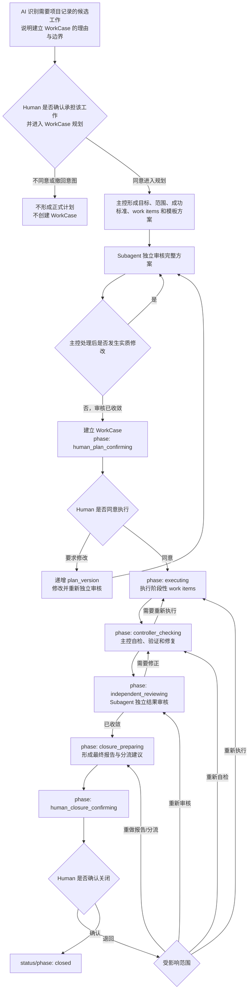

# WorkCase / 工作项

```yaml
ldvh_spec:
  spec_key: "workcase-fact-type"
  spec_id: "21"
  spec_kind: "spec"
  title: "WorkCase / 工作项"
  status: "active"
  canonical_path: "specs/21-WorkCase-工作项.md"
  parent_spec: "fact-model-foundation"
  relation: "refines"
  positioning: "定义 WorkCase 事实类型的对象边界、Schema、阶段性工作项、生命周期、Human 对建立项目记录的选择、完整质量控制链、来源、关系、验证与关闭规则"
  scope: "管辖项目中经 Human 明确确认需要作为项目记录管理，已经形成明确可验证目标，并需要持续保存计划、阶段结果、当前推进、质量关口与终态判断的单一工作责任"
  basis:
    - "fact-model-foundation"
    - "source-of-truth-traceability"
    - "action-template-foundation"
  authorized_attachments: []
```

> 文件状态：`active`。本文是 `workcase` 事实类型的唯一定义来源；它不使 WorkCase 读取、创建、校验、迁移、Helper、Code、tests、行动模板或 Web 能力自动成立。V3 WorkCase 规范、附件、实例和实现只作为设计与反例输入，不取得 V4 当前效力。

## 1. 价值判断

WorkCase 把一项已经由 Human 确认需要推进并作为项目记录管理、且已经形成明确目标、范围和成功标准的工作，保留为可持续回读、可分阶段交付、验证、阻塞与关闭的当前事实。它使后续 AI 不必依赖聊天记忆重建“为什么项目决定承担这项工作、要完成什么、分成哪些阶段结果、当前进展如何、什么阻止继续、经过哪些质量关口、依据什么关闭”。WorkCase 是否成立不取决于工作持续时间、工作项数量或实现复杂度；Human 是否明确选择将它作为项目记录管理，才是进入 WorkCase 准入判断的必要前提。

一个 WorkCase 只承担一个能够独立判断关闭的工作责任。共同服务该责任关闭判断、具有明确阶段目标和预期结果的工作项保留在 WorkCase；需要独立准入、授权、长期阻塞、取消、转交或关闭的目标形成其它 WorkCase。命令顺序、工具调用、临时 todo、AI 推理和单个工作项内部如何实现仍属于环境自由执行，不进入 WorkCase。

WorkCase 的阶段性工作项、创建方案审核、执行授权、主控自检、独立结果审核、关闭报告与确认共同形成从工作意图、计划、执行、结果到关闭的完整质量控制链。创建审核防止目标、范围、拆分和方法在执行前发生偏移；Human 执行批准确认当前计划值得实际执行；主控自检防止执行结果偏离计划和成功标准；独立结果审核防止主控只用自述证明自己；Human 关闭确认保留对整体结果和剩余责任的最终判断。任一环节的错误都可能使后续工作整体偏移；因此 Human 选择建立 WorkCase，就同时选择这条完整链路，不得因工作时间短、实现简单或只有一个 work item 而跳过其中的审核、批准或验证。V4 保留这些可消费的当前事实，同时移除 V3 的通用 `orchestration` 容器、环境内部步骤、工具日志、角色脚手架、重复确认位置、空占位和对象内 revision history。

WorkCase 主要服务 V1 快速定位、V2 充分理解、V3 边界识别、V4 稳定推进、V5 据实判断、V6 工作接续、V7 清晰沟通和 V8 持续积累。行动模板组织可复用的行动方法，WorkCase 保存这一项已经纳管的工作实际采用的阶段目标、当前结果与关口；两者不能互相替代。新增成本包括查重、持续回写、Schema、审核与消费维护；通过正交的责任状态和推进阶段、条件字段、版本绑定、禁止内部步骤与 Git 历史去重，把记录和治理成本限制在当前工作实际需要的信息上。不能证明该净收益的工作不准入 WorkCase。

## 2. 规范依据

本文直接依据：

1. `fact-model-foundation`：规定事实类型、统一字段、来源、证据、关系、状态、变更和验证的共同边界；
2. `source-of-truth-traceability`：规定 Git 可追踪事实源、当前 Working Tree、来源回指和稳定事实边界；
3. `action-template-foundation`：规定可复用行动结构与单次运行记录不应反向成为事实对象 Schema，同时允许具体事实类型定义自身需要稳定保留的阶段目标和质量关口。

历史 V3 21、21.Att.01、实例和 V2 候选行动编排只用于识别真实需求与失败模式。V4 保留其中已证明有消费价值的中断恢复、阶段结果、独立审核，以及对象建立后的执行批准与关闭确认双 Human Gate；对象建立前仍先取得 05 对事实对象创建行动要求的 Human 当前授权，不恢复旧路径、整个嵌套结构、空占位、运行日志或写入能力。

## 3. 职责边界

本文负责定义：

1. `workcase` 的类型语义、对象粒度、准入和排除边界；
2. WorkCase 的唯一当前承载位置、完整 Schema、责任状态、推进阶段和关闭口径；
3. 目标、范围、成功标准、阶段性工作项、最小恢复快照、创建审核、执行批准、主控自检、独立结果审核、当前摘要、验证、阻塞、来源、证据和关系的领域语义；
4. WorkCase 工作意图确认、创建、执行前确认、阶段推进、更新、更正、拆分、合并、关闭、删除和停止使用的边界；
5. WorkCase 的验证要求、对象建立后的执行与关闭双 Human Gate、Stop Conditions 和最小失败范围。

本文不负责定义：

1. 单个工作项内部的实施步骤、命令、工具调用、临时 todo、AI 推理、运行事件或完整执行日志；
2. 具体 AI 模型、平台线程、子 Agent API、工具运行状态或环境内部编排实现；
3. Helper API、CLI、Web 表单、Hook、文件分配算法或迁移兼容；
4. 其它事实类型、普通文档、规范、Git 提交或行动模板的内容；
5. 仅因 WorkCase 存在而产生的执行、写入、提交、发布或风险接受授权。

主控 AI 负责先确认 Human 当前指令是否已经明确要求由项目承担并建立 WorkCase；尚未明确时，向 Human 交还相应建议，取得工作意图确认后再形成方案、处理审核意见、委派和汇总工作项、自检修复、处理结果审核并准备关闭；独立审核者不得用主控自述代替实际审查；受委派执行者可在工作项边界内自主选择实现步骤；Human 负责对象创建前的工作意图确认、执行前的当前计划批准与最终关闭确认。Code 只可按当前来源检查固定结构、值闭集、版本绑定、引用和转换条件。WorkCase 不是命令或工具运行引擎，也不是聊天计划副本。

## 4. 适用范围

一个目标只有同时满足以下条件，才可以形成 WorkCase：

Human 对“这项工作需要作为 WorkCase 建立项目记录”的明确选择是准入的必要前提，但不单独替代其余目标、边界、来源和净收益检查。工作持续时间、预计会话数、工作项数量和实现复杂度都不是独立的准入或排除条件。

1. Human 已明确确认该工作应由项目继续推进并作为 WorkCase 建立项目记录；这项确认只授权 AI 进入计划形成、独立审核和受控创建，不表示 Human 已批准尚未形成的具体计划；
2. 已经存在清楚、可执行且能够独立判断关闭的单一目标；
3. 范围、排除边界和至少一项可检查成功标准能够明确表达；
4. 需要将计划、阶段结果、当前推进、质量关口或终态判断作为项目当前事实持续保存；这种需要可以来自跨行动、会话或执行者恢复，也可以来自验证、授权、依赖、阻塞或独立关闭要求；
5. 已召回并比较当前 WorkCase、Spark 与相邻稳定事实，没有可无损更新的现有对象；
6. 来源能够按目标、范围和成功标准所需精度回指，未知内容没有被补造；
7. 对象化减少的恢复、验证和关闭漂移高于持续回写与 Schema 维护成本。

以下内容不得形成 WorkCase：当前行动即可完成且无需稳定回读的小任务；只有模糊问题或信息缺口、尚无可验收目标的输入；临时 todo、Agent plan、命令清单、review checklist 或执行日志；长期规则或普通文档正文；纯结果报告；没有独立身份与关闭需要的提醒；无终点的周期运行入口。

工作可在当前行动或当前会话内完成，不会因此自动被排除；只要 Human 已明确选择建立项目记录，且其余准入条件成立，仍可形成 WorkCase。反之，工作预计跨越多个行动或会话，也不会因此自动准入。

Spark 与 WorkCase 的分界不取决于“以后是否可能做”。Spark 尚无确定承接位置或清楚验收边界；WorkCase 已经有可执行目标、范围与成功标准。把 Spark 分流到 WorkCase 必须分别满足 Spark 完整承接和本文准入，不得自动升级。

## 5. WorkCase 类型定义

### 事实类型声明

| fact_type_key | summary | definition_ref |
|---|---|---|
| `workcase` | 经 Human 明确确认需要作为项目记录管理，具有明确可验证目标，并保存当前推进、质量关口与终态判断的单一工作责任 | `workcase-fact-type::5. WorkCase 类型定义` |

### 准入审计引用

| admission_audit_ref |
|---|
| `v4-five-type-closure::five-type-admission-audit::workcase::admission-audit` |

### 类型专属结构定义

| structure_key | meaning | not_meaning | constraints |
|---|---|---|---|
| `workcase-item` | 共同服务同一 WorkCase 关闭判断、具有明确阶段目标和预期结果的内部工作单元 | 不表示命令步骤、临时 todo、工具调用、AI 推理或独立 WorkCase | 每项具有稳定 item 身份、目标、预期结果、方法边界和状态；依赖只引用同一对象内 item；状态条件字段形成闭集 |
| `workcase-review` | 独立审核者对一个明确计划版本或结果版本的实际审核结论、反馈及主控处置记录 | 不表示主控自检、Human 批准、工具验证或审核者执行了被审对象 | 必须标明审核对象版本、独立审核者、范围、时间、结论、实际反馈和主控逐项处置；不得创建空审核占位 |
| `workcase-human-approval` | Human 对一个明确计划版本或结果版本作出的执行或关闭批准记录 | 不表示技术验证、风险自动消失、后续版本获批或普通对话确认 | 只记录实际批准；拒绝或修改要求通过当前摘要和方案修订处理，不写伪批准；批准必须绑定准确版本和时间 |

### 类型字段使用绑定

| field_key | presence | constraint_ref |
|---|---|---|
| `object-id` | required | `workcase-fact-type::5. WorkCase 类型定义` |
| `fact-type-key` | required | `inherit` |
| `title` | required | `workcase-fact-type::5. WorkCase 类型定义` |
| `created-at` | required | `inherit` |
| `updated-at` | required | `workcase-fact-type::8. 对象变化与授权边界` |
| `status` | required | `workcase-fact-type::6. 对象语义与生命周期` |
| `source-refs` | required | `workcase-fact-type::7. 来源、证据与关系` |
| `evidence-refs` | conditional | `workcase-fact-type::7. 来源、证据与关系` |
| `relations` | conditional | `workcase-fact-type::7. 来源、证据与关系` |
| `current-summary` | required | `workcase-fact-type::6. 对象语义与生命周期` |
| `workcase-resume-from` | conditional | `workcase-fact-type::6. 对象语义与生命周期` |
| `workcase-waiting-on` | conditional | `workcase-fact-type::6. 对象语义与生命周期` |
| `priority` | conditional | `workcase-fact-type::6. 对象语义与生命周期` |
| `disposition-summary` | conditional | `workcase-fact-type::6. 对象语义与生命周期` |
| `closed-at` | conditional | `workcase-fact-type::6. 对象语义与生命周期` |
| `workcase-goal` | required | `inherit` |
| `workcase-scope` | required | `inherit` |
| `workcase-success-criteria` | required | `inherit` |
| `workcase-phase` | required | `workcase-fact-type::6. 对象语义与生命周期` |
| `workcase-plan-version` | required | `workcase-fact-type::6. 对象语义与生命周期` |
| `workcase-items` | required | `workcase-fact-type::6. 对象语义与生命周期` |
| `workcase-creation-reviews` | required | `workcase-fact-type::6. 对象语义与生命周期` |
| `workcase-execution-approval` | conditional | `workcase-fact-type::6. 对象语义与生命周期` |
| `workcase-result-version` | conditional | `workcase-fact-type::6. 对象语义与生命周期` |
| `workcase-controller-check-summary` | conditional | `workcase-fact-type::6. 对象语义与生命周期` |
| `workcase-result-reviews` | conditional | `workcase-fact-type::6. 对象语义与生命周期` |
| `workcase-closure-approval` | conditional | `workcase-fact-type::6. 对象语义与生命周期` |
| `workcase-validation-summary` | conditional | `workcase-fact-type::7. 来源、证据与关系` |
| `workcase-blocking-summary` | conditional | `workcase-fact-type::6. 对象语义与生命周期` |
| `workcase-closure-outcome` | conditional | `workcase-fact-type::6. 对象语义与生命周期` |

### 类型专属字段定义

| field_key | field_path | JSON type | meaning | not_meaning | constraints |
|---|---|---|---|---|---|
| `workcase-goal` | `goal` | string | WorkCase 期望达成并可独立判断关闭的单一目标状态 | 不表示标题、当前进展、步骤、成功标准或结果 | 必填非空；必须能够与范围和成功标准共同产生独立关闭判断；实质改成另一目标时新建对象 |
| `workcase-scope` | `scope` | string | WorkCase 承诺覆盖的内容、重要约束和明确排除边界 | 不表示当前进展、完整计划、实现细节或来源全文 | 必填非空；边界变化时同步复核目标、成功标准、授权和对象身份 |
| `workcase-success-criteria` | `success_criteria` | array | 共同构成目标达成判断的可观察条件闭集 | 不表示执行步骤、todo 状态、证据、测试命令或关闭结果 | 至少一项非空唯一字符串；每项可独立检查；不嵌入 checklist 标记或可变完成状态 |
| `workcase-phase` | `phase` | string | WorkCase 当前处于哪一个方案确认、执行、质量控制或关闭确认位置 | 不表示责任是否阻塞或终止、完成比例、命令阶段或模板运行事件 | 必填；闭集和转换条件由 §6 定义；必须与 status 正交且不得用 summary 代替 |
| `workcase-plan-version` | `plan_version` | integer | 当前目标、范围、成功标准、工作项及其依赖、方法和模板偏离共同形成的计划版本 | 不表示 Git revision、对象版本、审核次数或执行进度 | 必填且从 1 单调递增；任何影响 Human 执行判断的实质计划变化必须递增；创建审核和执行批准只对同版本有效 |
| `workcase-items` | `work_items` | array | 当前计划中共同服务 WorkCase 关闭判断的阶段性目标与结果集合 | 不表示环境内部步骤、独立事实对象、命令清单或完整运行日志 | 必填且至少一项；成员使用 `workcase-item`；item_id 唯一，依赖无缺失、自指或环；不得用数组顺序暗示未声明依赖 |
| `workcase-creation-reviews` | `creation_reviews` | array | 创建及执行批准前对当前计划版本完成的独立审核与主控处置记录 | 不表示 Human 已批准执行、主控自检或结果审核 | 必填且至少一项；成员使用 `workcase-review`；只保留当前 plan_version 的实际审核，旧版本由 Git 追溯；全部当前审核的联合 scope 必须覆盖 §6 规定的完整计划，且没有未解决 changes_required/blocked |
| `workcase-execution-approval` | `execution_approval` | object | Human 对当前计划版本开始执行的明确批准 | 不表示创建批准、技术验证、关闭批准或后续计划版本继续获批 | 仅在 Human 实际批准后出现；成员使用 `workcase-human-approval` 且 subject_version 等于当前 plan_version；计划版本变化时立即失效并移除，phase 回到 human_plan_confirming |
| `workcase-result-version` | `result_version` | integer | 工作项结果、主控自检、验证总结、关闭处置和分流建议共同形成的待审核结果包版本 | 不表示 plan_version、Git revision 或结果审核次数 | 进入 controller_checking 时建立为 1；结果包实质变化时单调递增；结果审核与关闭批准只对同版本有效 |
| `workcase-controller-check-summary` | `controller_check_summary` | string | 主控逐项检查成功标准、工作项结果、验证、残余问题并完成修复后的当前自检说明 | 不表示独立结果审核、Human 验收或工具日志 | controller_checking 后必填非空；必须说明检查覆盖、发现、修复和未验证范围，并由当前 evidence_refs 支持 |
| `workcase-result-reviews` | `result_reviews` | array | 独立审核者对当前结果版本进行审核以及主控处理反馈的记录 | 不表示创建审核、主控自检或 Human 关闭确认 | 进入 independent_reviewing 后必填且至少一项；成员使用 `workcase-review`；只保留当前 result_version 的实际审核，旧版本由 Git 追溯；全部当前审核的联合 scope 必须覆盖 §6 规定的完整结果包，且没有未解决 changes_required/blocked |
| `workcase-closure-approval` | `closure_approval` | object | Human 对当前结果版本、最终报告和分流建议作出的关闭批准 | 不表示技术验证、Git 已提交、下游责任完成或后续结果版本获批 | 仅在 Human 实际批准关闭后出现；成员使用 `workcase-human-approval` 且 subject_version 等于当前 result_version；写入与 status/phase 进入 closed 必须属于同一受控变更 |
| `workcase-resume-from` | `resume_from` | string | 当前非终态推进阶段在中断、压缩或执行者交接后继续的最小明确入口 | 不表示完整执行步骤、历史日志或单个工作项自己的恢复点 | status 非 closed 时必填非空；与 summary 共同覆盖当前 phase 的已完成范围、下一动作和所需输入；阶段变化时覆盖更新 |
| `workcase-waiting-on` | `waiting_on` | string | 当前阶段正在等待的 Human 决定、独立审核、外部能力、证据或其它明确条件 | 不表示普通下一步、低优先级或历史阻塞 | 实际等待时条件出现且非空；等待解除后移除；Human 确认阶段必须说明等待的具体 Gate，blocked 仍由 blocking_summary 表达整体阻塞 |
| `workcase-blocking-summary` | `blocking_summary` | string | WorkCase 当前不能继续的具体事实、影响范围和解除条件 | 不表示低优先级、普通剩余工作、失败历史或终态理由 | 非空；解除条件必须可观察且有依据；不保留已经解除的历史阻塞占位 |
| `workcase-closure-outcome` | `closure_outcome` | string | WorkCase 在当前身份下停止推进时的结果分类 | 不表示状态、成功标准验证详情、终态理由或 Git 已提交 | 闭集 completed、partial、cancelled、superseded、not-achieved；各值的互斥语义与成立条件由 §6 唯一定义 |
| `workcase-item-id` | `item_id` | string | 同一 WorkCase 内稳定识别一个阶段性工作项的局部身份 | 不表示事实对象身份、数组序号或执行者身份 | 必填；匹配 `item-[0-9]{2,}`；同一 WorkCase 内唯一，形成后不得因排序、状态或执行者变化而改变 |
| `workcase-item-goal` | `goal` | string | 该工作项需要达成的阶段目标 | 不表示 WorkCase 总目标、命令、方法或结果 | 必填非空；必须直接服务 WorkCase goal 与至少一项 success criterion |
| `workcase-item-expected-result` | `expected_result` | string | 该阶段目标完成时应形成的可观察结果 | 不表示实现步骤、验证证据或完成声明 | 必填非空；必须能据此判断工作项是否形成阶段结果 |
| `workcase-item-status` | `status` | string | 工作项当前未开始、进行、阻塞、完成或取消的状态 | 不表示 WorkCase status/phase、执行百分比或环境任务状态 | 必填；闭集 pending、in_progress、blocked、completed、cancelled；条件字段由 §6 定义 |
| `workcase-item-depends-on` | `depends_on` | array | 当前工作项开始或完成所依赖的同一 WorkCase 工作项身份 | 不表示事实对象关系、文件依赖或默认数组顺序 | 条件出现；成员为唯一非空 item_id；不得缺失、自指或形成环；无依赖时省略 |
| `workcase-item-approach-summary` | `approach_summary` | string | Human 可理解的阶段方法、执行边界和重要安排 | 不表示工作项内部命令清单、完整计划或执行日志 | 必填非空；应说明必要的委派、并行边界和验证入口，但保留环境内部自主实现空间 |
| `workcase-item-template-keys` | `template_keys` | array | 当前工作项计划采用的已成立行动模板稳定 key | 不表示模板自动适用、已经执行或环境 Skill | 条件出现；成员唯一非空；只引用当前可定位模板；没有适用模板时省略并由 approach_summary 说明普通求解路径 |
| `workcase-item-template-deviation-summary` | `template_deviation_summary` | string | 当前工作项偏离所列行动模板稳定结构的范围、原因和风险 | 不表示普通实现选择或未选择模板 | 仅实际偏离时出现且非空；必须足以供独立审核和 Human 判断；偏离不得绕过来源规则或 Human Gate |
| `workcase-item-current-summary` | `current_summary` | string | 当前进行中或阻塞工作项已经形成的事实、尚未完成范围和当前焦点 | 不表示历史日志、推理过程或最终结果 | in_progress/blocked 时必填；变化时覆盖当前快照，不追加流水 |
| `workcase-item-resume-from` | `resume_from` | string | 中断、压缩或执行者交接后恢复该工作项的最小明确入口 | 不表示完整步骤清单或未经验证的结果 | in_progress/blocked 时必填；必须能由新执行者结合对象和来源继续，不复制已完成过程 |
| `workcase-item-blocking-summary` | `blocking_summary` | string | 该工作项当前阻塞事实、影响和解除条件 | 不表示 WorkCase 整体阻塞或低优先级 | 仅 item status=blocked 时必填；解除后移除；WorkCase 是否 blocked 仍按 §6 独立判断 |
| `workcase-item-result-summary` | `result_summary` | string | 已完成或取消工作项的当前阶段结果、实际边界或停止原因 | 不表示 WorkCase 已完成、验证充分或命令日志 | completed/cancelled 时必填；必须据实说明预期结果满足范围和残留问题 |
| `workcase-item-evidence-refs` | `evidence_refs` | array | 支持工作项当前进展、阻塞、完成或取消结论的证据定位 | 不表示证据充分性或 WorkCase 顶层 evidence_refs 的替代品 | blocked/completed 时必填且至少一项；in_progress/cancelled 时有稳定可定位依据则条件出现；成员使用 `source-ref`；不得为无 locator 的真实 Human 取消决定伪造引用；顶层关闭结论仍必须由顶层 evidence_refs 支持 |
| `workcase-review-reviewer` | `reviewer` | string | 实际承担独立审核的 AI 执行者、任务或可区分审查身份 | 不表示模型能力已经验证或主控可以自审 | 必填非空；必须能够区分主控；不得写 `independent`、`subagent` 等无法区分实际审核者的占位 |
| `workcase-review-reviewed-at` | `reviewed_at` | string | 审核结论实际形成的时间 | 不表示计划或结果形成时间 | 必填带时区 RFC 3339 date-time，不得晚于对象 updated_at |
| `workcase-review-subject-version` | `subject_version` | integer | 本次审核实际覆盖的 plan_version 或 result_version | 不表示 Git revision 或审核次数 | 必填正整数；所在 creation_reviews/result_reviews 决定其引用的版本域 |
| `workcase-review-scope` | `scope` | string | 本次独立审核实际检查的对象、问题和未覆盖边界 | 不表示 WorkCase scope 或默认全量审核 | 必填非空；不得用“全部”替代实际检查范围 |
| `workcase-review-conclusion` | `conclusion` | string | 独立审核对该版本是否可进入下一关口的结论 | 不表示主控已经修复、Human 已批准或技术状态成立 | 闭集 pass、pass_with_followups、changes_required、blocked；进入下一关口时当前版本最后有效结论只能为 pass 或已处置非阻断项的 pass_with_followups |
| `workcase-review-feedback` | `feedback` | array | 审核者实际提出的发现、风险、反例或建议 | 不表示主控处置或聊天全文 | 必填且至少一项非空唯一字符串；即使 pass 也必须记录实际检查后的关键反馈，不允许空审核凭据 |
| `workcase-review-controller-resolution` | `controller_resolution` | string | 主控对本次全部审核反馈逐项接受、修正、拒绝或承接的处理结论 | 不表示审核者同意、Human 批准或技术验证 | 必填非空；必须按 feedback 原顺序使用编号清单逐项对应，说明相应变化、依据和未解决项；未解决阻断项不得进入下一关口 |
| `workcase-approval-subject-version` | `subject_version` | integer | Human 本次批准所针对的准确 plan_version 或 result_version | 不表示以后版本自动获批 | 必填正整数；所在 execution_approval/closure_approval 决定版本域，必须等于对象当前相应版本 |
| `workcase-approval-approved-at` | `approved_at` | string | Human 明确作出批准决定的时间 | 不表示技术状态成立或文件写入时间 | 必填带时区 RFC 3339 date-time，不得晚于对象 updated_at |
| `workcase-approval-summary` | `summary` | string | Human 批准的对象、范围、限制和附带条件 | 不表示 AI 对 Human 意图的扩张解释 | 必填非空；只记录实际批准范围，不能用“同意”隐藏版本、限制或偏离 |
| `workcase-approval-source-refs` | `source_refs` | array | 当环境具有稳定定位能力时回指 Human 批准原始输入 | 不表示没有稳定 locator 时可以伪造引用，也不替代批准摘要 | 条件出现且至少一项；成员使用 `source-ref`；没有真实稳定 locator 时省略，不得阻止在对象中据实记录批准 |

### Schema 与对象载体

WorkCase 对象使用 UTF-8 YAML，一文件一对象，当前权威位置固定为管辖项目仓库中的 `facts/workcases/<object_id>.yaml`。`object_id` 必须匹配 `workcase-[0-9]{4,}`；文件名必须与 `object_id` 完全一致，分配后的身份不得因标题、路径、状态或内容改变。`title` 只简短识别工作责任，不复制 `goal` 或 `summary`。未知或不适用的条件字段必须省略，不使用 `null`、空字符串、空数组、占位时间、默认状态或默认关系。

完整 Schema 由统一登记的 `fact-object` 直接字段、本节绑定、跨类型共享定义和类型专属字段/结构定义组合。WorkCase 不得出现 V3 `orchestration`、`execution_items`、`revision_history`、重复 confirmation 位置、请求时间镜像、角色/工具运行状态、`residual_risks`、`followup_refs`、按目标类型拆分的关系字段或其它未登记内容；不得用本节结构包裹命令、推理、日志或未登记扩展字段。

## 6. 对象语义与生命周期

一个 WorkCase 只表达一个能够独立判断关闭的工作责任。`goal` 和 `scope` 定义承诺，`success_criteria` 定义整体验收边界，`work_items` 把当前责任分解为可交接的阶段结果，`summary` 维护整体当前快照。工作项内部执行步骤由环境自主决定；WorkCase 只记录阶段目标、依赖、方法边界、当前恢复点、结果和证据。

责任状态 `status` 与推进阶段 `phase` 是两个正交维度。`status` 回答责任当前能否继续或是否终止；`phase` 回答它处于执行批准、实际执行、自检、独立审核或关闭确认的哪个位置。不能用 `blocked` 覆盖阶段，也不能用阶段冒充授权或完成。

WorkCase 的正式计划形成与对象创建存在一个对象外前提：Human 已通过当前指令明确确认该工作值得由项目承担并建立 WorkCase；当前指令尚未包含该决定时，AI 先基于只读召回说明建议理由与边界，再请求 Human 确认。该确认沿用 05 对事实对象创建行动授权的共同边界，只回答“是否承担并进入 WorkCase 规划与记录”，允许 AI 形成并独立审核计划以及受控创建对象；它不批准尚未形成的 `plan_version`，不形成 `execution_approval`，也不建立对象内 phase。Human 不确认或撤回该工作意图时，AI 不进入正式计划、Subagent 创建审核和对象创建流程；需要保留的未收敛入口按其实际语义留在当前上下文或另行判断是否满足 Spark 等承载位置。

本文所称“双 Human Gate”只指 WorkCase 对象建立后的当前计划执行批准与最终结果关闭确认。对象创建前的工作意图确认承接 05 对当次事实对象写入授权的共同边界，不因 WorkCase 生命周期另造第三个对象内 Gate；三项判断的对象分别是工作意图、具体计划和实际结果，不得互相替代。

Human 选择建立 WorkCase 表示选择由本文完整管理该工作的当前计划、执行结果、审核、批准与关闭；工作持续时间短、实现简单、只有一个 work item 或 Code 能验证部分结果，都不改变已经生效的审核、批准与关闭边界。不需要这条完整链路的工作不建立 WorkCase，不在建立后通过跳过关口将它降级为普通工作记录。

状态闭集为：

| status | 语义 | 必须成立 |
|---|---|---|
| `open` | 目标已经准入，仍有未完成内容；可以继续完成当前 phase 允许的准备、确认或执行活动 | `priority` 必填，blocking_summary、closure_approval、closed_at 禁止；结果包字段是否出现由 phase 决定；summary 明确当前 phase、焦点和剩余工作 |
| `blocked` | 仍有未完成内容，但明确的外部依赖、Human 决定、授权、证据或能力缺口使当前不能继续 | `priority`、`blocking_summary`、`evidence_refs` 必填，closure_approval、closed_at 禁止；结果包字段是否出现由 phase 决定 |
| `closed` | Human 已确认该 WorkCase 身份下不再继续推进，不等于成功、已提交或下游责任完成 | phase=closed；priority 与 blocking_summary 省略；result_version、controller_check_summary、result_reviews、closure_approval、validation_summary、closure_outcome、disposition_summary、closed_at、evidence_refs 必填 |

新建 WorkCase 必须已经取得 Human 对工作意图和建立项目记录的明确确认，并在该授权范围内完成计划形成、创建方案独立审核和主控对审核反馈的处置；初始 `phase` 固定为 `human_plan_confirming`，`execution_approval` 禁止出现。初始 `status` 可以是 `open` 或 `blocked`：正常等待对象建立后的计划执行批准不构成 blocked；只有另有具体、可证且使方案确认也无法继续的条件时才可 blocked。`closed` 不能作为普通新建初态。

正常转换只有 `open → blocked`、`blocked → open`、`open → closed` 和 `blocked → closed`。`closed` 不直接重开；后来出现的新工作建立新 WorkCase，确属替代时由新对象使用 `supersedes` 指向旧对象。原终态记录本身错误时按 05 的事实更正规则修正，不把更正伪装成重新推进。

推进阶段闭集与进入条件如下：

| phase | 当前含义 | 进入与保持条件 |
|---|---|---|
| `human_plan_confirming` | WorkCase 已建立，独立创建审核和主控处置已经形成，等待 Human 判断是否按当前计划执行 | 当前 plan_version 的 creation reviews 联合覆盖完整计划且均无未解决阻断项；execution_approval 禁止；Human 要求实质修改时递增 plan_version、重审并继续保持本阶段 |
| `executing` | Human 已批准当前计划版本，工作项正在按依赖推进 | execution_approval.subject_version 等于当前 plan_version；至少一项工作项尚未 completed/cancelled；只允许在依赖满足后进入 in_progress |
| `controller_checking` | 全部工作项已形成 completed/cancelled 结果，主控正在逐项核对、验证和修复 | result_version 必填；全部 work item 为 completed/cancelled；controller_check_summary 在离开本阶段前必填；修复需要重新执行时退回 executing 并更新相应 item |
| `independent_reviewing` | 主控自检完成，独立审核者正在审核当前结果版本 | controller_check_summary 与当前 result_version 必填；result_reviews 在离开本阶段前形成，审核进行中时可以尚未出现；changes_required/blocked 或主控修正使结果包变化时递增 result_version、删除旧版本审核并重新审核 |
| `closure_preparing` | 当前结果版本的独立审核已通过，主控正在形成最终验证报告、关闭结果和分流建议 | 当前 result_reviews 联合覆盖全部工作项结果、成功标准、验证、残余问题、关闭分类与分流，全部阻断反馈已解决；validation_summary、closure_outcome、disposition_summary、关系和顶层 evidence_refs 在离开前完整 |
| `human_closure_confirming` | 最终报告和分流建议已形成，等待 Human 判断关闭或退回 | 当前结果版本、验证、处置、结果审核和承接完整；closure_approval 禁止；Human 退回时按受影响范围回到 executing、controller_checking、independent_reviewing 或 closure_preparing |
| `closed` | Human 已批准当前结果版本并在同一受控变更中关闭 | status=closed；closure_approval.subject_version 等于当前 result_version；全部终态字段和剩余责任承接成立 |



流程图用于帮助 Human 和 AI 快速理解；阶段闭集、转换条件和必填字段以上表及本节文字为规范依据。图中最前面的 Human 工作意图确认发生在正式对象和 phase 之前；其后的计划执行批准与关闭确认才是本文所称的对象内双 Human Gate。图中只画对象建立后的 phase，`open ↔ blocked` 是覆盖在非终态 phase 之上的 status 变化；blocked WorkCase 仍须沿结果分类、独立审核和第二 Human Gate 对应的 phase 路径才能 closed，不另造一条 blocked phase 边。工作意图确认和两处对象内 Human Gate 都不得由审核、技术验证、模板选择或主控自述代替。

工作项状态条件如下：

| item status | 必须出现 | 禁止出现 |
|---|---|---|
| `pending` | 基础必填字段 | current_summary、resume_from、blocking_summary、result_summary、evidence_refs |
| `in_progress` | current_summary、resume_from | blocking_summary、result_summary；evidence_refs 在有稳定依据时允许出现 |
| `blocked` | current_summary、resume_from、blocking_summary、evidence_refs | result_summary |
| `completed` | result_summary、evidence_refs | current_summary、resume_from、blocking_summary |
| `cancelled` | result_summary | current_summary、resume_from、blocking_summary；evidence_refs 在有稳定依据时允许出现 |

工作项 blocked 不自动使 WorkCase status=blocked；只有当前 phase 内没有任何可继续活动，且具体条件确实阻止整个责任推进时，才将 WorkCase 置为 blocked。工作项只有在已获批准的计划明确预设取消条件且该条件实际成立时，才可直接进入 cancelled；其它取消改变计划承诺，必须递增 plan_version、重新独立审核并重新取得 Human 执行批准。中断、上下文压缩和执行者交接前，进行中或阻塞工作项必须更新 `current_summary` 与 `resume_from`；正常连续执行不要求为每条命令或每个内部步骤更新。恢复快照在工作项完成或取消时由结果与证据吸收并移除，Git 保留历史变化。

计划版本覆盖 goal、scope、success_criteria、work_items 的目标、预期结果、依赖、方法边界、模板选择、偏离以及非预设取消。Human 或审核导致这些内容发生实质变化时，必须递增 plan_version，移除旧 creation_reviews、execution_approval、result_version、controller_check_summary、result_reviews、closure_approval、validation_summary、closure_outcome、disposition_summary 和只支持旧结果包的 evidence_refs/relations，把受影响 work item 恢复为符合新计划的状态，回到 human_plan_confirming 并重新完成独立审核；旧值只由 Git 追溯。不得让旧审核、结果或批准覆盖新计划。结果版本覆盖工作项结果、controller_check_summary、validation_summary、closure_outcome、disposition_summary、相关关系与 evidence_refs；这些内容发生实质变化时必须递增 result_version，移除旧 result_reviews 与 closure_approval 并重新审核，不得沿用旧结果审核或关闭批准。Human 只要求修正工作项结果、验证、关闭分类、处置或分流，而没有改变计划覆盖内容时，不得递增 plan_version，不得移除仍有效的 creation_reviews/execution_approval，也不得把未受影响的 completed/cancelled 工作项恢复为待执行；只按受影响范围递增 result_version 并退回 controller_checking、independent_reviewing 或 closure_preparing。只有修正实际改变计划覆盖内容或确需重新执行工作项时，才进入 plan_version 级联失效或退回 executing。

creation reviews 对当前计划的联合覆盖至少包括 goal、scope、success_criteria、全部 work items、item 依赖/并行边界、方法、行动模板选择与偏离、验证方式和重要风险；result reviews 对当前结果包的联合覆盖至少包括全部 item 结果、成功标准逐项满足情况、主控自检、实际验证、未验证范围、残余问题、closure_outcome、disposition_summary 与 routed-to 建议。一个窄范围 pass 不得覆盖其它审核中的未解决 changes_required/blocked。

WorkCase 顶层 `summary`、`resume_from` 和按需出现的 `waiting_on` 共同形成当前阶段恢复快照，覆盖所有非 closed phase。进入新阶段、形成需要跨会话保留的中间结果、委派或交接、上下文压缩前以及返回 Human 等待决定前必须更新；意外中断只能保证恢复到最近一次已写入并回读的检查点。单个 in_progress/blocked item 还必须保留自己的精确恢复点，两层快照不得复制命令流水。

阶段允许转换闭集如下，未列出的转换均不成立：

| from | to | 触发者与前置条件 | 必须失效或更新 |
|---|---|---|---|
| 创建前候选 | `human_plan_confirming` | Human 已确认工作意图和建立项目记录，主控在该授权内完成当前计划的独立审核与反馈处置，并受控创建 WorkCase | 写入 plan_version、当前 creation_reviews、work_items 和阶段恢复快照；execution_approval 禁止 |
| `human_plan_confirming` | `human_plan_confirming` | Human/审核要求实质计划修改，或主控据新来源修订 | 递增 plan_version，按本节清除旧审核、批准与结果包，重新独立审核 |
| `human_plan_confirming` | `executing` | Human 明确批准当前 plan_version | 同一变更写 execution_approval 并更新阶段恢复快照 |
| `executing` | `controller_checking` | 全部 work item 为 completed/cancelled | 建立当前 plan 下的 result_version 并更新顶层恢复快照 |
| `controller_checking` | `executing` | 主控自检发现需要重新执行的范围 | 递增 result_version 或在首次结果包未形成前继续当前版本；重开受影响 item，移除旧结果审核/关闭批准 |
| `controller_checking` | `independent_reviewing` | controller_check_summary 和当前证据形成 | 更新恢复快照，等待实际独立审核 |
| `independent_reviewing` | `controller_checking` | 审核要求修正但无需重开工作项 | 递增 result_version，删除旧 result_reviews/closure_approval，记录修正入口 |
| `independent_reviewing` | `executing` | 审核发现需要重新执行工作项 | 递增 result_version，重开受影响 item，删除旧 result_reviews/closure_approval |
| `independent_reviewing` | `closure_preparing` | 当前结果版本联合审核覆盖完整且无未解决阻断项 | 保留当前版本 reviews，更新关闭准备恢复点 |
| `closure_preparing` | `independent_reviewing` | 最终报告或分流实质改变结果包 | 递增 result_version，删除旧 result_reviews/closure_approval并重新审核 |
| `closure_preparing` | `human_closure_confirming` | 验证报告、关闭分类、处置和承接建议完整 | 更新 summary/resume_from/waiting_on；closure_approval 禁止 |
| `human_closure_confirming` | 任一非终态 phase | Human 退回，目标阶段由受影响范围决定 | 若改计划按 plan_version 级联失效；若改结果按 result_version 失效；更新恢复快照 |
| `human_closure_confirming` | `closed` | Human 明确批准当前 result_version，且全部终态条件成立 | 同一受控变更写 closure_approval、closed_at、status/phase=closed，并移除 resume_from/waiting_on |

`open ↔ blocked` 只改变责任状态，不改变 phase；解除阻塞通常先恢复 open 再继续阶段转换。`blocked → closed` 只允许在 Human 取消、替代或接受停止且仍完整经过结果分类、独立审核、分流和第二 Human Gate 的同一终止事务中发生，不得绕过阶段闭集。closed 不允许正常重开。

`closure_outcome` 使用以下互斥语义。先判断原责任是否已由其它 WorkCase 整体接替，是则使用 `superseded`；再判断是否在足以评价成功标准前被明确撤回，是则使用 `cancelled`；其余情况才按成功标准的实际满足程度选择 `completed`、`partial` 或 `not-achieved`：

| closure_outcome | 成立条件 | 不得冒充 |
|---|---|---|
| `completed` | 全部成功标准均有充分满足依据；原范围内没有未满足或未验证项 | 有部分完成但仍遗留原成功标准 |
| `partial` | 至少一项成功标准已充分满足且至少一项未满足或未验证；已完成部分仍有稳定价值，剩余责任已明确承接或由 Human 接受停止 | “基本完成”、全部失败或只产生过程输出 |
| `not-achieved` | 没有任何成功标准得到充分满足，或已有输出不足以构成任一成功标准的稳定完成结果；停止理由和实际尝试边界有依据 | 尚未执行就被撤销，或把部分成功隐藏为整体失败 |
| `cancelled` | 在尚不足以对成功标准形成 `completed`、`partial` 或 `not-achieved` 判断时，授权、方向或继续投入决定被明确撤回 | 已经能够据实分类的完成或失败结果 |
| `superseded` | 原工作责任不再由本对象推进，并已由 `routed-to` 指向能够继续承担该责任的当前 open 或 blocked WorkCase | 普通拆分、取消、部分完成或只有新对象但没有责任承接 |

`closed` 必须逐项核对成功标准，并在 `validation_summary` 说明已满足、未满足与未验证范围。新对象需要表达身份沿革时可以单向 `supersedes` 本对象，但该入向关系由 Code 派生读取，不是旧对象关闭成立的第二权威，也不能替代旧对象的 `routed-to` 承接声明。所有仍适用责任都必须由 `routed-to` 指向能够按目标类型与当前状态稳定承接该具体责任的事实对象，或在 `disposition_summary` 明确证明没有残余内容。

## 7. 来源、证据与关系

`source_refs` 至少回指目标、范围和成功标准的形成依据。来源可以是 Human 输入、Spark、规范、issue、代码、文档或其它可定位内容；Human 对工作意图和建立项目记录的确认在能够稳定定位时作为来源进入长期对象，没有稳定 locator 时不得伪造引用，但仍必须在当次行动中实际取得该确认。WorkCase 来自 Spark 时可以把 Spark 作为来源；Spark 的 `routed-to` 已是分流关系，WorkCase 不复制反向来源关系。

顶层 `evidence_refs` 支持整体已验证进展、阻塞事实、成功标准判断和关闭结果；工作项成员的 `evidence_refs` 只支持相应阶段结果。`validation_summary` 说明最终验证结论，引用负责定位依据；二者不能互相替代。审核结论、Human 批准、命令返回成功、文件存在、关系存在或 Agent 声明都只能在其实际覆盖范围内作为依据。

WorkCase `relation_key` 闭集为：

| relation_key | source condition | target condition | cardinality | reverse authority | missing and cycle boundary |
|---|---|---|---|---|---|
| `depends-on` | source 为 open 或 blocked；依赖必须实际影响当前目标继续 | target 是可恢复的 open 或 blocked `workcase`，且其明确结果是当前对象的真实前置条件 | 每个不同目标最多一条；可以有多个不同依赖 | 反向 `depended-on-by` 只由 Code 派生，不写回 | 目标缺失、终态、类型不符或自指时无效；全部 depends-on 边组成的有向图不得成环 |
| `routed-to` | 只由 closed source 声明，且存在仍适用的具体剩余责任；没有残余时不得写占位关系 | 目标必须按自身类型与当前状态能够稳定承接该具体责任；WorkCase 目标只允许 open/blocked，Spark 目标只允许 open，其它类型必须由当前类型来源证明相应承接能力 | 每项不同剩余责任至少一个目标；同一责任与目标不得重复 | 反向 `routed-from` 只由 Code 派生，不写回；目标不复制来源关系 | 目标缺失、终态、类型或承接能力不符、自指时无效；routed-to 责任承接边不得形成直接或间接循环，也不得互相证明关闭 |
| `supersedes` | 只在新对象创建为 open/blocked 时建立；之后可以随 source 保留 | target 是同一管辖项目内可恢复的 closed `workcase`，且新对象确实替代其身份或责任 | 每个不同旧对象最多一条；合并多个旧责任时允许多个目标 | 反向 `superseded-by` 只由 Code 派生，不写回；不作为旧对象关闭证明 | 目标缺失、非终态、类型不符或自指时无效；全部 supersedes 边组成的有向图必须是 DAG |

关系目标必须在当前管辖配置中可恢复；跨项目 `depends-on` 或 `routed-to` 必须按 05 提供治理来源并证明实际承接，`supersedes` 限定同一管辖项目。普通文件、规范、commit 或外部页面不是事实对象，分别进入来源或证据引用。关系自身不是充分证据；基数、目标能力、缺失与循环规则不满足时，相应关系和依赖它的状态或关闭判断都不成立。

### 主动召回与消费时机

在管辖项目和实际 Working Tree 成立后，新会话开始、会话恢复和上下文压缩后恢复都必须向 AI 提供该项目全部 `open` 与 `blocked` WorkCase 的 F1 责任卡。每张卡直接投影 `object_id`、`title`、`status`、`phase`、`goal`、`scope`、`summary`、`priority`、`blocking_summary`、`updated_at`，并以 `work_item_counts` 返回从当前 work_items 派生的五类状态计数；条件字段不适用时保持省略，不用 AI 摘要或索引改写。`work_item_counts` 是非权威派生结果，不登记或写回事实对象。卡片可分页，但必须完整披露 coverage、cursor、未读、无效和不可读对象；未完整时不得声称已恢复当前全部稳定工作责任。

Web 和 Helper 可以从当前对象派生推进阶段条、`pending/in_progress/blocked/completed/cancelled` 五类工作项计数，以及 active item 的 goal、current_summary、resume_from 和 waiting_on。`status=blocked` 作为阶段条之上的责任阻塞提示，不替换 phase；cancelled 必须单列，不计作 completed；没有显式权重时不得按 item 数量或 phase 序号生成完成百分比。派生展示不得写回对象或取得状态权威，具体 UI 由 08 承接。

当前工作对象精确绑定某个 WorkCase 时，必须展开该对象和其直接 `open`/`blocked` `depends-on` 目标到 F3，核对 goal、scope、success criteria、status、phase、当前版本、work items、审核、批准、summary、blocking summary、依赖与当前授权。开始、继续、改变或交还一项可能由稳定工作责任承接的行动，检查阻塞或依赖，以及准备新建 WorkCase 时，AI 仍必须使用责任卡与完整对象判断当前实际承接者。卡片或对象被召回不表示当次已获得推进、解除阻塞、改变范围或关闭的授权。

`closed` WorkCase 只在精确引用、来源或验证追溯、检查未承接剩余责任、`routed-to`/`supersedes` 关系，或准备建立可能重复的新责任时作为历史候选。AI 展开后必须核对 `goal`、`scope`、`success_criteria`、工作项结果、审核、批准、验证、处置和关系；不得因标题相似就把当前临时步骤绑定到 WorkCase，也不得把 Web 派生进度当作第二事实源。

## 8. 对象变化与授权边界

AI 可以在建议阶段只读召回相邻 WorkCase、Spark 和其它稳定来源，以说明为什么候选值得建立；只有 Human 已明确确认该工作应由项目承担并进入 WorkCase 规划后，主控才能形成正式目标、范围、成功标准、阶段性工作项和模板方案，并委派独立 Subagent 审核。主控必须处理并记录全部反馈后才能分配身份并创建；新对象创建为 human_plan_confirming，不能把工作意图确认或创建成功表述为已获当前计划的执行授权。仅有多个环境步骤不构成工作项或拆分理由；具有阶段目标但共同服务同一关闭判断的内容形成 work item；需要独立准入、授权、长期阻塞、取消、转交或关闭的目标形成其它 WorkCase。

具体行动模板可以在 `action-template-foundation` 的边界内组织候选建议、计划形成、创建、执行、验证或交还中的可复用行动结构，但相应工作意图、对象、`plan_version`、phase、审核、批准和关闭语义仍只由本文定义。模板由 AI 自动召回和判断适用，不新增一次“是否使用模板”的 Human 选择，也不得替代工作意图确认、执行批准或关闭确认，扩张其授权范围，复制 WorkCase 字段或生命周期，或者把模板运行状态写成第二事实源；未来模板只需引用本文已经成立的 WorkCase 边界。

目标、范围、成功标准或计划边界实质变化时，必须重新检查来源、对象身份、当前授权和已有验证，递增 plan_version、撤销旧 execution_approval、重新独立审核并回到 Human 执行确认。仍是同一工作责任时更新当前字段与 `updated_at`；变成不同关闭责任时新建对象并明确旧对象处置。结果包实质变化按 §6 递增 result_version 并重审。过程历史由 Git 保留，不写 revision history。

迁移 V3 WorkCase 时不得整体复制 `orchestration` 或 `execution_items`。每一项必须按当前实际作用重新分流：具有明确阶段目标和预期结果、共同服务同一关闭判断且仍需恢复的内容可以迁为轻量 work item；只是命令、工具顺序、临时 todo、角色占位、运行日志或已经失效的步骤不迁移；需要独立准入、授权、长期阻塞、取消、转交或关闭的目标形成其它 WorkCase；已经完成且仍有长期价值的结果按实际语义进入 item 结果、来源、证据、ADR、Pitfall、Study、普通文档或其它稳定位置。V3 review/confirmation 只有能够证明实际发生、版本边界和当前作用时才可转换，不得把空结构或旧状态机械映射为当前审核与批准。

closed 文件默认保留在当前类型载体中供历史、来源和关系回读；本文不建立 `archived` 状态或归档位置。删除只有在适用来源规则允许、全部引用和剩余责任已经处置且不会丢失仍适用事实时才成立，不能用删除替代 closed。WorkCase 类型停止新增、合并、替代或取消时，必须按 05 处置唯一定义来源、全部现有对象（包括 closed）、引用消费者和仍适用责任；全部未终态责任还必须获得明确承接，不得只删除类型规范或隐藏对象目录。

具体保留给 Human 的决定见 §10。Human 对工作意图的确认只允许形成、审核并创建计划；Human 已批准当前 plan_version 后，授权范围内推进 work item、更新恢复快照、证据和客观状态不重复建立 Gate；但计划实质变化必须回到对象建立后的第一次 Gate，关闭始终必须经过第二次 Gate。任何确认或批准都不使技术验证、来源回读和字段约束自动成立。

## 9. 验证要求

| 验证对象 | 验证时机 | 成立条件 | 可接受依据 | 验证入口 | 可证明范围 | 未满足时的处理 |
|---|---|---|---|---|---|---|
| WorkCase 类型定义 | 新建或实质修改本文时 | 唯一声明、准入审计引用、字段/结构绑定、状态、阶段、工作项、审核、批准、来源、证据与关系完整且无第二权威 | 05、统一登记、本文、V3 反例和独立复核记录 | 当前来源回读与规范检查；Code 只验证可机械部分 | 当前 `workcase` 类型定义 | 本文不进入或退出当前规则源；修正定义，不消费受影响对象 |
| WorkCase 准入、创建审核与查重 | 建议建立候选、形成正式计划和创建新对象前 | Human 已确认工作意图和建立项目记录；单一目标、范围、成功标准和阶段性工作项清楚，模板选择/偏离可判断，已召回相邻对象且没有可无损更新入口；独立审核反馈和主控处置完整 | Human 当前确认、当前输入、来源定位、召回结果、计划方案、独立审核与主控处置 | AI 授权核对、来源回读与全局检索；Code 只辅助精确检索和检查结构 | 当次工作意图、候选、当前 plan_version 与直接相邻事实 | 未确认意图时不进入正式计划和创建；其余不满足时不创建，修订并重审、留在当前行动、更新已有对象、拆分或转 Spark |
| WorkCase 召回与消费 | 会话开始/恢复/压缩恢复，执行者交接，开始、继续、改变或交还工作，或检查阻塞与依赖时 | 全部 `open`/`blocked` F1 责任卡 coverage 完整；精确对象及直接依赖已展开；status、phase、版本、工作项、审核、批准和恢复点没有被派生视图改写 | 管辖与 worktree 结果、全部责任卡、coverage/cursor、完整对象、依赖与当前授权 | 完整卡片分页回读、对象/依赖回读与 AI 目标/范围比较 | 当次已读卡片范围、完整对象、责任、阶段与依赖 | 不声称上下文完整，不执行或改变对象；继续分页、补读来源或交还未确认责任 |
| 对象 Schema 与身份 | 创建、读取或更新对象时 | 路径、身份、字段闭集、类型、条件、时间和引用符合当前来源 | 当前文件、统一登记、本文与派生 Schema | 实际 parser/validator；未实现时逐项来源回读 | 当次对象当前 Working Tree 内容 | 不作为有效 WorkCase 消费；报告字段和未验证范围 |
| 状态、阶段、版本与双 Gate | 创建、转换 phase/status、修改计划或结果包、准备执行或关闭时 | 转换来自允许边；计划/结果实质变化递增相应版本；审核和 Human 批准绑定当前版本；阻塞、工作项条件、验证、终态和承接一致 | 当前对象、审核反馈、主控处置、Human 决定、实际验证、来源、证据与目标对象 | AI 语义审核、版本/结构校验、目标回读和受控变更前后比较 | 当次状态、阶段、版本、执行授权与关闭声明 | 保持或退回前一阶段；撤销失效批准；重审、补证据、承接或进入 Human Gate |
| 来源、证据与关系 | 写入当前说明、验证结论、阻塞或关系时 | 来源可定位，证据支持声明，关系方向、目标和状态稳定且无环 | 原始来源、目标对象、引用成员和当前说明 | 来源与目标回读；Code 检查结构、身份及可确定环 | 当次声明与关系 | 缩小声明、修正引用或移除无依据关系 |
| 变更与回读 | 创建、更新、更正、拆分、合并、替代或删除后 | 获准变更已写入、回读并验证；失败和部分结果如实保留 | Human 指令、文件差异、Working Tree 回读和验证结果 | 实际写入入口与当前文件回读 | 当次实际变更 | 不声明成功；修正、回滚或保留部分结果与残余风险 |

AI 语义审核必须检查：Human 是否已经确认工作意图和建立项目记录，且该确认没有被扩大解释为计划执行批准；对象是否值得建立；目标、范围和成功标准是否清楚且只有一个关闭责任；工作项是否为阶段目标而非内部步骤；拆分边界、依赖、方法、模板选择与偏离是否合理；是否与现有对象重复；独立审核是否真实覆盖当前版本；主控是否处理全部反馈；Human 批准是否针对当前版本；恢复快照、阶段结果和证据是否真实；阻塞是否具体；结果审核、关闭结果、残余内容和关系是否成立。

Code 可以确定性检查：载体路径和文件名；对象与局部身份格式；Schema 闭集；字段类型与非空；状态、阶段、工作项状态、审核结论、优先级、关闭结果和关系 key 值闭集；字段条件；item 依赖和对象关系的缺失、自指与环；计划/结果版本单调性；审核/批准版本绑定；时间格式与顺序；引用 shape、目标存在性和类型；允许的转换边。Code 不得自动判断目标、工作项拆分、方法或模板偏离是否合理，独立性是否真实，反馈是否已语义解决，成功标准是否真正满足，证据是否充分，Human 是否确实表达相应自然语言决定，目标事实上能否承接责任，风险是否可接受或两个自然语言目标是否同义。

最低验证样例必须覆盖：

1. open/blocked 与全部 phase 的有效组合，以及五种 closure outcome；
2. Human 未确认工作意图却进入正式计划、Subagent 创建审核或对象创建；新建对象不是 human_plan_confirming、没有 creation review、带伪 execution approval，或因工作时间短、实现简单、只有一个 work item 而缺少必需审核、批准和结果字段，或各状态/阶段缺少条件字段、带禁止字段、空值和未知字段；
3. 成功标准或 work_items 为空，item 身份重复，item 依赖缺失、自指或成环，item 状态条件错误，以及把命令/日志伪装成 work item；
4. plan_version 变化后沿用旧 creation review/execution approval，result_version 变化后沿用旧 result review/closure approval；
5. 两个 Human Gate 被跳过，Human 拒绝后直接执行或关闭，审核 changes_required/blocked 未解决却进入下一阶段；
6. completed 但验证范围不完整、blocked 无解除条件、closed 有未承接残余内容；
7. 三种对象关系各自的有效与无效 source/target 状态、基数、跨项目治理引用、自指与缺失目标，以及 depends-on 依赖环、routed-to 责任承接环和 supersedes 替代环；
8. V3 `orchestration`、环境内部 execution step、空 review/approval、重复 confirmation、related_* 和空占位被拒绝；
9. 历史 V3 实例只能作为迁移输入，不能直接通过 V4 Schema。

## 10. Human Gate

按照 05 的事实对象创建行动授权边界，WorkCase 只有在 Human 已明确确认当次工作意图和建立项目记录后才能进入正式计划、创建审核和对象创建。该对象外确认只决定“是否承担并规划这项工作”，不是对具体 `plan_version` 的批准；Human 已作出范围清楚的确认时，不为对象创建重复请求同一决定。以下两项才是 WorkCase 对象建立后的双 Human Gate，分别判断经过独立审核的具体计划和已经实际形成的结果包。行动模板只能按 `action-template-foundation` 组织这些来源已经定义的决定位置，不得新增、合并、跳过或替代任何一项。

对象外工作意图确认、对象内计划执行批准与最终关闭确认各自阻止不同层次的整体偏移；它们与创建方案审核、主控自检和独立结果审核共同构成 WorkCase 完整质量控制链。一项工作已经建立为 WorkCase 后，不再以工作时间、复杂度、work item 数量或局部 Code 验证能力为由合并、跳过或替代任一关口。

以下情况必须进入 Human Gate：

1. WorkCase 按经过独立审核和主控处置的当前 plan_version 建立后，必须由 Human 审阅目标、范围、成功标准、work items、依赖/并行安排、行动模板选择与偏离、验证方式和重要风险，并明确批准后才能从 human_plan_confirming 进入 executing；
2. 最终结果包经过主控自检修复、独立结果审核及主控处置并形成验证报告和分流建议后，必须由 Human 明确批准后才能从 human_closure_confirming 进入 closed；
3. 扩大范围、改变目标、接受 `partial`、`not-achieved`、残余风险、豁免、取消或替代，或者行动本身包含高影响、不可逆及其它来源保留给 Human 的决定；
4. 合并、拆分、删除或重组可能丢失身份、来源、证据、审核、批准或承接事实。

第一次执行批准只覆盖其 subject_version；实质计划变化必须重审并再次请求 Human。第二次关闭批准只覆盖其 subject_version，必须与 closed 同一受控变更。工作意图确认、计划执行批准和结果关闭确认分别针对不同判断对象，不构成重复请求；Human 批准当前计划后，在该计划边界内更新工作项恢复快照、阶段结果、验证和客观状态不重复进入 Gate。Human 确认不能替代技术验证、独立审核或字段约束；技术验证和审核也不能替代 Human 的工作意图、执行与关闭决定。

## 11. Stop Conditions

出现以下情况时暂停最小相关范围，不得写入或宣称 WorkCase 成立：

1. Human 尚未明确确认该工作应由项目推进并建立 WorkCase，却准备形成正式计划、发起 Subagent 创建审核或创建对象；
2. 目标、范围或成功标准不清楚，或多个独立关闭责任被捆绑；
3. 未完成现有对象召回与语义查重；
4. 来源无法按所需精度回指，或把推测、计划、Agent 输出、命令成功冒充当前事实；
5. creation review 或 result review 没有实际独立审核者、范围、反馈和主控处置，因工作时间短、实现简单、只有一个 work item 或 Code 已验证局部结果而准备跳过任一审核或 Human Gate，或者阻断反馈尚未解决；
6. plan_version/result_version 与审核或 Human 批准不一致，实质变化后仍沿用旧审核或批准；
7. 未经对象建立后的第一次 Human Gate 开始执行，或未经第二次 Human Gate 写 closed；
8. work item 是命令、临时 todo、工具日志或推理过程，或者本应独立形成 WorkCase 的责任被塞入 item；
9. item 或 WorkCase blocked 没有具体阻塞事实、影响和解除条件；
10. 缺少充分验证却声明阶段结果、成功标准或 WorkCase 完成；
11. closed 仍有适用责任但没有稳定承接，或把 closed 表述成成功、已提交或下游完成；
12. 关系目标失效、类型或状态不符、自指或成环；
13. 准备写入空占位、V3 orchestration、环境内部步骤、重复 confirmation、历史日志或其它未登记字段；
14. 高影响行动、范围扩张或风险接受缺少实际授权；
15. 正在从本文越界推导实例服务、Helper、迁移、Web 或行动模板已经成立。

暂停只影响相应候选、对象、关系或关闭声明。期间可以继续只读召回、来源核对、目标拆分、证据补充、正确承载位置比较和 Human Gate 准备；实例服务、迁移与消费实现必须等待后续阶段明确推进。
