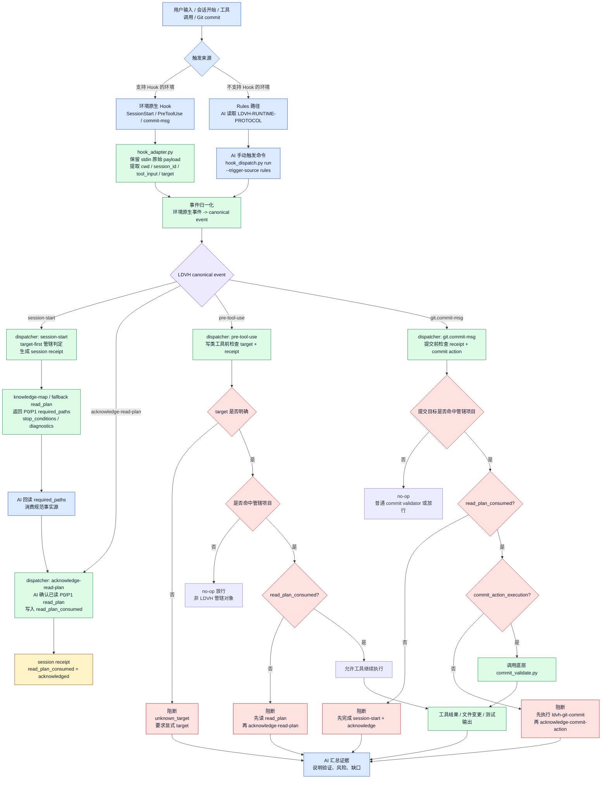

# V2 Hook Mechanism


```mermaid
flowchart TD
    U["用户输入 / 会话开始 / 工具调用 / Git commit"] --> E{"触发来源"}

    E -->|支持 Hook 的环境| H0["环境原生 Hook<br/>SessionStart / PreToolUse / commit-msg"]
    E -->|不支持 Hook 的环境| R0["Rules 路径<br/>AI 读取 LDVH-RUNTIME-PROTOCOL"]

    H0 --> A0["hook_adapter.py<br/>保留 stdin 原始 payload<br/>提取 cwd / session_id / tool_input / target"]
    R0 --> R1["AI 手动触发命令<br/>hook_dispatch.py run <event><br/>--trigger-source rules"]

    A0 --> M["事件归一化<br/>环境原生事件 -> canonical event"]
    R1 --> M

    M --> CE{"LDVH canonical event"}

    CE -->|session-start| S1["dispatcher: session-start<br/>target-first 管辖判定<br/>生成 session receipt"]
    CE -->|acknowledge-read-plan| ACK["dispatcher: acknowledge-read-plan<br/>AI 确认已读 P0/P1 read_plan<br/>写入 read_plan_consumed"]
    CE -->|pre-tool-use| PTU["dispatcher: pre-tool-use<br/>写类工具前检查 target + receipt"]
    CE -->|git.commit-msg| GCM["dispatcher: git.commit-msg<br/>提交前检查 receipt + commit action"]

    S1 --> KM["knowledge-map / fallback read_plan<br/>返回 P0/P1 required_paths<br/>stop_conditions / diagnostics"]
    KM --> AI1["AI 回读 required_paths<br/>消费规范事实源"]
    AI1 --> ACK

    ACK --> RC["session receipt<br/>read_plan_consumed = acknowledged"]

    PTU --> TGT{"target 是否明确"}
    TGT -->|否| B1["阻断<br/>unknown_target<br/>要求显式 target"]
    TGT -->|是| GOV{"是否命中管辖项目"}
    GOV -->|否| NOOP["no-op 放行<br/>非 LDVH 管辖对象"]
    GOV -->|是| CHK1{"read_plan_consumed?"}
    CHK1 -->|否| B2["阻断<br/>先读 read_plan<br/>再 acknowledge-read-plan"]
    CHK1 -->|是| ALLOW["允许工具继续执行"]

    GCM --> CGOV{"提交目标是否命中管辖项目"}
    CGOV -->|否| CNOOP["no-op<br/>普通 commit validator 或放行"]
    CGOV -->|是| CCHK1{"read_plan_consumed?"}
    CCHK1 -->|否| CB1["阻断<br/>先完成 session-start + acknowledge"]
    CCHK1 -->|是| CCHK2{"commit_action_execution?"}
    CCHK2 -->|否| CB2["阻断<br/>先执行 ldvh-git-commit<br/>再 acknowledge-commit-action"]
    CCHK2 -->|是| CV["调用底层 commit_validate.py"]

    ALLOW --> EV["工具结果 / 文件变更 / 测试输出"]
    CV --> EV
    EV --> AI2["AI 汇总证据<br/>说明验证、风险、缺口"]
    B1 --> AI2
    B2 --> AI2
    CB1 --> AI2
    CB2 --> AI2

    classDef source fill:#dbeafe,stroke:#1d4ed8,color:#111827
    classDef code fill:#dcfce7,stroke:#15803d,color:#111827
    classDef gate fill:#fee2e2,stroke:#b91c1c,color:#111827
    classDef receipt fill:#fef3c7,stroke:#92400e,color:#111827
    classDef event fill:#ede9fe,stroke:#6d28d9,color:#111827

    class U,E,H0,R0,R1,AI1,AI2 source
    class A0,M,S1,ACK,PTU,GCM,KM,CV,EV code
    class TGT,GOV,CHK1,CGOV,CCHK1,CCHK2,B1,B2,CB1,CB2 gate
    class RC receipt
    class CE event
```

关键补档链路：

```text
session-start
  -> read_plan / receipt
  -> AI 回读 required_paths
  -> acknowledge-read-plan
  -> read_plan_consumed
```
